# 로드맵

이 리포지토리가 다룰 **전체 커리큘럼**입니다. 목록은 계획이라 학습하면서 바뀔 수 있습니다.

- `[x]` 저장소에 문서와 코드가 있습니다. (품질 상태는 [레벨별 README](README.md#레벨)의 `상태`로 확인하세요)
- `[ ]` 아직 없는 주제입니다. (예정)

레벨은 solved.ac 티어를 대략적인 기준으로 삼습니다: Lv0 Bronze · Lv1 Silver · Lv2 Gold · Lv3 Platinum · Lv4 Diamond · Lv5 Ruby.

## 개념 선행 관계

현재 저장소에 있는 개념들의 선행 관계입니다. 각 개념 문서의 `prerequisites`에서 자동으로 만들어집니다. (`python tools/gen_index.py`)

```mermaid
flowchart LR
  n_array["array"]
  n_naive_prime_check["naive-prime-check"]
  n_brute_force["brute-force"]
  n_stack["stack"]
  n_queue["queue"]
  n_deque["deque"]
  n_linked_list["linked-list"]
  n_hash_table["hash-table"]
  n_priority_queue["priority-queue"]
  n_bubble_sort["bubble-sort"]
  n_selection_sort["selection-sort"]
  n_insertion_sort["insertion-sort"]
  n_merge_sort["merge-sort"]
  n_quick_sort["quick-sort"]
  n_heap_sort["heap-sort"]
  n_binary_search["binary-search"]
  n_prefix_sum["prefix-sum"]
  n_graph["graph"]
  n_tree["tree"]
  n_dfs["dfs"]
  n_bfs["bfs"]
  n_tree_traversal["tree-traversal"]
  n_euclidean_algorithm["euclidean-algorithm"]
  n_relatively_prime["relatively-prime"]
  n_sieve_of_eratosthenes["sieve-of-eratosthenes"]
  n_prime_factorization["prime-factorization"]
  n_greedy["greedy"]
  n_backtracking["backtracking"]
  n_dynamic_programming["dynamic-programming"]
  n_tower_of_hanoi["tower-of-hanoi"]
  n_bitwise_operators["bitwise-operators"]
  n_bitmask["bitmask"]
  n_dijkstra["dijkstra"]
  n_bellman_ford["bellman-ford"]
  n_floyd_warshall["floyd-warshall"]
  n_zero_one_bfs["zero-one-bfs"]
  n_union_find["union-find"]
  n_topological_sort["topological-sort"]
  n_binary_search_tree["binary-search-tree"]
  n_knapsack["knapsack"]
  n_divide_and_conquer["divide-and-conquer"]
  n_euler_phi["euler-phi"]
  n_fermat_little_theorem["fermat-little-theorem"]
  n_kmp["kmp"]
  n_rabin_karp["rabin-karp"]
  n_segment_tree["segment-tree"]
  n_extended_euclidean_algorithm["extended-euclidean-algorithm"]
  n_miller_rabin["miller-rabin"]
  n_array --> n_stack
  n_array --> n_queue
  n_queue --> n_deque
  n_stack --> n_deque
  n_array --> n_linked_list
  n_array --> n_hash_table
  n_queue --> n_priority_queue
  n_array --> n_bubble_sort
  n_array --> n_selection_sort
  n_array --> n_insertion_sort
  n_array --> n_merge_sort
  n_array --> n_quick_sort
  n_priority_queue --> n_heap_sort
  n_array --> n_binary_search
  n_array --> n_prefix_sum
  n_array --> n_graph
  n_graph --> n_tree
  n_graph --> n_dfs
  n_stack --> n_dfs
  n_graph --> n_bfs
  n_queue --> n_bfs
  n_tree --> n_tree_traversal
  n_dfs --> n_tree_traversal
  n_euclidean_algorithm --> n_relatively_prime
  n_naive_prime_check --> n_sieve_of_eratosthenes
  n_naive_prime_check --> n_prime_factorization
  n_brute_force --> n_backtracking
  n_dfs --> n_backtracking
  n_array --> n_dynamic_programming
  n_brute_force --> n_dynamic_programming
  n_bitwise_operators --> n_bitmask
  n_brute_force --> n_bitmask
  n_bfs --> n_dijkstra
  n_priority_queue --> n_dijkstra
  n_graph --> n_bellman_ford
  n_graph --> n_floyd_warshall
  n_bfs --> n_zero_one_bfs
  n_deque --> n_zero_one_bfs
  n_tree --> n_union_find
  n_graph --> n_topological_sort
  n_bfs --> n_topological_sort
  n_tree --> n_binary_search_tree
  n_binary_search --> n_binary_search_tree
  n_dynamic_programming --> n_knapsack
  n_tower_of_hanoi --> n_divide_and_conquer
  n_merge_sort --> n_divide_and_conquer
  n_prime_factorization --> n_euler_phi
  n_relatively_prime --> n_euler_phi
  n_euclidean_algorithm --> n_fermat_little_theorem
  n_relatively_prime --> n_fermat_little_theorem
  n_hash_table --> n_rabin_karp
  n_tree --> n_segment_tree
  n_divide_and_conquer --> n_segment_tree
  n_prefix_sum --> n_segment_tree
  n_euclidean_algorithm --> n_extended_euclidean_algorithm
  n_fermat_little_theorem --> n_miller_rabin
  classDef lv0 fill:#d8f0d8,stroke:#555,color:#111
  class n_array,n_naive_prime_check,n_brute_force lv0
  classDef lv1 fill:#d6e6fb,stroke:#555,color:#111
  class n_stack,n_queue,n_deque,n_linked_list,n_hash_table,n_priority_queue,n_bubble_sort,n_selection_sort,n_insertion_sort,n_merge_sort,n_quick_sort,n_heap_sort,n_binary_search,n_prefix_sum,n_graph,n_tree,n_dfs,n_bfs,n_tree_traversal,n_euclidean_algorithm,n_relatively_prime,n_sieve_of_eratosthenes,n_prime_factorization,n_greedy,n_backtracking,n_dynamic_programming,n_tower_of_hanoi,n_bitwise_operators,n_bitmask lv1
  classDef lv2 fill:#fdf0c4,stroke:#555,color:#111
  class n_dijkstra,n_bellman_ford,n_floyd_warshall,n_zero_one_bfs,n_union_find,n_topological_sort,n_binary_search_tree,n_knapsack,n_divide_and_conquer,n_euler_phi,n_fermat_little_theorem,n_kmp,n_rabin_karp lv2
  classDef lv3 fill:#fbd9c8,stroke:#555,color:#111
  class n_segment_tree,n_extended_euclidean_algorithm lv3
  classDef lv4 fill:#f2d0ee,stroke:#555,color:#111
  class n_miller_rabin lv4
```

<!-- GRAPH:START -->

색상: Lv0 초록 · Lv1 파랑 · Lv2 노랑 · Lv3 주황 · Lv4 보라
<!-- GRAPH:END -->

## Lv0 · 입문 (Bronze)

**01-data-structures**
- [x] [배열](lv0-basics/01-data-structures/array/)
- [ ] 2차원 배열 다루기
- [ ] 문자열 기초

**02-number-theory**
- [x] [단순 소수 판별](lv0-basics/02-number-theory/naive-prime-check/)
- [ ] 약수와 배수
- [ ] 진법 변환
- [ ] 나머지 연산

**03-brute-force**
- [x] [브루트 포스](lv0-basics/03-brute-force/brute-force/)
- [ ] 순열·조합 나열 (`itertools`)

**새 그룹**
- [ ] 빠른 입출력
- [ ] 시간 복잡도와 빅오
- [ ] 구현·시뮬레이션
- [ ] 문자열 처리
- [ ] 재귀 함수의 구조 (팩토리얼, 피보나치)

## Lv1 · 기초 (Silver)

**01-data-structures**
- [x] [스택](lv1-elementary/01-data-structures/stack/), [큐](lv1-elementary/01-data-structures/queue/), [덱](lv1-elementary/01-data-structures/deque/)
- [x] [연결 리스트](lv1-elementary/01-data-structures/linked-list/), [해시 테이블](lv1-elementary/01-data-structures/hash-table/), [우선순위 큐](lv1-elementary/01-data-structures/priority-queue/)
- [ ] `set` / `dict` 활용

**02-sorting**
- [x] [버블](lv1-elementary/02-sorting/bubble-sort/), [선택](lv1-elementary/02-sorting/selection-sort/), [삽입](lv1-elementary/02-sorting/insertion-sort/), [병합](lv1-elementary/02-sorting/merge-sort/), [퀵](lv1-elementary/02-sorting/quick-sort/), [힙](lv1-elementary/02-sorting/heap-sort/) 정렬
- [ ] 정렬 활용 (`key`, 정렬 후 탐색)

**03-binary-search**
- [x] [이분 탐색](lv1-elementary/03-binary-search/binary-search/)
- [ ] lower bound / upper bound

**04-range-techniques**
- [x] [누적 합](lv1-elementary/04-range-techniques/prefix-sum/)
- [ ] 2차원 누적 합
- [ ] 투 포인터

**05-graph-basics**
- [x] [그래프](lv1-elementary/05-graph-basics/graph/), [트리](lv1-elementary/05-graph-basics/tree/)
- [x] [DFS](lv1-elementary/05-graph-basics/dfs/), [BFS](lv1-elementary/05-graph-basics/bfs/), [트리 순회](lv1-elementary/05-graph-basics/tree-traversal/)
- [ ] 격자 탐색
- [ ] 연결 요소

**06-number-theory**
- [x] [유클리드 호제법](lv1-elementary/06-number-theory/euclidean-algorithm/), [서로소](lv1-elementary/06-number-theory/relatively-prime/)
- [x] [에라토스테네스의 체](lv1-elementary/06-number-theory/sieve-of-eratosthenes/), [소인수분해](lv1-elementary/06-number-theory/prime-factorization/)
- [ ] 약수 구하기

**07-algorithm-paradigms**
- [x] [그리디](lv1-elementary/07-algorithm-paradigms/greedy/), [백트래킹](lv1-elementary/07-algorithm-paradigms/backtracking/), [다이나믹 프로그래밍](lv1-elementary/07-algorithm-paradigms/dynamic-programming/)
- [ ] 대표 그리디 유형
- [ ] 1차원·2차원 DP 연습

**08-recursion**
- [x] [하노이의 탑](lv1-elementary/08-recursion/tower-of-hanoi/)

**09-bit-manipulation**
- [x] [비트 연산자](lv1-elementary/09-bit-manipulation/bitwise-operators/), [비트마스크](lv1-elementary/09-bit-manipulation/bitmask/)

## Lv2 · 중급 (Gold)

**01-shortest-path**
- [x] [다익스트라](lv2-intermediate/01-shortest-path/dijkstra/), [벨만-포드](lv2-intermediate/01-shortest-path/bellman-ford/), [플로이드-워셜](lv2-intermediate/01-shortest-path/floyd-warshall/), [0-1 BFS](lv2-intermediate/01-shortest-path/zero-one-bfs/)

**02-graph-algorithms**
- [x] [Union-Find](lv2-intermediate/02-graph-algorithms/union-find/), [위상 정렬](lv2-intermediate/02-graph-algorithms/topological-sort/)
- [ ] 최소 스패닝 트리 (크루스칼, 프림)
- [ ] 이분 그래프 판별

**03-trees**
- [x] [이진 탐색 트리](lv2-intermediate/03-trees/binary-search-tree/)
- [ ] 트리 DP
- [ ] 트리의 지름

**04-dynamic-programming**
- [x] [배낭 문제](lv2-intermediate/04-dynamic-programming/knapsack/)
- [ ] LIS O(n log n)
- [ ] LCS
- [ ] 구간 DP
- [ ] 비트마스크 DP

**05-divide-and-conquer**
- [x] [분할 정복](lv2-intermediate/05-divide-and-conquer/divide-and-conquer/)
- [ ] 빠른 거듭제곱

**06-number-theory**
- [x] [오일러 피 함수](lv2-intermediate/06-number-theory/euler-phi/), [페르마의 소정리](lv2-intermediate/06-number-theory/fermat-little-theorem/)
- [ ] 모듈러 역원
- [ ] 조합 nCr mod p

**07-strings**
- [x] [KMP](lv2-intermediate/07-strings/kmp/), [라빈-카프](lv2-intermediate/07-strings/rabin-karp/)
- [ ] 트라이

**새 그룹: 탐색 기법**
- [ ] 매개변수 탐색
- [ ] 모노톤 스택
- [ ] 슬라이딩 윈도우
- [ ] 좌표 압축
- [ ] 스위핑

## Lv3 · 고급 (Platinum)

**01-range-query-structures**
- [x] [세그먼트 트리](lv3-advanced/01-range-query-structures/segment-tree/)
- [ ] 느리게 갱신되는 세그먼트 트리 (lazy propagation)
- [ ] 펜윅 트리
- [ ] 희소 배열

**02-number-theory**
- [x] [확장 유클리드 호제법](lv3-advanced/02-number-theory/extended-euclidean-algorithm/)
- [ ] 중국인의 나머지 정리

**새 그룹**
- [ ] 고급 그래프: LCA, SCC, 2-SAT, 단절점·단절선, 네트워크 플로우(디닉), 이분 매칭
- [ ] 기하: CCW, 선분 교차, 볼록 껍질
- [ ] 문자열 고급: 접미사 배열·LCP, Z 알고리즘, 매내처, 아호-코라식
- [ ] 쿼리 기법: Mo's 알고리즘, 제곱근 분할, 중간에서 만나기
- [ ] DP 고급: 자릿수 DP, 확률·기댓값 DP, 분할 정복 최적화, 볼록 껍질 트릭(CHT), 행렬 거듭제곱

## Lv4 · 최상급 (Diamond)

**01-number-theory**
- [x] [밀러-라빈 소수 판정법](lv4-expert/01-number-theory/miller-rabin/)
- [ ] 폴라드 로
- [ ] FFT / NTT
- [ ] 뫼비우스 반전, 뤼카 정리, 번사이드 보조정리

**새 그룹**
- [ ] 트리 분해: HLD, 센트로이드 분해
- [ ] 고급 자료구조: 퍼시스턴트 세그먼트 트리, 머지 소트 트리, 웨이블릿 트리, Li Chao 트리, 트립·스플레이 트리
- [ ] 플로우·매칭: 최소 비용 최대 유량, 헝가리안 알고리즘
- [ ] 문자열: 접미사 자동자
- [ ] 기타: 반평면 교집합, 스프라그-그런디, Aliens trick(WQS 이분 탐색), 키타마사

## Lv5 · 마스터 (Ruby)

- [ ] Link-Cut Tree, Top Tree
- [ ] Blossom 알고리즘, Matroid Intersection
- [ ] Berlekamp-Massey, 다항식 연산(역원·ln·exp), min_25 체
- [ ] 오프라인 동적 연결성, Slope trick

## 진행 계획

1. **Phase 0 · 뼈대** — 레벨 구조, 문서 템플릿, 도구·CI, 기존 코드 이전 *(완료)*
2. **Phase 1 · 기준 샘플** — 다익스트라를 템플릿 전 항목(설명·구현·테스트·연습문제)으로 완성해 기준으로 삼기 *(완료)*
3. **Phase 2 · Lv0~1** — 기존 개념을 템플릿에 맞게 다시 쓰고, 빠진 주제 추가
4. **Phase 3 · Lv2**
5. **Phase 4 · Lv3**
6. **Phase 5 · Lv4~5**

## 알려진 이슈 (기존 코드)

기존 코드를 이전하면서 확인한 문제입니다. 각 개념을 템플릿에 맞춰 다시 쓰고 테스트를 붙일 때 고칠 예정입니다.

| 개념 | 문제 |
|---|---|
| [그래프](lv1-elementary/05-graph-basics/graph/) | 인접 리스트 예제의 리스트 리터럴에 쉼표가 빠져 있어 실행하면 `TypeError`가 발생합니다. |
| [퀵 정렬](lv1-elementary/02-sorting/quick-sort/) | `Quick_Sort`(예시 코드 1)가 값이 중복된 입력에서 `RecursionError`를 냅니다. |
| [힙 정렬](lv1-elementary/02-sorting/heap-sort/) | `Heapify`의 자식 인덱스 계산이 0-based 배열과 맞지 않아 일부 입력에서 틀린 결과가 나옵니다. |
| [병합 정렬](lv1-elementary/02-sorting/merge-sort/) | 병합 단계의 비교가 `<`라서 안정 정렬이 아닙니다. |
| [에라토스테네스의 체](lv1-elementary/06-number-theory/sieve-of-eratosthenes/) | 설명의 시간 복잡도가 `O(nlogn)`으로 되어 있지만 올바른 값은 `O(n log log n)`입니다. |
