# 로드맵

이 리포지토리가 다룰 **전체 커리큘럼**입니다. 목록은 계획이라 학습하면서 바뀔 수 있습니다.

- `[x]` 저장소에 문서와 코드가 있습니다. (품질 상태는 [레벨별 README](README.md#레벨)의 `상태`로 확인하세요)
- `[ ]` 아직 없는 주제입니다. (예정)

레벨은 solved.ac 티어를 대략적인 기준으로 삼습니다: Lv0 Bronze · Lv1 Silver · Lv2 Gold · Lv3 Platinum · Lv4 Diamond · Lv5 Ruby.

## 개념 선행 관계

현재 저장소에 있는 개념들의 선행 관계입니다. 각 개념 문서의 `prerequisites`에서 자동으로 만들어집니다. (`python tools/gen_index.py`)

```mermaid
flowchart LR
  n_array["array"]
  n_two_dimensional_array["two-dimensional-array"]
  n_string_basics["string-basics"]
  n_naive_prime_check["naive-prime-check"]
  n_divisors_and_multiples["divisors-and-multiples"]
  n_base_conversion["base-conversion"]
  n_modular_arithmetic["modular-arithmetic"]
  n_brute_force["brute-force"]
  n_permutations_and_combinations["permutations-and-combinations"]
  n_fast_io["fast-io"]
  n_time_complexity["time-complexity"]
  n_simulation["simulation"]
  n_string_processing["string-processing"]
  n_recursion_basics["recursion-basics"]
  n_stack["stack"]
  n_queue["queue"]
  n_deque["deque"]
  n_linked_list["linked-list"]
  n_hash_table["hash-table"]
  n_priority_queue["priority-queue"]
  n_set_and_dict["set-and-dict"]
  n_bubble_sort["bubble-sort"]
  n_selection_sort["selection-sort"]
  n_insertion_sort["insertion-sort"]
  n_merge_sort["merge-sort"]
  n_quick_sort["quick-sort"]
  n_heap_sort["heap-sort"]
  n_sort_with_key["sort-with-key"]
  n_binary_search["binary-search"]
  n_lower_upper_bound["lower-upper-bound"]
  n_prefix_sum["prefix-sum"]
  n_two_dimensional_prefix_sum["two-dimensional-prefix-sum"]
  n_two_pointers["two-pointers"]
  n_graph["graph"]
  n_tree["tree"]
  n_dfs["dfs"]
  n_bfs["bfs"]
  n_tree_traversal["tree-traversal"]
  n_grid_search["grid-search"]
  n_connected_components["connected-components"]
  n_euclidean_algorithm["euclidean-algorithm"]
  n_relatively_prime["relatively-prime"]
  n_sieve_of_eratosthenes["sieve-of-eratosthenes"]
  n_prime_factorization["prime-factorization"]
  n_divisor_sieve["divisor-sieve"]
  n_greedy["greedy"]
  n_backtracking["backtracking"]
  n_dynamic_programming["dynamic-programming"]
  n_greedy_patterns["greedy-patterns"]
  n_dp_practice["dp-practice"]
  n_tower_of_hanoi["tower-of-hanoi"]
  n_bitwise_operators["bitwise-operators"]
  n_bitmask["bitmask"]
  n_dijkstra["dijkstra"]
  n_bellman_ford["bellman-ford"]
  n_floyd_warshall["floyd-warshall"]
  n_zero_one_bfs["zero-one-bfs"]
  n_union_find["union-find"]
  n_topological_sort["topological-sort"]
  n_kruskal["kruskal"]
  n_prim["prim"]
  n_bipartite_graph["bipartite-graph"]
  n_binary_search_tree["binary-search-tree"]
  n_tree_dp["tree-dp"]
  n_tree_diameter["tree-diameter"]
  n_knapsack["knapsack"]
  n_lis["lis"]
  n_lcs["lcs"]
  n_interval_dp["interval-dp"]
  n_bitmask_dp["bitmask-dp"]
  n_divide_and_conquer["divide-and-conquer"]
  n_fast_exponentiation["fast-exponentiation"]
  n_euler_phi["euler-phi"]
  n_fermat_little_theorem["fermat-little-theorem"]
  n_modular_inverse["modular-inverse"]
  n_ncr_mod["ncr-mod"]
  n_kmp["kmp"]
  n_rabin_karp["rabin-karp"]
  n_trie["trie"]
  n_parametric_search["parametric-search"]
  n_monotonic_stack["monotonic-stack"]
  n_sliding_window["sliding-window"]
  n_coordinate_compression["coordinate-compression"]
  n_sweeping["sweeping"]
  n_fenwick_tree["fenwick-tree"]
  n_segment_tree["segment-tree"]
  n_lazy_propagation["lazy-propagation"]
  n_sparse_table["sparse-table"]
  n_extended_euclidean_algorithm["extended-euclidean-algorithm"]
  n_chinese_remainder_theorem["chinese-remainder-theorem"]
  n_lca["lca"]
  n_scc["scc"]
  n_two_sat["two-sat"]
  n_articulation_and_bridges["articulation-and-bridges"]
  n_dinic["dinic"]
  n_bipartite_matching["bipartite-matching"]
  n_ccw["ccw"]
  n_segment_intersection["segment-intersection"]
  n_convex_hull["convex-hull"]
  n_z_algorithm["z-algorithm"]
  n_manacher["manacher"]
  n_aho_corasick["aho-corasick"]
  n_suffix_array_lcp["suffix-array-lcp"]
  n_mos_algorithm["mos-algorithm"]
  n_sqrt_decomposition["sqrt-decomposition"]
  n_meet_in_the_middle["meet-in-the-middle"]
  n_digit_dp["digit-dp"]
  n_expected_value_dp["expected-value-dp"]
  n_divide_and_conquer_optimization["divide-and-conquer-optimization"]
  n_convex_hull_trick["convex-hull-trick"]
  n_matrix_exponentiation["matrix-exponentiation"]
  n_miller_rabin["miller-rabin"]
  n_array --> n_two_dimensional_array
  n_array --> n_string_basics
  n_naive_prime_check --> n_divisors_and_multiples
  n_brute_force --> n_permutations_and_combinations
  n_recursion_basics --> n_permutations_and_combinations
  n_two_dimensional_array --> n_simulation
  n_string_basics --> n_string_processing
  n_array --> n_stack
  n_array --> n_queue
  n_queue --> n_deque
  n_stack --> n_deque
  n_array --> n_linked_list
  n_array --> n_hash_table
  n_queue --> n_priority_queue
  n_hash_table --> n_set_and_dict
  n_array --> n_bubble_sort
  n_array --> n_selection_sort
  n_array --> n_insertion_sort
  n_array --> n_merge_sort
  n_array --> n_quick_sort
  n_priority_queue --> n_heap_sort
  n_merge_sort --> n_sort_with_key
  n_set_and_dict --> n_sort_with_key
  n_array --> n_binary_search
  n_binary_search --> n_lower_upper_bound
  n_array --> n_prefix_sum
  n_prefix_sum --> n_two_dimensional_prefix_sum
  n_two_dimensional_array --> n_two_dimensional_prefix_sum
  n_array --> n_two_pointers
  n_array --> n_graph
  n_graph --> n_tree
  n_graph --> n_dfs
  n_stack --> n_dfs
  n_graph --> n_bfs
  n_queue --> n_bfs
  n_tree --> n_tree_traversal
  n_dfs --> n_tree_traversal
  n_two_dimensional_array --> n_grid_search
  n_dfs --> n_grid_search
  n_bfs --> n_grid_search
  n_dfs --> n_connected_components
  n_bfs --> n_connected_components
  n_divisors_and_multiples --> n_euclidean_algorithm
  n_modular_arithmetic --> n_euclidean_algorithm
  n_euclidean_algorithm --> n_relatively_prime
  n_naive_prime_check --> n_sieve_of_eratosthenes
  n_naive_prime_check --> n_prime_factorization
  n_sieve_of_eratosthenes --> n_prime_factorization
  n_divisors_and_multiples --> n_divisor_sieve
  n_sieve_of_eratosthenes --> n_divisor_sieve
  n_sort_with_key --> n_greedy
  n_brute_force --> n_backtracking
  n_dfs --> n_backtracking
  n_recursion_basics --> n_backtracking
  n_array --> n_dynamic_programming
  n_recursion_basics --> n_dynamic_programming
  n_brute_force --> n_dynamic_programming
  n_greedy --> n_greedy_patterns
  n_priority_queue --> n_greedy_patterns
  n_stack --> n_greedy_patterns
  n_dynamic_programming --> n_dp_practice
  n_recursion_basics --> n_tower_of_hanoi
  n_base_conversion --> n_bitwise_operators
  n_bitwise_operators --> n_bitmask
  n_brute_force --> n_bitmask
  n_bfs --> n_dijkstra
  n_priority_queue --> n_dijkstra
  n_graph --> n_bellman_ford
  n_graph --> n_floyd_warshall
  n_dynamic_programming --> n_floyd_warshall
  n_bfs --> n_zero_one_bfs
  n_deque --> n_zero_one_bfs
  n_tree --> n_union_find
  n_array --> n_union_find
  n_graph --> n_topological_sort
  n_bfs --> n_topological_sort
  n_union_find --> n_kruskal
  n_sort_with_key --> n_kruskal
  n_greedy --> n_kruskal
  n_priority_queue --> n_prim
  n_graph --> n_prim
  n_bfs --> n_bipartite_graph
  n_connected_components --> n_bipartite_graph
  n_tree --> n_binary_search_tree
  n_binary_search --> n_binary_search_tree
  n_tree_traversal --> n_binary_search_tree
  n_tree --> n_tree_dp
  n_dynamic_programming --> n_tree_dp
  n_dp_practice --> n_tree_dp
  n_tree --> n_tree_diameter
  n_bfs --> n_tree_diameter
  n_dynamic_programming --> n_knapsack
  n_dp_practice --> n_knapsack
  n_greedy --> n_knapsack
  n_dp_practice --> n_lis
  n_binary_search --> n_lis
  n_lower_upper_bound --> n_lis
  n_dp_practice --> n_lcs
  n_string_basics --> n_lcs
  n_dp_practice --> n_interval_dp
  n_prefix_sum --> n_interval_dp
  n_bitmask --> n_bitmask_dp
  n_dp_practice --> n_bitmask_dp
  n_tower_of_hanoi --> n_divide_and_conquer
  n_merge_sort --> n_divide_and_conquer
  n_recursion_basics --> n_divide_and_conquer
  n_divide_and_conquer --> n_fast_exponentiation
  n_modular_arithmetic --> n_fast_exponentiation
  n_bitwise_operators --> n_fast_exponentiation
  n_prime_factorization --> n_euler_phi
  n_relatively_prime --> n_euler_phi
  n_sieve_of_eratosthenes --> n_euler_phi
  n_fast_exponentiation --> n_fermat_little_theorem
  n_modular_arithmetic --> n_fermat_little_theorem
  n_relatively_prime --> n_fermat_little_theorem
  n_fermat_little_theorem --> n_modular_inverse
  n_euler_phi --> n_modular_inverse
  n_euclidean_algorithm --> n_modular_inverse
  n_modular_arithmetic --> n_modular_inverse
  n_modular_inverse --> n_ncr_mod
  n_fermat_little_theorem --> n_ncr_mod
  n_fast_exponentiation --> n_ncr_mod
  n_permutations_and_combinations --> n_ncr_mod
  n_string_basics --> n_kmp
  n_time_complexity --> n_kmp
  n_hash_table --> n_rabin_karp
  n_modular_arithmetic --> n_rabin_karp
  n_binary_search --> n_rabin_karp
  n_tree --> n_trie
  n_hash_table --> n_trie
  n_set_and_dict --> n_trie
  n_binary_search --> n_parametric_search
  n_lower_upper_bound --> n_parametric_search
  n_greedy --> n_parametric_search
  n_stack --> n_monotonic_stack
  n_time_complexity --> n_monotonic_stack
  n_two_pointers --> n_sliding_window
  n_deque --> n_sliding_window
  n_monotonic_stack --> n_sliding_window
  n_sort_with_key --> n_coordinate_compression
  n_lower_upper_bound --> n_coordinate_compression
  n_set_and_dict --> n_coordinate_compression
  n_sort_with_key --> n_sweeping
  n_priority_queue --> n_sweeping
  n_coordinate_compression --> n_sweeping
  n_prefix_sum --> n_fenwick_tree
  n_bitwise_operators --> n_fenwick_tree
  n_coordinate_compression --> n_fenwick_tree
  n_tree --> n_segment_tree
  n_divide_and_conquer --> n_segment_tree
  n_prefix_sum --> n_segment_tree
  n_segment_tree --> n_lazy_propagation
  n_recursion_basics --> n_lazy_propagation
  n_segment_tree --> n_sparse_table
  n_bitwise_operators --> n_sparse_table
  n_dynamic_programming --> n_sparse_table
  n_euclidean_algorithm --> n_extended_euclidean_algorithm
  n_modular_inverse --> n_extended_euclidean_algorithm
  n_extended_euclidean_algorithm --> n_chinese_remainder_theorem
  n_modular_inverse --> n_chinese_remainder_theorem
  n_tree --> n_lca
  n_bfs --> n_lca
  n_sparse_table --> n_lca
  n_dfs --> n_scc
  n_topological_sort --> n_scc
  n_scc --> n_two_sat
  n_graph --> n_two_sat
  n_dfs --> n_articulation_and_bridges
  n_scc --> n_articulation_and_bridges
  n_bfs --> n_dinic
  n_dfs --> n_dinic
  n_graph --> n_dinic
  n_dfs --> n_bipartite_matching
  n_bfs --> n_bipartite_matching
  n_bipartite_graph --> n_bipartite_matching
  n_time_complexity --> n_ccw
  n_sort_with_key --> n_ccw
  n_ccw --> n_segment_intersection
  n_union_find --> n_segment_intersection
  n_ccw --> n_convex_hull
  n_sort_with_key --> n_convex_hull
  n_kmp --> n_z_algorithm
  n_time_complexity --> n_z_algorithm
  n_z_algorithm --> n_manacher
  n_two_pointers --> n_manacher
  n_time_complexity --> n_manacher
  n_trie --> n_aho_corasick
  n_kmp --> n_aho_corasick
  n_z_algorithm --> n_suffix_array_lcp
  n_sort_with_key --> n_suffix_array_lcp
  n_sparse_table --> n_suffix_array_lcp
  n_two_pointers --> n_mos_algorithm
  n_sort_with_key --> n_mos_algorithm
  n_coordinate_compression --> n_mos_algorithm
  n_prefix_sum --> n_sqrt_decomposition
  n_lower_upper_bound --> n_sqrt_decomposition
  n_time_complexity --> n_sqrt_decomposition
  n_bitmask --> n_meet_in_the_middle
  n_binary_search --> n_meet_in_the_middle
  n_lower_upper_bound --> n_meet_in_the_middle
  n_dynamic_programming --> n_digit_dp
  n_prefix_sum --> n_digit_dp
  n_dynamic_programming --> n_expected_value_dp
  n_modular_inverse --> n_expected_value_dp
  n_dynamic_programming --> n_divide_and_conquer_optimization
  n_divide_and_conquer --> n_divide_and_conquer_optimization
  n_prefix_sum --> n_divide_and_conquer_optimization
  n_dynamic_programming --> n_convex_hull_trick
  n_ccw --> n_convex_hull_trick
  n_binary_search --> n_convex_hull_trick
  n_fast_exponentiation --> n_matrix_exponentiation
  n_dynamic_programming --> n_matrix_exponentiation
  n_fermat_little_theorem --> n_miller_rabin
  classDef lv0 fill:#d8f0d8,stroke:#555,color:#111
  class n_array,n_two_dimensional_array,n_string_basics,n_naive_prime_check,n_divisors_and_multiples,n_base_conversion,n_modular_arithmetic,n_brute_force,n_permutations_and_combinations,n_fast_io,n_time_complexity,n_simulation,n_string_processing,n_recursion_basics lv0
  classDef lv1 fill:#d6e6fb,stroke:#555,color:#111
  class n_stack,n_queue,n_deque,n_linked_list,n_hash_table,n_priority_queue,n_set_and_dict,n_bubble_sort,n_selection_sort,n_insertion_sort,n_merge_sort,n_quick_sort,n_heap_sort,n_sort_with_key,n_binary_search,n_lower_upper_bound,n_prefix_sum,n_two_dimensional_prefix_sum,n_two_pointers,n_graph,n_tree,n_dfs,n_bfs,n_tree_traversal,n_grid_search,n_connected_components,n_euclidean_algorithm,n_relatively_prime,n_sieve_of_eratosthenes,n_prime_factorization,n_divisor_sieve,n_greedy,n_backtracking,n_dynamic_programming,n_greedy_patterns,n_dp_practice,n_tower_of_hanoi,n_bitwise_operators,n_bitmask lv1
  classDef lv2 fill:#fdf0c4,stroke:#555,color:#111
  class n_dijkstra,n_bellman_ford,n_floyd_warshall,n_zero_one_bfs,n_union_find,n_topological_sort,n_kruskal,n_prim,n_bipartite_graph,n_binary_search_tree,n_tree_dp,n_tree_diameter,n_knapsack,n_lis,n_lcs,n_interval_dp,n_bitmask_dp,n_divide_and_conquer,n_fast_exponentiation,n_euler_phi,n_fermat_little_theorem,n_modular_inverse,n_ncr_mod,n_kmp,n_rabin_karp,n_trie,n_parametric_search,n_monotonic_stack,n_sliding_window,n_coordinate_compression,n_sweeping lv2
  classDef lv3 fill:#fbd9c8,stroke:#555,color:#111
  class n_fenwick_tree,n_segment_tree,n_lazy_propagation,n_sparse_table,n_extended_euclidean_algorithm,n_chinese_remainder_theorem,n_lca,n_scc,n_two_sat,n_articulation_and_bridges,n_dinic,n_bipartite_matching,n_ccw,n_segment_intersection,n_convex_hull,n_z_algorithm,n_manacher,n_aho_corasick,n_suffix_array_lcp,n_mos_algorithm,n_sqrt_decomposition,n_meet_in_the_middle,n_digit_dp,n_expected_value_dp,n_divide_and_conquer_optimization,n_convex_hull_trick,n_matrix_exponentiation lv3
  classDef lv4 fill:#f2d0ee,stroke:#555,color:#111
  class n_miller_rabin lv4
```

<!-- GRAPH:START -->

색상: Lv0 초록 · Lv1 파랑 · Lv2 노랑 · Lv3 주황 · Lv4 보라
<!-- GRAPH:END -->

## Lv0 · 입문 (Bronze)

**01-data-structures**
- [x] [배열](lv0-basics/01-data-structures/array/), [2차원 배열](lv0-basics/01-data-structures/two-dimensional-array/), [문자열 기초](lv0-basics/01-data-structures/string-basics/)

**02-number-theory**
- [x] [단순 소수 판별](lv0-basics/02-number-theory/naive-prime-check/), [약수와 배수](lv0-basics/02-number-theory/divisors-and-multiples/), [진법 변환](lv0-basics/02-number-theory/base-conversion/), [나머지 연산](lv0-basics/02-number-theory/modular-arithmetic/)

**03-brute-force**
- [x] [브루트 포스](lv0-basics/03-brute-force/brute-force/), [순열과 조합 나열](lv0-basics/03-brute-force/permutations-and-combinations/)

**04-io-and-complexity**
- [x] [빠른 입출력](lv0-basics/04-io-and-complexity/fast-io/), [시간 복잡도와 빅오](lv0-basics/04-io-and-complexity/time-complexity/)

**05-implementation**
- [x] [구현·시뮬레이션](lv0-basics/05-implementation/simulation/), [문자열 처리](lv0-basics/05-implementation/string-processing/)

**06-recursion**
- [x] [재귀 함수의 구조](lv0-basics/06-recursion/recursion-basics/)

## Lv1 · 기초 (Silver)

**01-data-structures**
- [x] [스택](lv1-elementary/01-data-structures/stack/), [큐](lv1-elementary/01-data-structures/queue/), [덱](lv1-elementary/01-data-structures/deque/), [연결 리스트](lv1-elementary/01-data-structures/linked-list/), [해시 테이블](lv1-elementary/01-data-structures/hash-table/), [Priority Queue (우선순위 큐)와 힙](lv1-elementary/01-data-structures/priority-queue/), [집합과 딕셔너리 활용](lv1-elementary/01-data-structures/set-and-dict/)

**02-sorting**
- [x] [버블 정렬](lv1-elementary/02-sorting/bubble-sort/), [선택 정렬](lv1-elementary/02-sorting/selection-sort/), [삽입 정렬](lv1-elementary/02-sorting/insertion-sort/), [병합 정렬](lv1-elementary/02-sorting/merge-sort/), [퀵 정렬](lv1-elementary/02-sorting/quick-sort/), [힙 정렬](lv1-elementary/02-sorting/heap-sort/), [정렬 활용](lv1-elementary/02-sorting/sort-with-key/)

**03-binary-search**
- [x] [이분 탐색](lv1-elementary/03-binary-search/binary-search/), [하한과 상한](lv1-elementary/03-binary-search/lower-upper-bound/)

**04-range-techniques**
- [x] [누적 합](lv1-elementary/04-range-techniques/prefix-sum/), [2차원 누적 합](lv1-elementary/04-range-techniques/two-dimensional-prefix-sum/), [투 포인터](lv1-elementary/04-range-techniques/two-pointers/)

**05-graph-basics**
- [x] [그래프](lv1-elementary/05-graph-basics/graph/), [트리](lv1-elementary/05-graph-basics/tree/), [깊이 우선 탐색](lv1-elementary/05-graph-basics/dfs/), [너비 우선 탐색](lv1-elementary/05-graph-basics/bfs/), [트리 순회](lv1-elementary/05-graph-basics/tree-traversal/), [격자 탐색](lv1-elementary/05-graph-basics/grid-search/), [연결 요소](lv1-elementary/05-graph-basics/connected-components/)

**06-number-theory**
- [x] [유클리드 호제법](lv1-elementary/06-number-theory/euclidean-algorithm/), [서로소](lv1-elementary/06-number-theory/relatively-prime/), [에라토스테네스의 체](lv1-elementary/06-number-theory/sieve-of-eratosthenes/), [소인수분해](lv1-elementary/06-number-theory/prime-factorization/), [약수 체](lv1-elementary/06-number-theory/divisor-sieve/)

**07-algorithm-paradigms**
- [x] [그리디 알고리즘](lv1-elementary/07-algorithm-paradigms/greedy/), [백트래킹](lv1-elementary/07-algorithm-paradigms/backtracking/), [다이나믹 프로그래밍](lv1-elementary/07-algorithm-paradigms/dynamic-programming/), [대표 그리디 유형](lv1-elementary/07-algorithm-paradigms/greedy-patterns/), [1차원·2차원 DP 연습](lv1-elementary/07-algorithm-paradigms/dp-practice/)

**08-recursion**
- [x] [하노이의 탑](lv1-elementary/08-recursion/tower-of-hanoi/)

**09-bit-manipulation**
- [x] [비트 연산자](lv1-elementary/09-bit-manipulation/bitwise-operators/), [비트마스킹](lv1-elementary/09-bit-manipulation/bitmask/)

## Lv2 · 중급 (Gold)

**01-shortest-path**
- [x] [다익스트라 알고리즘](lv2-intermediate/01-shortest-path/dijkstra/), [벨만-포드 알고리즘](lv2-intermediate/01-shortest-path/bellman-ford/), [플로이드-워셜 알고리즘](lv2-intermediate/01-shortest-path/floyd-warshall/), [0-1 너비 우선 탐색](lv2-intermediate/01-shortest-path/zero-one-bfs/)

**02-graph-algorithms**
- [x] [유니온 파인드](lv2-intermediate/02-graph-algorithms/union-find/), [위상 정렬](lv2-intermediate/02-graph-algorithms/topological-sort/), [크루스칼 알고리즘](lv2-intermediate/02-graph-algorithms/kruskal/), [프림 알고리즘](lv2-intermediate/02-graph-algorithms/prim/), [이분 그래프](lv2-intermediate/02-graph-algorithms/bipartite-graph/)

**03-trees**
- [x] [이진 탐색 트리](lv2-intermediate/03-trees/binary-search-tree/), [트리 DP](lv2-intermediate/03-trees/tree-dp/), [트리의 지름](lv2-intermediate/03-trees/tree-diameter/)

**04-dynamic-programming**
- [x] [배낭 문제](lv2-intermediate/04-dynamic-programming/knapsack/), [가장 긴 증가하는 부분 수열](lv2-intermediate/04-dynamic-programming/lis/), [LCS (최장 공통 부분 수열)와 편집 거리](lv2-intermediate/04-dynamic-programming/lcs/), [구간 DP](lv2-intermediate/04-dynamic-programming/interval-dp/), [비트마스크 DP](lv2-intermediate/04-dynamic-programming/bitmask-dp/)

**05-divide-and-conquer**
- [x] [분할 정복](lv2-intermediate/05-divide-and-conquer/divide-and-conquer/), [빠른 거듭제곱](lv2-intermediate/05-divide-and-conquer/fast-exponentiation/)

**06-number-theory**
- [x] [오일러 피 함수](lv2-intermediate/06-number-theory/euler-phi/), [페르마의 소정리](lv2-intermediate/06-number-theory/fermat-little-theorem/), [모듈러 역원](lv2-intermediate/06-number-theory/modular-inverse/), [조합 mod 소수](lv2-intermediate/06-number-theory/ncr-mod/)

**07-strings**
- [x] [KMP 알고리즘](lv2-intermediate/07-strings/kmp/), [라빈-카프 알고리즘](lv2-intermediate/07-strings/rabin-karp/), [트라이](lv2-intermediate/07-strings/trie/)

**08-search-techniques**
- [x] [매개변수 탐색](lv2-intermediate/08-search-techniques/parametric-search/), [모노톤 스택](lv2-intermediate/08-search-techniques/monotonic-stack/), [슬라이딩 윈도우](lv2-intermediate/08-search-techniques/sliding-window/), [좌표 압축](lv2-intermediate/08-search-techniques/coordinate-compression/), [스위핑](lv2-intermediate/08-search-techniques/sweeping/)

## Lv3 · 고급 (Platinum)

**01-range-query-structures**
- [x] [펜윅 트리](lv3-advanced/01-range-query-structures/fenwick-tree/), [세그먼트 트리](lv3-advanced/01-range-query-structures/segment-tree/), [느리게 갱신되는 세그먼트 트리](lv3-advanced/01-range-query-structures/lazy-propagation/), [희소 배열](lv3-advanced/01-range-query-structures/sparse-table/)

**02-number-theory**
- [x] [확장 유클리드 호제법](lv3-advanced/02-number-theory/extended-euclidean-algorithm/), [중국인의 나머지 정리](lv3-advanced/02-number-theory/chinese-remainder-theorem/)

**03-graph-advanced**
- [x] [최소 공통 조상](lv3-advanced/03-graph-advanced/lca/), [강한 연결 요소](lv3-advanced/03-graph-advanced/scc/), [2-SAT](lv3-advanced/03-graph-advanced/two-sat/), [단절점과 단절선](lv3-advanced/03-graph-advanced/articulation-and-bridges/), [디닉 알고리즘](lv3-advanced/03-graph-advanced/dinic/), [이분 매칭](lv3-advanced/03-graph-advanced/bipartite-matching/)

**04-geometry**
- [x] [CCW (반시계 판정)와 외적](lv3-advanced/04-geometry/ccw/), [선분 교차](lv3-advanced/04-geometry/segment-intersection/), [볼록 껍질](lv3-advanced/04-geometry/convex-hull/)

**05-strings-advanced**
- [x] [Z 알고리즘](lv3-advanced/05-strings-advanced/z-algorithm/), [매내처 알고리즘](lv3-advanced/05-strings-advanced/manacher/), [아호-코라식](lv3-advanced/05-strings-advanced/aho-corasick/), [접미사 배열과 LCP 배열](lv3-advanced/05-strings-advanced/suffix-array-lcp/)

**06-query-techniques**
- [x] [모스 알고리즘](lv3-advanced/06-query-techniques/mos-algorithm/), [제곱근 분할](lv3-advanced/06-query-techniques/sqrt-decomposition/), [중간에서 만나기](lv3-advanced/06-query-techniques/meet-in-the-middle/)

**07-dp-advanced**
- [x] [자릿수 DP](lv3-advanced/07-dp-advanced/digit-dp/), [기댓값 DP](lv3-advanced/07-dp-advanced/expected-value-dp/), [분할 정복 최적화](lv3-advanced/07-dp-advanced/divide-and-conquer-optimization/), [볼록 껍질 트릭](lv3-advanced/07-dp-advanced/convex-hull-trick/), [행렬 거듭제곱](lv3-advanced/07-dp-advanced/matrix-exponentiation/)

## Lv4 · 최상급 (Diamond)

**01-number-theory**
- [x] [밀러-라빈 소수 판정법](lv4-expert/01-number-theory/miller-rabin/)
- [ ] 폴라드 로
- [ ] FFT / NTT
- [ ] 뫼비우스 반전, 뤼카 정리, 번사이드 보조정리

**새 그룹**
- [ ] 트리 분해: HLD, 센트로이드 분해
- [ ] 고급 자료구조: 퍼시스턴트 세그먼트 트리, 머지 소트 트리, 웨이블릿 트리, Li Chao 트리, 트립·스플레이 트리
- [ ] 플로우·매칭: 최소 비용 최대 유량, 헝가리안 알고리즘
- [ ] 문자열: 접미사 자동자
- [ ] 기타: 반평면 교집합, 스프라그-그런디, Aliens trick(WQS 이분 탐색), 키타마사

## Lv5 · 마스터 (Ruby)

- [ ] Link-Cut Tree, Top Tree
- [ ] Blossom 알고리즘, Matroid Intersection
- [ ] Berlekamp-Massey, 다항식 연산(역원·ln·exp), min_25 체
- [ ] 오프라인 동적 연결성, Slope trick

## 진행 계획

1. **Phase 0 · 뼈대** — 레벨 구조, 문서 템플릿, 도구·CI, 기존 코드 이전 *(완료)*
2. **Phase 1 · 기준 샘플** — 다익스트라를 템플릿 전 항목(설명·구현·테스트·연습문제)으로 완성해 기준으로 삼기 *(완료)*
3. **Phase 2 · Lv0~1** — 기존 개념을 템플릿에 맞게 다시 쓰고, 빠진 주제 추가 *(완료)*
4. **Phase 3 · Lv2** *(완료)*
5. **Phase 4 · Lv3** *(완료)*
6. **Phase 5 · Lv4~5** *(진행 중)*

## 알려진 이슈 (기존 코드)

기존 코드를 이전하면서 확인했던 문제는 모두 해당 개념을 다시 쓰면서 고쳤습니다.

- 정렬 그룹: 퀵 정렬의 중복값 `RecursionError`, 힙 정렬의 자식 인덱스, 병합 정렬의 안정성
- [그래프](lv1-elementary/05-graph-basics/graph/): 인접 리스트 예제의 쉼표 누락
- [에라토스테네스의 체](lv1-elementary/06-number-theory/sieve-of-eratosthenes/): 시간 복잡도 `O(n log log n)`로 정정

각 개념의 `test_solution.py`가 같은 문제가 되돌아오지 않도록 막고 있습니다.
