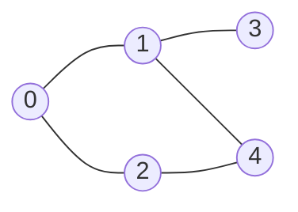

# BFS (Breadth-First Search, 너비 우선 탐색)

> **한 줄 요약**: 시작점에서 가까운 정점부터 한 겹씩 넓혀 가며 탐색한다. **가중치가 없는 그래프에서 최단 거리**를 구하는 표준 방법이다.

## 1. 언제 쓰나 (문제 신호)

- "**최소 몇 번 만에**", "**최단 거리**", "가장 적은 이동 횟수"인데 **모든 이동의 비용이 같을 때**
- 미로 탈출, 숨바꼭질(±1, ×2 이동), 촌수 계산, 단계별로 퍼지는 것(토마토 익기, 불 번짐)
- 가중치가 있다면 [다익스트라](../../../lv2-intermediate/01-shortest-path/dijkstra/), 가중치가 0 또는 1이라면 [0-1 BFS](../../../lv2-intermediate/01-shortest-path/zero-one-bfs/)

"갈 수 있는가"만 묻는다면 [DFS](../dfs/)와 BFS 어느 쪽이든 됩니다.

## 2. 핵심 아이디어

**큐(FIFO)** 에 정점을 넣고 앞에서부터 꺼내 이웃을 뒤에 넣습니다. 먼저 들어온 정점이 먼저 나오므로, **거리가 가까운 정점이 항상 먼저** 처리됩니다.

1. 시작점의 거리를 0으로 하고 큐에 넣는다.
2. 큐에서 `u`를 꺼내 아직 방문하지 않은 이웃 `v`의 거리를 `dist[u] + 1`로 정하고 큐에 넣는다.
3. 큐가 빌 때까지 반복한다.

**방문 표시는 큐에 넣을 때** 합니다. 꺼낼 때 하면 같은 정점이 큐에 여러 번 들어가 느려집니다. `dist[v] == -1`(거리 미정)을 방문 여부로 함께 씁니다.

**왜 최단 거리인가**: 거리가 `d`인 정점은 모두 거리가 `d+1`인 정점보다 먼저 큐에 들어갑니다. 따라서 어떤 정점에 **처음 도착한 순간이 가장 짧은 경로**입니다.

경로 자체가 필요하면 도착할 때 `parent[v] = u`를 기록하고, 도착점에서 `parent`를 따라 거슬러 올라간 뒤 뒤집습니다.

### 무엇을 저장하고 어떻게 움직이나

거리 배열은 시작점에서 각 정점까지 사용한 간선 수입니다. 발견한 정점을 큐에 넣고, 꺼낼 때 이웃을 발견합니다. 아직 발견하지 않은 정점의 거리는 현재 거리+1로 정하고 부모를 기록하면 최단 경로도 복원할 수 있습니다.

### 왜 이 방법이 맞는가

모든 간선 비용이 같으면 큐는 거리 0, 1, 2 순으로 정점을 처리합니다. 처음 발견한 정점에 더 짧게 오는 경로가 있었다면 더 작은 거리 층에서 먼저 발견됐어야 하므로 모순입니다. 따라서 삽입 순간의 거리 확정이 안전합니다.

### 작은 예제로 검산하기

A가 B와 C에 연결되고 B-D, C-E라면 처리 순서는 A, B, C, D, E이고 거리는 0,1,1,2,2입니다. 여러 시작점의 거리를 모두 0으로 넣으면 가장 가까운 시작점까지의 거리를 한 번에 구합니다.

## 3. 손으로 따라가기

[DFS 문서](../dfs/)와 같은 그래프, 시작 0:



| 꺼낸 정점 | 하는 일 | 큐 (왼쪽이 앞) | dist `[0,1,2,3,4]` |
|---|---|---|---|
| 시작 | `dist[0] = 0`, 큐에 0 | `[0]` | `[0, -1, -1, -1, -1]` |
| 0 | 이웃 1, 2 → 거리 1 | `[1, 2]` | `[0, 1, 1, -1, -1]` |
| 1 | 이웃 3, 4 → 거리 2 (0은 이미 방문) | `[2, 3, 4]` | `[0, 1, 1, 2, 2]` |
| 2 | 이웃 0, 4는 이미 방문 | `[3, 4]` | `[0, 1, 1, 2, 2]` |
| 3 | 이웃 1은 이미 방문 | `[4]` | `[0, 1, 1, 2, 2]` |
| 4 | 이웃 1, 2는 이미 방문 | `[]` | `[0, 1, 1, 2, 2]` |

방문 순서는 `0, 1, 2, 3, 4`이고, 거리별로 묶으면 `[[0], [1, 2], [3, 4]]`입니다. (`bfs_levels`) 정점 3에서 2까지의 최단 경로는 `[3, 1, 0, 2]`(거리 3)입니다. 둘로 갈라지는 경우 하나를 골라 줍니다. `[3, 1, 4, 2]`도 같은 길이입니다.

## 4. 구현

전체 코드는 [solution.py](solution.py)에 있습니다.

```python
from collections import deque

def bfs_distances(adj, start):
    dist = [-1] * len(adj)
    dist[start] = 0
    queue = deque([start])
    while queue:
        u = queue.popleft()                  # 리스트의 pop(0) 은 O(n) 이니 deque 를 쓴다
        for v in adj[u]:
            if dist[v] == -1:                # 거리가 정해지지 않았다 = 아직 방문하지 않았다
                dist[v] = dist[u] + 1
                queue.append(v)
    return dist
```

`bfs_order`(방문 순서), `bfs_shortest_path`(경로 복원), `bfs_levels`(거리별 묶음)도 있습니다. 직접 실행하면 `V E S`와 간선을 받아 S에서 각 정점까지의 거리를 출력합니다. (도달 불가는 `-1`)

## 5. 복잡도와 입력 크기 가이드

- **시간 O(V + E)**, 공간 O(V). 정점과 간선을 한 번씩만 봅니다.
- 큐는 반드시 `collections.deque`로 만드세요. 리스트의 `pop(0)`은 O(n)이라 전체가 O(V²)이 됩니다. ([복잡도 치트시트](../../../docs/complexity-cheatsheet.md))
- 정점 수가 10^5~10^6이어도 BFS는 재귀가 없으므로 안전합니다.

## 6. 자주 하는 실수

- **큐에서 꺼낼 때 방문 표시**: 같은 정점이 큐에 여러 번 들어가 시간이 늘고, 거리 갱신이 꼬일 수 있습니다. 넣을 때 표시하세요.
- **리스트로 큐 만들기**: `list.pop(0)`는 O(n). `deque.popleft()`를 쓰세요.
- **가중치가 있는 그래프에 쓰기**: BFS의 거리는 **간선 수**입니다. 비용이 다르면 [다익스트라](../../../lv2-intermediate/01-shortest-path/dijkstra/)입니다.
- **시작점 거리 초기화 누락**: `dist[start] = 0`을 안 하면 시작점이 `-1`이라 다시 방문됩니다.
- **다중 시작점**: 여러 곳에서 동시에 퍼지는 문제(불, 토마토)는 시작점을 **모두** 큐에 넣고 시작합니다.

## 7. 변형과 응용

- **격자 최단 경로**: 칸 → [격자 탐색](../grid-search/)
- **다중 시작점 BFS**: 모든 시작점을 거리 0으로 큐에 넣기
- **상태 BFS**: "정점"을 (위치, 남은 횟수) 같은 **상태**로 확장. (숨바꼭질, 벽 부수고 이동하기)
- **0-1 BFS**: 가중치 0이면 덱의 앞에, 1이면 뒤에 → [0-1 BFS](../../../lv2-intermediate/01-shortest-path/zero-one-bfs/)

## 8. 연습문제

[problems.md](problems.md)에 쉬운 것부터 어려운 순서로 정리했습니다.

## 9. 다음 단계

- 선행: [그래프](../graph/), [큐](../../01-data-structures/queue/)
- 이어서: [격자 탐색](../grid-search/), [다익스트라](../../../lv2-intermediate/01-shortest-path/dijkstra/), [0-1 BFS](../../../lv2-intermediate/01-shortest-path/zero-one-bfs/)
