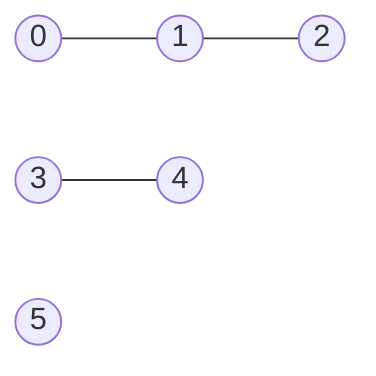

# Connected Components (연결 요소)

> **한 줄 요약**: 간선으로 서로 오갈 수 있는 정점끼리 묶은 덩어리. 방문하지 않은 정점마다 탐색을 새로 시작하면 덩어리가 몇 개인지 알 수 있다.

## 1. 언제 쓰나 (문제 신호)

- "**연결된 덩어리의 개수**", "그룹이 몇 개", "서로 연결되어 있는가"
- 그래프가 **하나로 이어져 있는지**, 가장 큰 그룹의 크기, **트리(사이클 없는 연결 요소)가 몇 개**인지
- 간선이 **추가되기만** 하며 연결 여부를 물으면 [Union-Find](../../../lv2-intermediate/02-graph-algorithms/union-find/)가 더 맞습니다.

## 2. 핵심 아이디어

1. 모든 정점을 `0, 1, 2, …` 차례로 봅니다.
2. **아직 속한 요소가 없는 정점**을 만나면 새 요소 번호를 붙이고, 거기서 [BFS(또는 DFS)](../bfs/)로 갈 수 있는 정점 전부에 같은 번호를 붙입니다.
3. 새 번호를 부여한 횟수가 연결 요소의 개수입니다.

**사이클 판별**(무방향): 탐색 중 **이미 방문한 정점**을 다시 만나면(방금 온 바로 그 간선 제외) 사이클입니다. 같은 두 정점을 잇는 간선이 둘이면 그것도 사이클입니다. 다른 확인법도 있습니다. **사이클이 없는 그래프(숲)** 에서는 `간선 수 = 정점 수 − 연결 요소 수`가 성립하므로, 간선이 그보다 많으면 사이클이 있습니다.

### 무엇을 저장하고 어떻게 움직이나

한 정점에서 탐색해 방문되는 정점들은 하나의 연결 요소입니다. 아직 방문하지 않은 정점을 새 출발점으로 골라 탐색을 반복하며 요소 번호를 붙입니다. 격자 영역 세기와 그래프 묶음 판정은 같은 구조입니다.

### 왜 이 방법이 맞는가

한 탐색이 도달 가능한 모든 정점을 방문하므로 같은 요소의 정점을 두 번 새 출발점으로 고르지 않습니다. 다른 요소는 연결 경로가 없어 이전 탐색에서 방문될 수 없습니다. 따라서 새로운 탐색을 시작한 횟수가 요소 수입니다.

### 작은 예제로 검산하기

간선 0-1, 1-2, 3-4이고 정점 5가 고립돼 있으면 요소는 `{0,1,2}`, `{3,4}`, `{5}` 세 개입니다. 간선이 없는 정점도 반드시 포함해야 합니다. 방향 그래프의 강한 연결 요소는 이 방법과 조건이 다릅니다.

## 3. 손으로 따라가기

정점 0~5, 간선 `(0,1) (1,2) (3,4)`:



| 시작하는 정점 | 새 요소 번호 | 이 탐색으로 붙는 정점 | ids 상태 |
|---|---|---|---|
| 0 | 0 | 0, 1, 2 | `[0, 0, 0, -1, -1, -1]` |
| 1, 2 | (이미 속함) | - | |
| 3 | 1 | 3, 4 | `[0, 0, 0, 1, 1, -1]` |
| 4 | (이미 속함) | - | |
| 5 | 2 | 5 | `[0, 0, 0, 1, 1, 2]` |

연결 요소는 3개: `[[0, 1, 2], [3, 4], [5]]`. 간선 3개, 정점 6개, 요소 3개이므로 `6 − 3 = 3 = 간선 수`라 **사이클이 없습니다.**

## 4. 구현

전체 코드는 [solution.py](solution.py)에 있습니다.

```python
def component_ids(n, edges):
    adj = _adjacency(n, edges)
    ids = [-1] * n
    count = 0
    for start in range(n):
        if ids[start] != -1:                 # 이미 어떤 요소에 속한 정점
            continue
        ids[start] = count
        queue = deque([start])
        while queue:
            u = queue.popleft()
            for v in adj[u]:
                if ids[v] == -1:
                    ids[v] = count
                    queue.append(v)
        count += 1
    return ids
```

`connected_components`(요소별 정점 목록), `count_components`, `is_connected`, `largest_component_size`, `has_cycle`도 있습니다. 직접 실행하면 `N M`과 간선을 받아 연결 요소의 수를 출력합니다.

## 5. 복잡도와 입력 크기 가이드

- 모든 정점과 간선을 한 번씩 보므로 **O(V + E)** 입니다. V, E가 10^5~10^6이어도 BFS 방식이면 안전합니다.
- 간선이 계속 추가되는 문제에서는 요소를 매번 다시 구하면 느리니 [Union-Find](../../../lv2-intermediate/02-graph-algorithms/union-find/)를 쓰세요. ([복잡도 치트시트](../../../docs/complexity-cheatsheet.md))

## 6. 자주 하는 실수

- **정점 하나뿐인 요소를 놓침**: 간선이 없는 정점도 하나의 연결 요소입니다. 간선 목록만 훑으면 놓칩니다. 모든 정점을 순서대로 봐야 합니다.
- **사이클 판별에서 부모로 되돌아가기를 사이클로 착각**: 무방향 간선은 양쪽에 있으므로 방금 온 간선으로 돌아가는 것은 제외해야 합니다. 정점이 아니라 **간선**으로 구분해야 중복 간선이 올바르게 처리됩니다.
- **방향 그래프에 적용**: 방향 그래프의 "강하게 연결된 요소(SCC)"는 다른 알고리즘입니다. ([SCC](../../../lv3-advanced/03-graph-advanced/scc/))
- **재귀 DFS 깊이**: 정점이 많으면 BFS나 스택을 쓰세요.

## 7. 변형과 응용

- **트리 개수 세기**: 연결 요소 중 사이클이 없는 것의 수 (예: 숲에서 트리의 개수)
- **가장 큰 요소의 크기**: `largest_component_size`
- **격자의 덩어리**: [격자 탐색](../grid-search/)
- **동적 연결**: [Union-Find](../../../lv2-intermediate/02-graph-algorithms/union-find/)

## 8. 연습문제

[problems.md](problems.md)에 쉬운 것부터 어려운 순서로 정리했습니다.

## 9. 다음 단계

- 선행: [DFS](../dfs/), [BFS](../bfs/)
- 이어서: [Union-Find](../../../lv2-intermediate/02-graph-algorithms/union-find/), [위상 정렬](../../../lv2-intermediate/02-graph-algorithms/topological-sort/)
