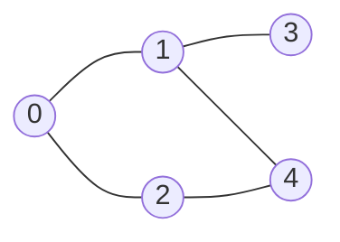

# DFS (Depth-First Search, 깊이 우선 탐색)

> **한 줄 요약**: 갈 수 있는 데까지 한 길로 깊이 들어갔다가, 막히면 되돌아와 다른 길을 가는 탐색. **재귀나 스택**으로 구현한다.

## 1. 언제 쓰나 (문제 신호)

- "**갈 수 있는가**", "연결된 덩어리의 개수/크기", "모든 경우를 끝까지 따라가 보기"
- **경로 자체**나 **구조**(사이클, 서브트리, 방문 순서/시각)가 필요한 문제
- [백트래킹](../../07-algorithm-paradigms/backtracking/), [위상 정렬](../../../lv2-intermediate/02-graph-algorithms/topological-sort/), [SCC](../../../lv3-advanced/03-graph-advanced/scc/), [단절점](../../../lv3-advanced/03-graph-advanced/articulation-and-bridges/) 같은 알고리즘의 뼈대

**최단 거리**(간선 수가 가장 적은 경로)가 필요하면 DFS가 아니라 [BFS](../bfs/)입니다.

## 2. 핵심 아이디어

1. 시작 정점을 **방문 처리**하고 이웃을 하나씩 봅니다.
2. 아직 방문하지 않은 이웃이 있으면 **그 이웃으로 들어가서 같은 일을 반복**합니다. (재귀 호출)
3. 이웃을 모두 보면 **되돌아갑니다.**

**방문 표시가 핵심**입니다. 사이클이 있는 그래프에서 표시 없이는 영원히 돕니다. 각 정점을 한 번씩만 방문하므로 O(V + E)입니다.

**재귀 vs 스택**: 재귀 호출이 쌓이는 것과 같은 일을 직접 만든 스택으로 할 수 있습니다. 파이썬의 재귀는 깊이 1000이 한계(기본값)이므로, 정점이 많은 그래프나 깊은 경로 모양에서는 **스택 버전**이 안전합니다. 같은 방문 순서를 내려면 이웃을 **뒤집어서** 스택에 넣고, 정점을 **꺼낼 때** 방문 확인을 합니다.

**발견·종료 시각**: 각 정점을 처음 만난 시각 `discovered`와 모든 후손을 다 본 시각 `finished`를 기록하면 괄호 구조가 됩니다. v가 u의 후손이면 `discovered[u] < discovered[v] < finished[v] < finished[u]`입니다. 이 시각이 [위상 정렬](../../../lv2-intermediate/02-graph-algorithms/topological-sort/), SCC, 단절점의 재료입니다.

### 무엇을 저장하고 어떻게 움직이나

깊이 우선 탐색은 현재 정점에서 아직 방문하지 않은 이웃을 따라 가능한 한 깊게 들어갔다가 돌아옵니다. 방문 상태 외에 진입 시각·종료 시각·부모를 저장하면 탐색 구조를 여러 문제에 재사용할 수 있습니다.

### 왜 이 방법이 맞는가

정점에 처음 도착했을 때 표시하면 사이클에서도 같은 정점을 반복 처리하지 않습니다. 각 정점의 인접 간선을 한 번씩 훑어 도달 가능한 모든 정점을 방문합니다. 반복형 DFS에서 재귀의 종료 시점까지 재현하려면 다음 이웃 위치나 종료 이벤트도 스택에 저장해야 합니다.

### 작은 예제로 검산하기

A-B-C와 A-D 간선에서 재귀 DFS는 A, B, C를 방문한 뒤 B와 A로 돌아와 D를 봅니다. 스택에 이웃을 넣는 순서가 방문 순서를 바꿀 수 있습니다. 도달 가능성만 필요할 때와 정확한 순회 순서가 필요할 때를 구분하세요.

## 3. 손으로 따라가기



`adj = [[1, 2], [0, 3, 4], [0, 4], [1], [1, 2]]`, 시작 0. (스택 버전)

| 꺼낸 정점 | 하는 일 | 스택 (오른쪽이 위) | 방문 순서 |
|---|---|---|---|
| 시작 | 스택에 0 | `[0]` | |
| 0 | 방문. 이웃 2, 1을 뒤집어 넣음 | `[2, 1]` | 0 |
| 1 | 방문. 이웃 4, 3을 뒤집어 넣음 (0은 방문함) | `[2, 4, 3]` | 0 1 |
| 3 | 방문. 이웃 1은 방문함 | `[2, 4]` | 0 1 3 |
| 4 | 방문. 이웃 2를 넣음 (1은 방문함) | `[2, 2]` | 0 1 3 4 |
| 2 | 방문. 이웃은 모두 방문함 | `[2]` | 0 1 3 4 2 |
| 2 | 이미 방문 → 건너뜀 | `[]` | 0 1 3 4 2 |

방문 순서는 `0, 1, 3, 4, 2`이고 재귀 버전과 같습니다. 스택에 `2`가 두 번 들어가므로 **꺼낼 때 방문 확인**이 필요합니다.

**발견·종료 시각** (`dfs_times`): `discovered = [0, 1, 5, 2, 4]`, `finished = [9, 8, 6, 3, 7]`. 예를 들어 3은 `[2, 3]`, 1은 `[1, 8]`이고 `[2, 3]`이 `[1, 8]` 안에 들어가 있으니 3은 1의 후손입니다.

## 4. 구현

전체 코드는 [solution.py](solution.py)에 있습니다.

```python
def dfs_recursive(adj, start):
    visited = [False] * len(adj)
    order = []
    def visit(u):
        visited[u] = True
        order.append(u)
        for v in adj[u]:
            if not visited[v]:
                visit(v)
    visit(start)
    return order

def dfs_iterative(adj, start):
    visited = [False] * len(adj)
    order, stack = [], [start]
    while stack:
        u = stack.pop()
        if visited[u]:                       # 같은 정점이 스택에 여러 번 들어갈 수 있다
            continue
        visited[u] = True
        order.append(u)
        for v in reversed(adj[u]):           # 첫 이웃이 가장 나중에 들어가야 먼저 나온다
            if not visited[v]:
                stack.append(v)
    return order
```

`dfs_times`(발견·종료 시각), `reachable`, `has_path`도 있습니다. 직접 실행하면 `V E S`와 간선을 받아 S에서 시작한 DFS 순서를 출력합니다.

## 5. 복잡도와 입력 크기 가이드

- **시간 O(V + E)**: 정점은 한 번씩, 간선은 (무방향이면 양쪽에서) 훑습니다.
- **공간 O(V)**: 방문 배열과 스택(또는 재귀 깊이).
- V, E가 10^5~10^6이면 반드시 스택 버전을 쓰고, 입력은 빠르게 읽으세요. ([파이썬으로 PS 하기](../../../docs/python-for-ps.md))

## 6. 자주 하는 실수

- **방문 표시 누락**: 사이클이 있으면 무한 반복(또는 `RecursionError`)입니다.
- **스택에 넣을 때 방문 처리**: 순서가 재귀 DFS와 달라집니다. 이 구현처럼 꺼낼 때 방문 처리하면 같은 순서입니다.
- **재귀 깊이 제한**: 정점 수가 큰 경로형 그래프에서 `RecursionError`. 이 저장소의 테스트가 5만 정점으로 재귀가 실패함을 확인합니다.
- **이웃 방문 순서**: 문제가 "작은 번호부터"라고 하면 인접 리스트를 정렬하세요.
- **연결되지 않은 그래프**: 한 번의 DFS는 시작점에서 갈 수 있는 정점만 봅니다. 모든 정점을 보려면 방문하지 않은 정점마다 새로 시작하세요. (`dfs_times`처럼)

## 7. 변형과 응용

- **연결 요소 세기**: 방문하지 않은 정점마다 DFS를 한 번씩 시작 → [연결 요소](../connected-components/)
- **격자 탐색**: 칸이 정점 → [격자 탐색](../grid-search/)
- **사이클 판별**: 방문 중인 정점을 다시 만나면 사이클 → [연결 요소](../connected-components/)의 `has_cycle`
- **위상 정렬, SCC, 단절점**: 종료 시각을 이용 → [Lv2](../../../lv2-intermediate/02-graph-algorithms/topological-sort/), [Lv3](../../../lv3-advanced/03-graph-advanced/scc/)

## 8. 연습문제

[problems.md](problems.md)에 쉬운 것부터 어려운 순서로 정리했습니다.

## 9. 다음 단계

- 선행: [그래프](../graph/), [스택](../../01-data-structures/stack/)
- 이어서: [BFS](../bfs/), [트리 순회](../tree-traversal/), [연결 요소](../connected-components/), [백트래킹](../../07-algorithm-paradigms/backtracking/)
