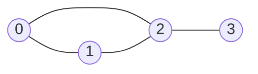

# Graph (그래프)

> **한 줄 요약**: 정점(점)과 간선(점을 잇는 선)으로 "관계"를 나타내는 구조. 코드에서는 **인접 리스트**로 담는 것이 기본이다.

## 1. 언제 쓰나 (문제 신호)

- "도시와 도로", "사람과 친구 관계", "작업과 선후 관계", "컴퓨터와 네트워크" 처럼 **대상들 사이의 연결**이 문제의 중심일 때
- 격자나 상태 전이도 그래프로 볼 수 있습니다. (칸 = 정점, 이동 = 간선)
- 그래프를 **어떻게 코드로 담을지**가 이후 모든 그래프 알고리즘([DFS](../dfs/), [BFS](../bfs/), [다익스트라](../../../lv2-intermediate/01-shortest-path/dijkstra/) …)의 출발점입니다.

## 2. 핵심 아이디어

**용어**: 정점(vertex), 간선(edge), 인접(두 정점이 간선으로 직접 이어짐), 차수(정점에 붙은 간선 수). **무방향** 간선은 양쪽으로 오갈 수 있고, **방향** 간선은 한쪽으로만 갑니다. 간선에 **가중치**(거리, 비용)가 붙을 수 있습니다.

세 가지 표현이 있습니다.

| 표현 | 담는 법 | 메모리 | `u-v` 간선이 있나 | `u`의 이웃 훑기 |
|---|---|---|---|---|
| **간선 목록** | `[(u, v, w), ...]` | O(E) | O(E) | O(E) |
| **인접 행렬** | `matrix[u][v]` = 가중치 (없으면 0/INF) | **O(V²)** | **O(1)** | O(V) |
| **인접 리스트** | `adj[u] = [이웃, ...]` | O(V + E) | O(차수) | **O(차수)** |

- **인접 리스트**가 기본입니다. 간선이 적은 그래프(희소 그래프)에서 메모리와 이웃 훑기가 모두 효율적이고, DFS·BFS·다익스트라가 모두 "이웃을 훑는" 연산을 쓰기 때문입니다.
- **인접 행렬**은 V가 작고(≤ 수백) 간선이 많거나, "두 정점이 이어졌나"를 O(1)에 자주 물을 때 씁니다. [플로이드-워셜](../../../lv2-intermediate/01-shortest-path/floyd-warshall/)이 대표적입니다.
- **간선 목록**은 간선을 정렬하거나 하나씩 처리할 때 씁니다. ([크루스칼](../../../lv2-intermediate/02-graph-algorithms/kruskal/))

**무방향 간선**은 인접 리스트에 **양쪽**으로 넣습니다. (`adj[u]`에 `v`, `adj[v]`에 `u`)

## 3. 손으로 따라가기

정점 4개, 무방향 간선 4개: `(0,1) (0,2) (1,2) (2,3)`



| 표현 | 내용 |
|---|---|
| 인접 리스트 | `adj = [[1, 2], [0, 2], [0, 1, 3], [2]]` |
| 인접 행렬 | `[[0,1,1,0], [1,0,1,0], [1,1,0,1], [0,0,1,0]]` |
| 차수 | `[2, 2, 3, 1]` (합 = 8 = 2 × 간선 수) |

무방향 그래프에서는 **차수의 합 = 2 × 간선 수**이고, 인접 행렬은 대각선을 기준으로 **대칭**입니다. 방향 그래프에서는 진입 차수의 합 = 진출 차수의 합 = 간선 수입니다.

## 4. 구현

전체 코드는 [solution.py](solution.py)에 있습니다.

```python
def build_adjacency_list(n, edges, directed=False):
    adj = [[] for _ in range(n)]
    for u, v in edges:
        adj[u].append(v)
        if not directed and u != v:        # 무방향이면 반대쪽에도 넣는다 (자기 간선은 한 번만)
            adj[v].append(u)
    return adj
```

가중치가 있으면 `adj[u].append((v, w))`로 쌍을 넣습니다. (`build_weighted_adjacency_list`) 정점 번호가 1부터 주어지면 배열을 `n + 1` 크기로 만들거나 입력을 읽을 때 1을 빼서 0부터 씁니다.

## 5. 복잡도와 입력 크기 가이드

- 인접 리스트를 만드는 데 O(V + E), 메모리도 O(V + E)입니다.
- 인접 행렬은 V = 10^4이면 10^8칸이라 메모리가 불가능합니다. V ≤ 500 안팎에서만 쓰세요. ([복잡도 치트시트](../../../docs/complexity-cheatsheet.md))
- 파이썬에서 인접 리스트를 만들 때 간선 수가 10^6이면 입력 읽기가 병목입니다. ([빠른 입출력](../../../lv0-basics/04-io-and-complexity/fast-io/))

## 6. 자주 하는 실수

- **무방향인데 한쪽만 추가**: 반대쪽을 빼먹으면 한 방향으로만 탐색됩니다.
- **정점 번호 기준(0부터/1부터)**: 입력이 1부터인데 `n` 크기 배열을 쓰면 `IndexError`가 납니다.
- **인접 행렬의 0 의미**: 가중치가 0인 간선이 있을 수 있으면 0을 "간선 없음"으로 쓸 수 없습니다. `INF`를 쓰세요.
- **큰 V에 인접 행렬**: 메모리 초과.
- **중복 간선과 자기 간선**: 문제가 허용하는지 확인하세요. 인접 리스트에는 중복이 그대로 쌓이고, 행렬에는 마지막 값만 남습니다.
- (이 저장소의 이전 문서) 인접 리스트 예제의 리스트 리터럴에 쉼표가 빠져 있었습니다. 이 버전에서 고쳤고 테스트가 실행합니다.

## 7. 변형과 응용

- 가중치가 있는 그래프의 최단 경로 → [다익스트라](../../../lv2-intermediate/01-shortest-path/dijkstra/)
- 트리는 사이클이 없는 연결 그래프입니다. → [트리](../tree/)
- 격자를 그래프로 보기 → [격자 탐색](../grid-search/)
- 연결된 덩어리 세기 → [연결 요소](../connected-components/)

## 8. 연습문제

[problems.md](problems.md)에 쉬운 것부터 어려운 순서로 정리했습니다.

## 9. 다음 단계

- 선행: [배열](../../../lv0-basics/01-data-structures/array/)
- 이어서: [트리](../tree/), [DFS](../dfs/), [BFS](../bfs/)
