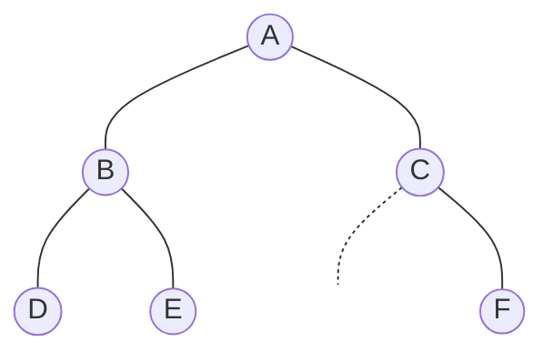

# Tree Traversal (트리 순회)

> **한 줄 요약**: 이진 트리의 모든 노드를 한 번씩, **정해진 순서**(전위·중위·후위·레벨)로 방문하는 방법. 두 가지 순회 결과만 있으면 트리를 복원할 수 있다.

## 1. 언제 쓰나 (문제 신호)

- "전위/중위/후위 순회 결과를 출력하라", "순회 결과로 트리를 복원하라"
- **이진 탐색 트리**에서 값을 정렬된 순서로 꺼낼 때 (중위 순회)
- 자식의 결과를 모아 부모를 계산하는 문제(후위), 부모부터 처리하는 문제(전위)

## 2. 핵심 아이디어

루트(R), 왼쪽 서브트리(L), 오른쪽 서브트리(R′)를 어떤 순서로 방문하느냐입니다. 서브트리도 같은 규칙으로 재귀합니다.

| 순회 | 순서 | 특징 |
|---|---|---|
| 전위(preorder) | R → L → R′ | 부모가 자식보다 먼저. **첫 원소가 루트** |
| 중위(inorder) | L → R → R′ | 이진 탐색 트리에서는 **오름차순** |
| 후위(postorder) | L → R′ → R | 자식이 부모보다 먼저. **마지막 원소가 루트** |
| 레벨(level order) | 위에서 아래로, 왼쪽에서 오른쪽으로 | [BFS](../bfs/)와 같다 |

**트리 복원**: 전위(또는 후위) 순회로 **루트**를 알고, 중위 순회에서 루트의 위치를 찾으면 그 **왼쪽이 왼쪽 서브트리, 오른쪽이 오른쪽 서브트리**입니다. 이를 재귀로 반복하면 트리가 복원됩니다. (전위 + 중위, 후위 + 중위. 전위 + 후위만으로는 모양이 정해지지 않을 수 있습니다)

## 3. 손으로 따라가기



(C의 왼쪽 자식은 없고 오른쪽 자식이 F입니다.)

| 순회 | 결과 | 읽는 법 |
|---|---|---|
| 전위 | `A B D E C F` | A를 먼저, 그다음 B의 서브트리(B D E), 그다음 C의 서브트리(C F) |
| 중위 | `D B E A C F` | 왼쪽 서브트리(D B E), A, 오른쪽 서브트리(C F) |
| 후위 | `D E B F C A` | B의 서브트리(D E B), C의 서브트리(F C), 마지막에 A |
| 레벨 | `A B C D E F` | 깊이 0, 1, 2 순서 |

**복원** 전위 `A B D E C F`, 중위 `D B E A C F`:
1. 전위의 첫 원소 `A`가 루트. 중위에서 `A`의 왼쪽 `D B E`는 왼쪽 서브트리, 오른쪽 `C F`는 오른쪽 서브트리.
2. 전위에서 `A` 다음 `B`가 왼쪽 서브트리의 루트. 중위 `D B E`에서 `B` 왼쪽 `D`, 오른쪽 `E`.
3. 다음 `D`, `E`는 각각 리프. 그다음 `C`가 오른쪽 서브트리의 루트. 중위 `C F`에서 `C` 왼쪽은 없고 오른쪽 `F`.

## 4. 구현

전체 코드는 [solution.py](solution.py)에 있습니다. 트리는 `tree[노드] = (왼쪽, 오른쪽)` 딕셔너리이고 자식이 없으면 `None`입니다.

```python
def preorder(tree, root):
    if root is None:
        return []
    left, right = tree[root]
    return [root] + preorder(tree, left) + preorder(tree, right)

def inorder_iterative(tree, root):            # 재귀 없이 스택으로
    result, stack, node = [], [], root
    while node is not None or stack:
        while node is not None:               # 왼쪽 끝까지 내려가며 쌓는다
            stack.append(node)
            node = tree[node][0]
        node = stack.pop()
        result.append(node)
        node = tree[node][1]                  # 꺼낸 뒤 오른쪽으로
    return result
```

`postorder`, `level_order`, `build_from_preorder_inorder`, `build_from_postorder_inorder`도 있습니다. 직접 실행하면 `N`과 `노드 왼쪽 오른쪽` 줄(없으면 `.`)을 받아 세 가지 순회 결과를 출력합니다. 루트는 `A`입니다.

## 5. 복잡도와 입력 크기 가이드

- 순회는 모든 노드를 한 번씩 보므로 **O(n)**, 추가 공간은 트리의 높이 **O(h)** (재귀 깊이 또는 스택)입니다.
- 한쪽으로 치우친 트리는 높이가 n이 되어 재귀 깊이 제한(기본 1000)에 걸립니다. 노드가 많으면 반복문 버전을 쓰거나 한계를 확인하세요.
- 이 구현은 리스트를 이어 붙여 만들어서 편하지만 깊은 트리에서는 O(n²)이 될 수 있습니다. 큰 입력에서는 결과 리스트에 `append`하는 방식이 좋습니다.

## 6. 자주 하는 실수

- **순서 혼동**: 중위는 `L → R → R′`입니다. 이름의 "전/중/후"는 **루트를 언제 방문하는지**입니다.
- **빈 서브트리 처리**: 자식이 `None`일 때 기저 조건(빈 리스트 반환)이 필요합니다.
- **복원 시 값 중복**: 노드 값이 서로 달라야 중위에서 루트의 위치를 유일하게 찾을 수 있습니다.
- **전위 + 후위로 복원 시도**: 모양이 하나로 정해지지 않을 수 있습니다. (자식이 하나뿐인 노드가 있으면 왼쪽/오른쪽을 알 수 없다)
- **복원 재귀 순서**: 전위 + 중위에서는 왼쪽을 먼저, 후위 + 중위에서는 **오른쪽을 먼저** 만들어야 인덱스가 맞습니다.

## 7. 변형과 응용

- **이진 탐색 트리**: 중위 순회 = 정렬된 값. 전위 순회만으로도 BST를 복원할 수 있습니다. ([이진 탐색 트리](../../../lv2-intermediate/03-trees/binary-search-tree/))
- **서브트리 값 모으기**: 후위 순회에서 자식의 결과로 부모를 계산 → [트리 DP](../../../lv2-intermediate/03-trees/tree-dp/)
- **일반 트리 순회**: 자식이 여러 개인 트리의 DFS는 전위/후위가 같은 아이디어 → [DFS](../dfs/), [트리](../tree/)

## 8. 연습문제

[problems.md](problems.md)에 쉬운 것부터 어려운 순서로 정리했습니다.

## 9. 다음 단계

- 선행: [트리](../tree/), [DFS](../dfs/)
- 이어서: [이진 탐색 트리](../../../lv2-intermediate/03-trees/binary-search-tree/), [트리 DP](../../../lv2-intermediate/03-trees/tree-dp/)
