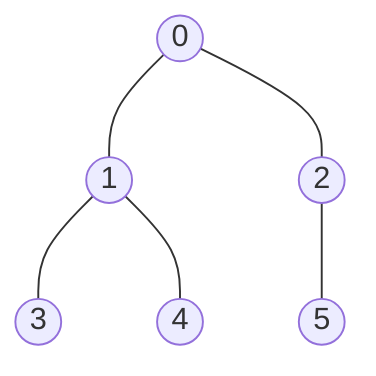

# Tree (트리)

> **한 줄 요약**: 사이클이 없고 모든 정점이 연결된 그래프. 정점이 n개면 간선은 정확히 n−1개이고, **루트**를 정하면 부모–자식 관계가 생긴다.

## 1. 언제 쓰나 (문제 신호)

- "N개의 노드와 N−1개의 간선", "사이클이 없다", "루트가 1번", "부모 노드", "서브트리", "깊이"
- 계층 구조(조직도, 폴더, 가계도)나, 두 점 사이 경로가 **정확히 하나**인 구조
- [트리 순회](../tree-traversal/), [트리 DP](../../../lv2-intermediate/03-trees/tree-dp/), [LCA](../../../lv3-advanced/03-graph-advanced/lca/) 같은 트리 알고리즘의 바탕

## 2. 핵심 아이디어

**트리의 성질**: 정점 n개, 간선 n−1개, 연결되어 있고 사이클이 없음 — 이 중 (연결 + n−1개)이면 사이클이 자동으로 없습니다. 두 정점 사이의 경로는 유일합니다.

**루트 정하기**: 입력은 보통 무방향 간선 목록입니다. 루트에서 BFS(또는 DFS)를 하면서 **처음 도착할 때의 이웃을 부모**로 기록하면 방향이 정해집니다.

| 용어 | 뜻 |
|---|---|
| 부모 / 자식 | 루트에 가까운 쪽이 부모 |
| 리프(잎) | 자식이 없는 정점 |
| 깊이 | 루트에서 그 정점까지의 간선 수 (루트는 0) |
| 서브트리 | 그 정점과 모든 후손 |

BFS 방문 순서(`order`)는 **부모가 항상 자식보다 앞**에 옵니다. 그래서 `order`를 **앞에서부터** 훑으면 깊이를 구하고(부모의 깊이 + 1), **뒤에서부터** 훑으면 서브트리 크기를 구할 수 있습니다(자식의 크기를 부모에 더하기). 재귀가 필요 없어서 깊은 트리에서도 안전합니다.

## 3. 손으로 따라가기

간선 `(0,1) (0,2) (1,3) (1,4) (2,5)`, 루트 0:



| 정점 | 0 | 1 | 2 | 3 | 4 | 5 |
|---|---|---|---|---|---|---|
| 부모 | -1 | 0 | 0 | 1 | 1 | 2 |
| 깊이 | 0 | 1 | 1 | 2 | 2 | 2 |
| 서브트리 크기 | 6 | 3 | 2 | 1 | 1 | 1 |

BFS 순서는 `[0, 1, 2, 3, 4, 5]`. 서브트리 크기는 뒤에서부터 올라가며 구합니다: `5 → 2`에 1을 더해 `size[2] = 2`, `4, 3 → 1`에 각각 1을 더해 `size[1] = 3`, `2, 1 → 0`에 더해 `size[0] = 1 + 3 + 2 = 6`.

## 4. 구현

전체 코드는 [solution.py](solution.py)에 있습니다.

```python
def build_rooted_tree(n, edges, root=0):
    adj = _adjacency(n, edges)
    parent = [-1] * n
    children = [[] for _ in range(n)]
    order = [root]
    seen = [False] * n
    seen[root] = True
    for u in order:                      # order 에 추가하면서 훑으면 BFS
        for v in adj[u]:
            if not seen[v]:
                seen[v] = True
                parent[v] = u
                children[u].append(v)
                order.append(v)
    return parent, children, order

def subtree_sizes(parent, order):
    size = [1] * len(parent)
    for v in reversed(order):            # 자식이 부모보다 먼저 처리된다
        if parent[v] != -1:
            size[parent[v]] += size[v]
    return size
```

그 밖에 `is_tree`(간선이 n−1개이고 연결됐는지), `depths`, `leaves`, `path_to_root`가 있습니다. 직접 실행하면 `N`과 간선을 받아 1번을 루트로 한 부모를 출력합니다.

## 5. 복잡도와 입력 크기 가이드

- 루트 정하기, 깊이, 서브트리 크기 모두 **O(V)** 입니다. 간선이 n−1개뿐이라 O(V + E) = O(V).
- N = 10^5~10^6의 트리도 반복문으로 안전하게 다룹니다. 재귀로 하면 한쪽으로 치우친 트리(경로 모양)에서 깊이 제한에 걸립니다. ([파이썬으로 PS 하기](../../../docs/python-for-ps.md))

## 6. 자주 하는 실수

- **방향이 있는 줄 알기**: 입력 간선 `u v`에서 `u`가 부모라는 보장이 없습니다. 무방향으로 담고 루트에서 탐색해 방향을 정하세요.
- **부모로 되돌아가기**: 무방향이라 자식의 이웃에 부모가 있습니다. `seen`(또는 부모 비교)으로 걸러야 합니다.
- **재귀 깊이**: 깊은 트리에서 재귀 DFS는 `RecursionError`가 납니다. BFS 순서나 반복문 DFS를 쓰세요.
- **루트 번호**: 문제의 루트가 1번인지 확인하세요.
- **n−1개 간선만으로 트리라고 단정**: 연결되지 않으면 트리가 아닙니다. (사이클 + 떨어진 정점이 있는 경우)

## 7. 변형과 응용

- **트리의 지름**: 가장 먼 두 정점 사이의 거리 → [트리의 지름](../../../lv2-intermediate/03-trees/tree-diameter/)
- **트리 위의 DP**: 서브트리 값을 자식에서 부모로 모으는 방식 → [트리 DP](../../../lv2-intermediate/03-trees/tree-dp/)
- **이진 트리**의 순회와 복원 → [트리 순회](../tree-traversal/)
- **가장 가까운 공통 조상(LCA)** → [LCA](../../../lv3-advanced/03-graph-advanced/lca/)

## 8. 연습문제

[problems.md](problems.md)에 쉬운 것부터 어려운 순서로 정리했습니다.

## 9. 다음 단계

- 선행: [그래프](../graph/)
- 이어서: [트리 순회](../tree-traversal/), [DFS](../dfs/), [BFS](../bfs/)
