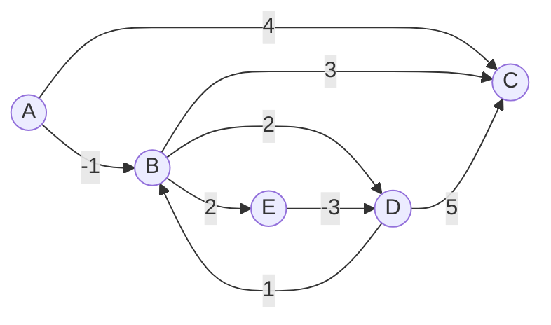

# Bellman-Ford Algorithm (벨만-포드 알고리즘)

> **한 줄 요약**: 모든 간선을 훑어 거리를 줄이는 일을 V−1번 반복하면 음수 간선이 있어도 최단 거리가 확정된다. V번째 반복에서도 줄어들면 음수 사이클이 있다는 뜻이다.

## 1. 언제 쓰나 (문제 신호)

- 간선 가중치에 **음수**가 있다 (손해, 할인, 시간을 되돌리기 등).
- "**음수 사이클이 있는가**", "무한히 줄어드는가" (예: 타임머신으로 무한히 과거로 갈 수 있는가)
- V가 수백~수천, E가 수천~수만 정도로 작다. O(VE)는 크기가 크면 느립니다.
- 환율 차익 거래처럼 `곱`을 `log`의 `합`으로 바꿨을 때 음수 사이클이 차익을 뜻하는 문제

가중치가 모두 0 이상이면 [다익스트라](../dijkstra/)가 더 빠릅니다. 모든 정점 쌍이 필요하면 [플로이드-워셜](../floyd-warshall/)입니다.

## 2. 핵심 아이디어

**완화(relax)**: 간선 `u → v`(가중치 `w`)를 보고 `dist[u] + w < dist[v]`이면 `dist[v]`를 `dist[u] + w`로 줄입니다. 다익스트라도 같은 연산을 씁니다.

시작점에서 어떤 정점까지의 최단 경로는 (음수 사이클이 없다면) 같은 정점을 두 번 지나지 않으므로 **간선이 최대 V−1개**입니다. 그러면

> **모든 간선을 한 번씩 완화하는 "라운드"를 V−1번 하면, 간선이 k개인 최단 경로는 k번째 라운드까지 확정된다.**

(1번 라운드가 끝나면 간선 1개로 닿는 최단 거리가, 2번 라운드가 끝나면 간선 2개 이하로 닿는 최단 거리가 확정되는 식입니다. 간선을 훑는 순서가 나쁘면 한 라운드에 한 칸씩만 진행하므로 V−1번이 필요하고, 순서가 좋으면 더 빨리 끝납니다.)

**음수 사이클 탐지**: V−1번 뒤에도 어떤 간선이 완화되면, 최단 경로의 간선 수가 V−1을 넘는다는 뜻이므로 **음수 사이클**이 있습니다. 그래서 라운드를 V번까지 돌리고 V번째에 갱신이 있는지 봅니다. (음수 사이클이 시작점에서 도달 가능할 때만 영향이 나타납니다.)

**조기 종료**: 한 라운드 동안 아무 간선도 완화되지 않으면 이미 확정입니다. 대부분의 입력은 V−1번보다 훨씬 빨리 끝납니다.

### 무엇을 저장하고 어떻게 움직이나

거리 완화는 간선 u→v에서 `dist[u]+w`가 더 작으면 v의 후보를 바꾸는 일입니다. 모든 간선을 반복해 확인하면 경로의 간선 수가 늘어날 때 필요한 정보가 전달됩니다. 음수 비용을 허용하되 도달 가능성과 음의 사이클을 따로 처리합니다.

### 왜 이 방법이 맞는가

음의 사이클이 없는 최단 경로는 같은 정점을 반복할 필요가 없어 최대 V-1개의 간선으로 표현됩니다. V-1번의 전체 완화 후에도 개선이 가능한 도달 정점은 음의 사이클의 영향을 받습니다. 도달 불가능한 정점에서의 완화는 막아야 합니다.

### 작은 예제로 검산하기

A→B가 4, B→C가 -3이면 A→C는 1입니다. B→C를 먼저 검사해도 다음 반복에서 A→B의 정보가 전달됩니다. 음의 사이클이 존재하더라도 시작점에서 도달하지 못하면 그 시작점의 거리에는 영향을 주지 않습니다.

## 3. 손으로 따라가기

다음 그래프에서 A로부터의 최단 거리를 구합니다. 간선은 아래 순서대로 훑습니다.



간선 순서: `A→B, A→C, B→C, B→D, B→E, D→B, D→C, E→D`. 거리는 `[A, B, C, D, E]` 순서입니다.

| 라운드 | 거리 | 바뀌었나 |
|---|---|---|
| 시작 | `[0, ∞, ∞, ∞, ∞]` | |
| 1 | `[0, -1, 2, -2, 1]` | 예 |
| 2 | `[0, -1, 2, -2, 1]` | 아니오 → 종료 |

1라운드 안에서도 `A→B`(B=−1), `B→C`(C: 4 → **2**), `B→D`(D=1), `B→E`(E=1), 마지막 `E→D`(D: 1 → **−2**)로 연쇄 갱신이 일어났습니다. 간선을 훑는 순서가 좋았기 때문에 한 라운드에 끝났습니다.

**같은 간선을 역순으로 훑으면**: `E→D, D→C, D→B, B→E, B→D, B→C, A→C, A→B`

| 라운드 | 거리 | 바뀌었나 |
|---|---|---|
| 1 | `[0, -1, 4, ∞, ∞]` | 예 (A에서 나가는 간선이 맨 끝이라 두 개만 갱신) |
| 2 | `[0, -1, 2, 1, 1]` | 예 |
| 3 | `[0, -1, 2, -2, 1]` | 예 |
| 4 | `[0, -1, 2, -2, 1]` | 아니오 → 종료 |

최단 경로 `A→B→E→D`가 간선 3개라서 정확히 3라운드가 필요했습니다.

**음수 사이클**: `C→A` (−5)를 추가하면 `A→B→C→A`의 합이 `−1 + 3 − 5 = −3`이라 돌 때마다 줄어듭니다.

| 라운드 | 거리 |
|---|---|
| 1 | `[-3, -1, 2, -2, 1]` |
| 2 | `[-6, -4, -1, -5, -2]` |
| 3 | `[-9, -7, -4, -8, -5]` |
| … | 라운드마다 3씩 계속 줄어든다 |

V = 5번째 라운드에도 갱신되므로 음수 사이클입니다. (이 예제는 [테스트](test_solution.py)의 `README_EDGES`로 검증됩니다.)

## 4. 구현

전체 코드는 [solution.py](solution.py)에 있습니다.

```python
def bellman_ford(n, edges, start):
    dist = [INF] * n
    dist[start] = 0
    for _ in range(n):                   # 마지막(n 번째) 라운드는 음수 사이클 확인용
        changed = False
        for u, v, w in edges:
            if dist[u] + w < dist[v]:    # inf + w = inf 라서 닿지 않은 정점은 갱신되지 않는다
                dist[v] = dist[u] + w
                changed = True
        if not changed:                  # 조기 종료
            return dist, False
    return dist, True                    # n 번째 라운드에도 갱신 → 음수 사이클
```

- 그래프는 **간선 목록** `[(u, v, w), ...]`으로 받습니다. 정점 번호는 0부터입니다.
- `negative_cycle`이 `True`이면 `dist`는 믿을 수 없습니다.
- `INF`를 `float("inf")`로 두어서 `inf + w`가 `inf`를 유지합니다. **큰 정수**(예: `10**9`)로 INF를 쓰면 `INF + 음수 < INF`가 되어 닿지 않은 정점이 거짓으로 갱신되므로 `dist[u] != INF` 검사가 필요합니다.
- `bellman_ford_with_prev`와 `restore_path`: 경로 복원. 음수 사이클이 없을 때만 올바릅니다.
- `find_negative_cycle(n, edges)`: **어느 곳이든** 음수 사이클이 있으면 그 사이클의 정점 목록을 돌려줍니다. 모든 정점의 거리를 0으로 시작해 "모든 정점으로 가는 가상의 시작점"을 둔 것과 같습니다. V번째 라운드에 갱신된 정점에서 `prev`를 V번 거슬러 올라가면 사이클 안에 들어갑니다.
- `spfa`: 큐를 이용해 거리가 줄어든 정점만 다시 보는 개선판입니다. 평균은 빠르지만 최악은 같습니다.
- 직접 실행하면 `N M`과 `A B C`(M줄)를 받아 1번 정점에서 2~N번 정점까지의 거리를 출력합니다. (음수 사이클이면 `-1`, 닿지 않으면 `-1`)

## 5. 복잡도와 입력 크기 가이드

- **시간 O(VE)**, 공간 O(V) (거리 배열. 간선 목록은 입력). 조기 종료로 평균은 훨씬 빠릅니다.
- 이 환경에서 측정한 값입니다. ([복잡도 치트시트](../../../docs/complexity-cheatsheet.md))

| 입력 | 시간 |
|---|---|
| V=500, E=6,000, 음수 간선이 있고 사이클이 없음 (랜덤) | 0.004초 (조기 종료) |
| V=1,000, E=20,000 (랜덤) | 0.014초 |
| 간선을 역순으로 준 경로 V=2,000 (V−1 라운드 필요) | 0.22초 |
| V=500, E=6,000, **음수 사이클** (V 라운드를 모두 돈다, 약 300만 번 완화) | 0.23초 |

- V·E가 1,000만을 넘으면 CPython에서는 느려집니다. PyPy3나 SPFA를 고려하세요. ([파이썬으로 PS 하기](../../../docs/python-for-ps.md))

## 6. 자주 하는 실수

- **음수 사이클이 도달 가능한지 확인하지 않음**: 시작점에서 닿지 않는 음수 사이클은 답에 영향이 없습니다. 이 구현은 시작점에서 닿는 것만 보고합니다(`test_negative_cycle_unreachable_from_start_is_not_reported`). 반대로 "어디든 있는가"를 묻는다면 `find_negative_cycle`입니다.
- **INF를 큰 정수로 두고 검사 누락**: 위 4절 참고. 닿지 않은 정점에서 음수 간선으로 거짓 갱신이 일어납니다.
- **라운드를 V−1번만 돌리고 사이클 확인 생략**: V번째에 갱신이 있는지 봐야 합니다.
- **무방향 그래프의 음수 간선**: 무방향 음수 간선 하나가 곧 음수 사이클(양쪽으로 왕복)이 됩니다. 방향 그래프에서만 의미가 있습니다.
- **합이 0인 사이클을 음수로 착각**: `<`로 비교하므로 합이 0인 사이클은 갱신을 일으키지 않아 정상입니다.
- **SPFA를 만능으로 믿음**: 평균은 빠르지만 격자 같은 입력에서 최악이 나올 수 있습니다. 음수 간선이 없다면 다익스트라가 안전합니다.
- **dist 오버플로**: 음수 사이클이 있을 때 값이 계속 줄어듭니다. 파이썬은 오버플로가 없지만 다른 언어에서는 주의하세요.

## 7. 변형과 응용

- **음수 사이클 구하기**: `find_negative_cycle`. 환율 차익, 무한 이득 문제
- **음수 사이클의 영향 범위**: 사이클에서 닿는 정점은 −∞입니다. 라운드를 V번 더 돌려 계속 갱신되는 정점을 −∞로 표시합니다.
- **제약 조건 시스템(차분 제약)**: `x_v − x_u ≤ w` 형태의 부등식 묶음을 간선 `u → v`(w)로 바꿔 풀면 해의 존재(음수 사이클 없음)와 한 해를 구할 수 있습니다.
- **정확히 k개의 간선**: 라운드 수를 k로 제한하고, 이전 라운드의 값만 읽도록 복사본을 씁니다. (K번 이내 경유 문제)
- **존슨 알고리즘**: 음수 간선이 있는 그래프에서 모든 쌍을 구할 때 벨만-포드로 퍼텐셜을 구하고 다익스트라를 V번 돌립니다. (V가 크고 E가 작을 때)

## 8. 연습문제

[problems.md](problems.md)에 쉬운 것부터 어려운 순서로 정리했습니다.

## 9. 다음 단계

- 선행: [그래프](../../../lv1-elementary/05-graph-basics/graph/), [다익스트라](../dijkstra/)
- 이어서: [플로이드-워셜](../floyd-warshall/) (모든 쌍), [위상 정렬](../../02-graph-algorithms/topological-sort/) (DAG에서는 음수 간선도 O(V+E))
