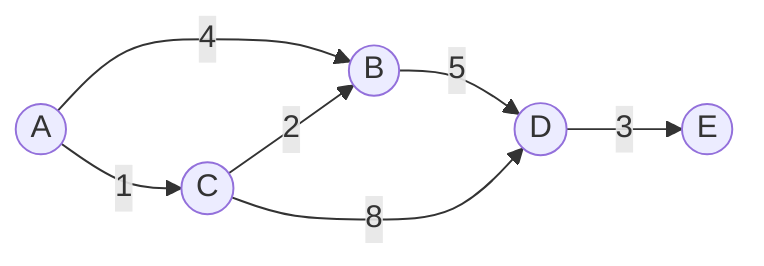

# Dijkstra's Algorithm (다익스트라 알고리즘)

> **한 줄 요약**: 가중치가 0 이상인 그래프에서, 시작 정점에서 가장 가까운 정점부터 차례로 거리를 확정해 나가며 모든 정점까지의 최단 거리를 구한다.

## 1. 언제 쓰나 (문제 신호)

- "A에서 B까지 **최소 비용 / 최단 거리**", "한 지점에서 **모든 지점까지**의 최단 거리"
- 간선마다 **비용(가중치)** 이 있고, 그 값이 **모두 0 이상**이다.
- 정점·간선 수가 10^5 안팎이다. (V³인 플로이드-워셜은 불가능한 크기)

다른 알고리즘과의 경계는 [최단 경로 비교표](../README.md)에 있습니다.

| 조건 | 대신 쓸 것 |
|---|---|
| 가중치가 없다 (모두 같다) | [BFS](../../../lv1-elementary/05-graph-basics/bfs/) |
| 가중치가 0 또는 1뿐이다 | [0-1 BFS](../zero-one-bfs/) (O(V+E)) |
| **음수 간선**이 있다 | [벨만-포드](../bellman-ford/) |
| **모든 정점 쌍**의 거리가 필요하고 V가 작다 | [플로이드-워셜](../floyd-warshall/) |

문제가 "그래프" 모양으로 주어지지 않아도 쓰입니다. 격자에서 칸마다 비용이 있는 이동, "상태"(정점 + 남은 횟수 등)를 정점으로 바꾼 문제가 흔한 변형입니다. ([7. 변형과 응용](#7-변형과-응용))

## 2. 핵심 아이디어

BFS는 "가까운 정점부터" 탐색해서 간선 수가 최소인 경로를 찾습니다. 다익스트라는 같은 생각을 **거리**에 적용한 것입니다.

> 아직 거리가 확정되지 않은 정점 중 **시작점에서 가장 가까운 정점**을 하나 고르면, 그 거리는 더 이상 줄어들 수 없다. 그 정점을 확정하고, 거기서 나가는 간선으로 이웃의 거리를 갱신(**relax**)한다.

**왜 맞는가.** 지금 꺼낸 정점 u의 거리가 d라고 합시다. 다른 경로로 u에 가려면 아직 확정되지 않은 어떤 정점 x를 지나야 하는데, 가장 가까운 후보가 u였으니 x까지의 거리도 이미 d 이상입니다. 그 뒤의 간선 가중치는 0 이상이라 거리가 d보다 줄어들 수 없습니다. 그래서 d는 최단 거리입니다. **가중치가 음수이면 이 논리가 깨집니다.** ([6. 자주 하는 실수](#6-자주-하는-실수))

**"가장 가까운 정점"을 빠르게 찾는 방법이 우선순위 큐(힙)입니다.** 파이썬의 `heapq`에는 항목을 수정하거나 지우는 기능이 없습니다. 그래서 거리가 줄어들 때마다 **새 항목을 추가**하고, 꺼냈을 때 이미 더 짧은 거리가 기록되어 있으면 **낡은 항목으로 보고 버립니다.** (lazy deletion)

```
dist[시작] = 0, 나머지는 INF.  힙에 (0, 시작)을 넣는다.
힙이 빌 때까지:
    (d, u)를 꺼낸다.
    d > dist[u] 이면 낡은 항목이므로 버린다.
    u에서 나가는 각 간선 (u → v, 가중치 w)에 대해:
        d + w < dist[v] 이면  dist[v] = d + w,  힙에 (d + w, v)를 넣는다.
```

### 무엇을 저장하고 어떻게 움직이나

시작점에서 각 정점까지 현재 발견한 최소 비용을 거리 배열에 저장합니다. 힙은 그 거리의 후보이며 같은 정점의 낡은 후보가 남을 수 있습니다. 가장 작은 후보를 꺼내고 그 정점에서 한 간선 더 가는 경로로 이웃 거리를 완화합니다.

### 왜 이 방법이 맞는가

간선 비용이 모두 0 이상이면 가장 작은 유효 후보보다 나중의 경로가 더 싸게 그 정점에 도착할 수 없습니다. 이 성질로 최단 거리를 확정합니다. 음수 간선에서는 이 논리가 깨집니다. 방문 여부만 보지 말고 힙의 값과 현재 거리의 일치로 낡은 후보를 걸러야 합니다.

### 작은 예제로 검산하기

A→B 비용 5, A→C 비용 1, C→B 비용 2라면 B 후보 5가 먼저 등록돼도 C를 거쳐 3으로 줄어듭니다. 힙에서 나중에 꺼낸 B의 5는 무시합니다. 부모도 거리 개선 때만 갱신하면 비용 3의 경로 A-C-B를 복원합니다.

## 3. 손으로 따라가기

다음 그래프에서 A로부터 각 정점까지의 최단 거리를 구해 봅시다. 화살표 위의 숫자가 가중치입니다.



거리 배열은 `[A, B, C, D, E]` 순서이고, `∞`는 아직 도달하지 못했다는 뜻입니다.

| 단계 | 꺼낸 항목 `(거리, 정점)` | 하는 일 | 거리 배열 | 힙 (작은 순) |
|---|---|---|---|---|
| 시작 | - | A의 거리를 0으로 하고 `(0, A)`를 넣는다 | `[0, ∞, ∞, ∞, ∞]` | `(0,A)` |
| 1 | `(0, A)` | B: ∞→4, C: ∞→1 로 갱신 | `[0, 4, 1, ∞, ∞]` | `(1,C) (4,B)` |
| 2 | `(1, C)` | B: 4→**3** (C를 거치면 더 짧다), D: ∞→9 | `[0, 3, 1, 9, ∞]` | `(3,B) (4,B) (9,D)` |
| 3 | `(3, B)` | D: 9→**8** | `[0, 3, 1, 8, ∞]` | `(4,B) (8,D) (9,D)` |
| 4 | `(4, B)` | `4 > dist[B] = 3` 이므로 **낡은 항목**, 버린다 | `[0, 3, 1, 8, ∞]` | `(8,D) (9,D)` |
| 5 | `(8, D)` | E: ∞→11 | `[0, 3, 1, 8, 11]` | `(9,D) (11,E)` |
| 6 | `(9, D)` | `9 > dist[D] = 8` 이므로 **낡은 항목**, 버린다 | `[0, 3, 1, 8, 11]` | `(11,E)` |
| 7 | `(11, E)` | 나가는 간선이 없다 | `[0, 3, 1, 8, 11]` | 비어 있음 |

결과는 `A=0, B=3, C=1, D=8, E=11`입니다. A→B를 직접 가는 간선(4)보다 C를 거쳐 가는 길(1+2=3)이 더 짧았고, 그 사실을 알기 전에 힙에 들어간 `(4, B)`는 4단계에서 버려졌습니다. 이 예제는 `test_solution.py`의 `test_readme_example`로 검증됩니다.

## 4. 구현

전체 코드는 [solution.py](solution.py)에 있습니다. 핵심은 이 열 줄 남짓입니다.

```python
def dijkstra(graph, start):
    dist = [INF] * len(graph)
    dist[start] = 0
    heap = [(0, start)]              # (거리, 정점) — 거리가 앞에 와야 거리순으로 꺼내진다

    while heap:
        d, u = heapq.heappop(heap)
        if d > dist[u]:              # 낡은 항목은 건너뛴다
            continue
        for v, w in graph[u]:
            nd = d + w
            if nd < dist[v]:         # u를 거쳐 가는 길이 더 짧을 때만 갱신
                dist[v] = nd
                heapq.heappush(heap, (nd, v))
    return dist
```

- 그래프는 인접 리스트 `graph[u] = [(v, w), ...]` 입니다. 정점 번호가 1부터 주어지면 크기를 `V + 1`로 만들어 0번을 비워 둡니다.
- 도달할 수 없는 정점은 `INF`로 남습니다. 출력할 때 `INF`로 바꿔 찍는 문제가 많습니다.
- **경로 복원**: 갱신할 때 `prev[v] = u` 한 줄을 더 기록하고, 도착 정점에서 `prev`를 따라 시작점까지 거슬러 올라간 뒤 뒤집습니다. ([`dijkstra_with_prev`, `restore_path`](solution.py))
- **직접 실행**: `V E`, 시작 정점, `u v w`(E줄) 형식의 입력을 받아 각 정점까지의 거리를 한 줄씩 출력합니다.

  ```bash
  printf '5 4\n1\n1 2 5\n1 3 2\n3 2 1\n2 4 1\n' | python solution.py   # 0 3 2 4 INF (한 줄씩)
  ```

## 5. 복잡도와 입력 크기 가이드

- **시간 O((V+E) log V).** 거리가 줄어들 때만 힙에 넣으므로 push는 많아야 E+1번(시작 항목 포함)입니다. push와 pop은 각각 O(log E) = O(log V)이고, 낡지 않은 항목은 정점마다 한 번만 나와서 간선 검사는 전체 O(E)입니다.
- **공간 O(V+E).** 그래프 자체와 힙, 거리 배열입니다.
- 간선이 매우 많은 **밀집 그래프**(E ≈ V²)에서는 힙 없이 "아직 확정되지 않은 정점 중 최솟값"을 배열에서 직접 찾는 O(V²) 구현이 더 나을 수 있습니다.
- 파이썬에서는 V, E가 10^5 안팎이면 보통 문제없고, 10^6 근처면 CPython은 시간 초과 위험이 큽니다. 입력을 읽는 시간도 상당하므로 `sys.stdin.readline`을 쓰고, 필요하면 PyPy3로 제출해 보세요. ([파이썬으로 PS 하기](../../../docs/python-for-ps.md), [복잡도 치트시트](../../../docs/complexity-cheatsheet.md))

## 6. 자주 하는 실수

- **음수 간선에 쓰기.** 위의 정당성은 "가중치 ≥ 0"에 기대고 있습니다. 예를 들어 `s→a` 3, `s→b` 4, `b→a` −2인 그래프에서 진짜 `dist[a]`는 `s→b→a`의 2입니다. 꺼낸 정점을 확정하고 다시 보지 않는 교과서식 구현은 `a`를 3으로 확정해 **틀린 답**을 냅니다. 이 저장소의 구현은 확정 표시 없이 낡은 항목만 건너뛰어서 이 예에서는 2를 내지만, 음수 간선이 있으면 **시간 복잡도 보장이 사라지고**(최악의 경우 지수 시간) 음수 사이클이 있으면 끝나지 않습니다. 음수 간선이 있다면 [벨만-포드](../bellman-ford/)를 쓰세요.
- **낡은 항목 검사 누락.** `if d > dist[u]: continue`가 없어도 답은 맞지만, 같은 정점의 간선을 여러 번 훑어서 시간이 크게 늘어납니다.
- **힙에 `(정점, 거리)` 순서로 넣기.** 튜플은 앞 원소부터 비교하므로 거리가 맨 앞이어야 합니다.
- **무방향 그래프에서 한쪽만 추가.** "양방향 도로"는 `graph[a].append((b, w))`와 `graph[b].append((a, w))`를 둘 다 해야 합니다.
- **`INF`가 너무 작음.** 가중치 합이 `INF`보다 커질 수 있으면 안 됩니다. `float("inf")`를 쓰거나, 정수라면 최대 거리보다 충분히 큰 값을 쓰세요.
- **정점 번호 기준 혼동.** 입력이 1부터인데 배열은 0부터 만들어서 `IndexError`가 나거나 한 칸씩 밀리는 경우가 많습니다.

## 7. 변형과 응용

- **경로 복원**: `prev` 배열을 기록합니다. (위 4번)
- **도착점이 하나, 출발점이 여러 개**: 간선 방향을 뒤집은 그래프에서 도착점을 시작점으로 한 번만 실행합니다.
- **격자 최단 경로**: 칸이 정점이고 상하좌우가 간선입니다. 칸마다 비용이 있으면 "이동해 들어가는 칸의 비용"을 간선 가중치로 봅니다.
- **상태 확장**: 정점 대신 `(정점, k)`를 한 정점으로 취급합니다. 예를 들어 "도로를 최대 K개까지 무료로 지날 수 있다"는 `dist[정점][사용 횟수]`로 풀립니다.
- **시작점이 여러 개**: 모든 시작점의 거리를 0으로 하고 힙에 한꺼번에 넣으면 됩니다.
- **가중치가 0 또는 1**이면 힙 대신 덱을 쓰는 [0-1 BFS](../zero-one-bfs/)가 O(V+E)로 더 빠릅니다.

## 8. 연습문제

[problems.md](problems.md)에 쉬운 것부터 어려운 순서로 정리했습니다.

## 9. 다음 단계

- 선행: [BFS](../../../lv1-elementary/05-graph-basics/bfs/), [우선순위 큐](../../../lv1-elementary/01-data-structures/priority-queue/)
- 이어서: [벨만-포드](../bellman-ford/) (음수 간선), [플로이드-워셜](../floyd-warshall/) (모든 쌍), [0-1 BFS](../zero-one-bfs/)
