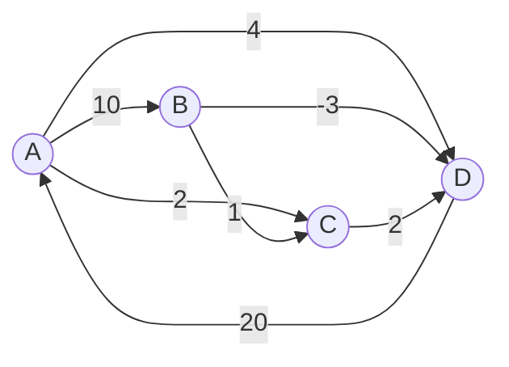

# Floyd-Warshall Algorithm (플로이드-워셜 알고리즘)

> **한 줄 요약**: "정점 0..k만 거쳐도 된다"는 조건을 k = 0, 1, …, V−1로 넓혀 가며 모든 쌍의 최단 거리를 세 겹 반복문 하나로 구한다. V가 100~400 정도일 때 가장 간단하고 확실한 방법이다.

## 1. 언제 쓰나 (문제 신호)

- "**모든 도시 쌍**의 최단 거리/최소 비용"을 출력하라
- 정점 수 V가 **수백 이하** (V³이 허용되는 크기. 500³ = 1.25억은 CPython에서 수 초가 걸린다)
- "A에서 B로 갈 수 있는가?" 질문이 많다 (**도달 가능성**, 전이적 폐쇄)
- **가장 짧은 사이클**, 모든 정점 사이의 거리 합 최소 정점(케빈 베이컨) 같은, 모든 쌍의 거리를 이용하는 문제
- 음수 간선이 있어도 되지만 음수 사이클이 없어야 합니다.

한 시작점에서의 거리만 필요하면 [다익스트라](../dijkstra/)나 [벨만-포드](../bellman-ford/)가 훨씬 빠릅니다.

## 2. 핵심 아이디어

다음을 정의합니다.

> `dp[k][i][j]` = `i`에서 `j`로 가는 최단 거리, 단 **중간에 거치는 정점은 {0, 1, …, k−1}에서만** 고른다.

`k`번 정점 하나를 더 거쳐도 된다고 허용할 때, 최단 경로는 둘 중 하나입니다.

1. `k`를 거치지 않는다 → `dp[k−1][i][j]` 그대로
2. `k`를 거친다 → `i → k`와 `k → j`가 각각 {0..k−1}만 거치는 최단 거리 → `dp[k−1][i][k] + dp[k−1][k][j]`

그래서 `dp[k][i][j] = min(dp[k−1][i][j], dp[k−1][i][k] + dp[k−1][k][j])`. `k` 차원이 한 칸씩만 의존하므로 **2차원 표 하나에 덮어쓰며** 계산합니다. (`k`번째 행과 열은 이번 `k`에서 바뀌지 않으므로 안전합니다. 음수 사이클이 없다면 `dist[k][k] = 0`이기 때문입니다.)

**반복문의 순서**: 바깥이 `k`(거쳐 가는 정점), 안쪽이 `i`, `j`입니다. `i, j, k` 순서로 쓰면 틀립니다. `k`를 가장 바깥에 둬야 "{0..k}만 거치는 최단 거리"라는 의미가 지켜집니다.

**도달 가능성(전이적 폐쇄)**: 거리 대신 `갈 수 있다/없다`만 기록하고 `min`, `+`를 `OR`, `AND`로 바꾸면 같은 틀입니다. 각 행을 정수 하나(비트마스크)로 들고 있으면 안쪽 반복이 비트 `OR` 한 번이 됩니다.

### 무엇을 저장하고 어떻게 움직이나

`dist[i][j]`는 i에서 j까지의 최단 비용이며 k번째 바깥 반복에서는 정점 k를 중간 경유지로 새로 허용합니다. 기존 경로와 i→k→j를 비교합니다. 대각선은 0, 직접 간선은 주어진 비용, 나머지는 무한대로 시작합니다.

### 왜 이 방법이 맞는가

k를 경유하지 않는 최적 경로는 이전 값에 있고, 경유하는 최적 경로는 i→k와 k→j 두 부분으로 나눌 수 있습니다. 이 두 경우를 최소로 합치면 새 허용 범위의 답입니다. k를 가장 바깥 반복에 둬야 단계별 허용 경유지의 의미가 보존됩니다.

### 작은 예제로 검산하기

A→B=2, B→C=3, A→C=9라면 B를 허용할 때 A→C가 5로 바뀝니다. 중복 간선은 최소 비용을 취합니다. 실행 후 `dist[v][v]<0`인 정점은 음의 사이클을 나타내므로 그 사이클을 경유하는 거리의 의미를 별도로 판단합니다.

## 3. 손으로 따라가기

네 정점 A, B, C, D (0~3).



처음 표 (간선 하나로 가는 거리, `∞`는 간선 없음):

| | A | B | C | D |
|---|---|---|---|---|
| **A** | 0 | 10 | 2 | 4 |
| **B** | ∞ | 0 | 1 | −3 |
| **C** | ∞ | ∞ | 0 | 2 |
| **D** | 20 | ∞ | ∞ | 0 |

`k`를 늘려 가며 바뀐 칸만 적습니다.

| k | 거쳐 갈 정점 | 바뀐 칸 |
|---|---|---|
| 0 | A | D→B: ∞ → 30 (D→A→B), D→C: ∞ → 22 (D→A→C) |
| 1 | B | 없음 |
| 2 | C | 없음 |
| 3 | D | B→A: ∞ → 17 (B→D→A), C→A: ∞ → 22 (C→D→A), C→B: ∞ → 32 (C→D→A→B) |

결과:

| | A | B | C | D |
|---|---|---|---|---|
| **A** | 0 | 10 | 2 | 4 |
| **B** | 17 | 0 | 1 | −3 |
| **C** | 22 | 32 | 0 | 2 |
| **D** | 20 | 30 | 22 | 0 |

마지막 줄의 `C→B = 32`는 `C→D→A→B`(2+20+10)로, 중간에 D(k=3)를 거치는 것이 마지막에 허용되고, 그 시점에 `D→B = 30`(k=0에서 이미 구해짐)이 있었기 때문에 가능했습니다. (이 예제는 [테스트](test_solution.py)의 `test_readme_example`로 검증됩니다.)

## 4. 구현

전체 코드는 [solution.py](solution.py)에 있습니다.

```python
def floyd_warshall(n, edges):
    dist = init_matrix(n, edges)          # 자기 자신 0, 간선 가중치(중복이면 최솟값), 나머지 INF
    for k in range(n):                    # 거쳐 가도 되는 정점 0..k
        for i in range(n):
            if dist[i][k] == INF:
                continue                  # i → k 가 안 되면 건너뛴다
            for j in range(n):
                if dist[i][k] + dist[k][j] < dist[i][j]:
                    dist[i][j] = dist[i][k] + dist[k][j]
    return dist
```

- 그래프는 **간선 목록**으로 받습니다. 같은 쌍의 중복 간선은 가장 작은 것만 남기고, 자기 자신으로의 거리는 0입니다.
- `floyd_warshall_with_next`, `restore_path`: `next_hop[i][j]` = i에서 j로 가는 최단 경로에서 **다음에 갈 정점**을 기록해 경로 전체를 복원합니다. 갱신할 때 `next_hop[i][j] = next_hop[i][k]`입니다.
- `has_negative_cycle(dist)`: 끝난 뒤 `dist[i][i] < 0`인 정점이 있으면 음수 사이클입니다. (음수 사이클이 있으면 표의 다른 값도 의미가 없습니다.)
- `transitive_closure(n, edges)`: 도달 가능성 표. 비트마스크 행을 쓴 워셜 알고리즘입니다.
- `shortest_cycle(n, edges)`: 자기 자신으로의 거리를 0이 아니라 **INF에서 시작**해 돌리면 `dist[i][i]`가 `i`를 지나는 가장 짧은 사이클의 길이가 됩니다.
- 직접 실행하면 `N`, `M`, `a b c`(M줄)를 받아 모든 쌍의 최단 거리 표를 출력합니다. (닿지 않으면 0)

## 5. 복잡도와 입력 크기 가이드

- **시간 O(V³)**, **공간 O(V²)**.
- 이 환경에서 간선 5V개인 랜덤 그래프로 측정했습니다. ([복잡도 치트시트](../../../docs/complexity-cheatsheet.md))

| V | 시간 |
|---|---|
| 100 | 0.03초 |
| 200 | 0.21초 |
| 300 | 0.66초 |

- V = 400이면 약 1.6초, 500이면 약 3초로 늘어납니다(측정한 V = 300의 0.66초에서 세제곱 증가를 따라 추정한 값). 파이썬에서는 **V ≤ 300** 정도가 안전합니다. 더 크면 PyPy3나 V번의 [다익스트라](../dijkstra/) 또는 NumPy를 고려하세요.
- E가 작고 V가 크면 V번의 다익스트라가 O(V(V+E) log V)로 더 빠릅니다.

## 6. 자주 하는 실수

- **반복문 순서**: `k`가 가장 바깥이어야 합니다. 잘못된 순서는 일부 쌍이 덜 줄어든 채 끝납니다. (이 폴더의 변이 검사로 확인했습니다)
- **`dist[i][i] = 0` 누락**: 자기 자신으로 가는 거리가 INF면 `i → k → i` 같은 경로가 엉뚱하게 계산됩니다. 사이클 길이를 구할 때만 일부러 INF로 시작합니다.
- **중복 간선**: 같은 쌍에 간선이 여러 개면 가장 작은 값만 써야 합니다. (`dist[u][v] = w`로 덮어쓰면 나중에 입력된 큰 값이 남습니다)
- **INF를 큰 정수로 쓸 때**: 음수 간선이 있으면 `INF + (음수)`가 INF보다 작아져, 닿지 않는 쌍이 닿는 것처럼 갱신됩니다. 이 구현은 `float("inf")`를 쓰고, 어차피 `dist[i][k] == INF`이면 안쪽 반복을 건너뜁니다.
- **음수 사이클**: `dist[i][i] < 0`으로 확인하세요. 값이 계속 줄어서 의미가 없어집니다.
- **방향 그래프를 무방향으로 입력**: 양방향 간선이면 `dist[u][v]`와 `dist[v][u]`를 모두 설정합니다.
- **출력 형식**: 문제에 따라 닿지 않는 쌍을 `0`, `-1`, `INF`로 출력합니다. 문제의 조건을 확인하세요.

## 7. 변형과 응용

- **경로 복원**: `next_hop` 표. (11780 플로이드 2)
- **전이적 폐쇄**: 갈 수 있는가만. 비트마스크로 O(V³/64). (11403 경로 찾기, 1613 역사)
- **가장 짧은 사이클**: `shortest_cycle`. (1956 운동)
- **모든 쌍의 최소/최대 경로 제약**: 거리 대신 병목(경로 위 간선의 최댓값을 최소화)이나 확률의 곱 등으로 `+`/`min`을 바꿔도 같은 틀이 적용됩니다.
- **한 시작점만 필요하면**: [다익스트라](../dijkstra/), [벨만-포드](../bellman-ford/)

## 8. 연습문제

[problems.md](problems.md)에 쉬운 것부터 어려운 순서로 정리했습니다.

## 9. 다음 단계

- 선행: [그래프](../../../lv1-elementary/05-graph-basics/graph/), [다이나믹 프로그래밍](../../../lv1-elementary/07-algorithm-paradigms/dynamic-programming/)
- 이어서: [다익스트라](../dijkstra/), [벨만-포드](../bellman-ford/), [위상 정렬](../../02-graph-algorithms/topological-sort/)
