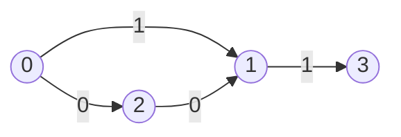

# 0-1 BFS (0-1 너비 우선 탐색)

> **한 줄 요약**: 간선 가중치가 0 또는 1뿐이라면 우선순위 큐 없이 **덱**만으로 최단 거리를 구한다. 0인 간선으로 닿는 정점은 덱의 앞에, 1인 간선은 뒤에 넣는다.

## 1. 언제 쓰나 (문제 신호)

- 간선 가중치가 **0 또는 1**: "벽을 부수는 데 1", "그냥 이동은 0"
- 격자에서 **벽을 최소 몇 개 부수면** 도착하는가
- "순간이동은 비용 0, 걸어가기는 비용 1" 같은 이동 규칙 (숨바꼭질 3)
- "방향을 바꿀 때만 비용 1"처럼 비용을 0/1로 바꿀 수 있는 문제
- 일반 [다익스트라](../dijkstra/)로도 풀리지만, 0-1 BFS는 로그가 빠지고 구현이 더 단순합니다.

## 2. 핵심 아이디어

[BFS](../../../lv1-elementary/05-graph-basics/bfs/)의 큐는 "거리가 d인 정점들, 그 뒤에 거리 d+1인 정점들" 순서를 자연스럽게 유지합니다. 간선 가중치가 0이면 거리가 그대로이므로 **같은 거리 그룹의 맨 앞**에, 1이면 거리가 1 늘어나므로 **맨 뒤**에 넣으면 이 순서가 깨지지 않습니다.

> 덱의 내용은 항상 `거리 d인 정점들 | 거리 d+1인 정점들` 모양이다. 0인 간선은 앞쪽(`appendleft`), 1인 간선은 뒤쪽(`append`)에 넣는다.

다익스트라에서 힙이 하던 일("가장 가까운 정점부터")을 덱이 대신합니다. 정점의 거리는 많아야 두 번(`d+1`로 먼저 도달하고 나중에 `d`로 줄어듦) 정해지므로, 각 정점은 덱에 많아야 두 번 들어가고 **전체가 O(V+E)** 입니다.

> 가중치가 0, 1, 2 이상이면 이 성질이 깨집니다. 예를 들어 2가 섞이면 덱이 `d, d+1, d+2` 세 그룹을 가져야 하므로 일반 다익스트라나 가중치별 큐(다이얼 알고리즘)가 필요합니다.

### 무엇을 저장하고 어떻게 움직이나

간선 비용이 0 또는 1이면 다음 후보의 거리가 현재와 같거나 한 단계 큽니다. 덱의 앞에는 비용 0으로 갱신된 정점을, 뒤에는 비용 1로 갱신된 정점을 넣습니다. 일반 BFS의 발견 표시 대신 실제 거리 개선 여부를 확인합니다.

### 왜 이 방법이 맞는가

현재 최소 거리 d를 처리하면서 생기는 후보는 d와 d+1뿐입니다. 같은 거리 후보를 앞에서 먼저 처리하면 더 큰 거리 후보가 앞서 확정되지 않습니다. 비용이 2 이상인 간선까지 들어오면 이 두 층의 순서 보장이 없어집니다.

### 작은 예제로 검산하기

A→B=1, A→C=0, C→B=0이면 B를 먼저 발견해도 거리는 아직 1입니다. 앞에 넣은 C를 처리하며 B가 0으로 개선됩니다. 따라서 처음 발견했다는 이유만으로 B의 재갱신을 막으면 틀립니다.

## 3. 손으로 따라가기



`0`에서 출발합니다. 거리 배열은 `[0, 1, 2, 3]`번 정점 순서입니다.

| 단계 | 꺼낸 정점 | 하는 일 | 거리 | 덱 (앞 → 뒤) |
|---|---|---|---|---|
| 시작 | | 0을 덱에 넣는다 | `[0, ∞, ∞, ∞]` | `[0]` |
| 1 | 0 | 0→1 (1): 거리 1, **뒤**에 / 0→2 (0): 거리 0, **앞**에 | `[0, 1, 0, ∞]` | `[2, 1]` |
| 2 | 2 | 2→1 (0): 1의 거리 1 → **0**으로 줄어듦, **앞**에 | `[0, 0, 0, ∞]` | `[1, 1]` |
| 3 | 1 | 1→3 (1): 거리 1, 뒤에 | `[0, 0, 0, 1]` | `[1, 3]` |
| 4 | 1 | 뒤에 남아 있던 낡은 항목. 더 줄일 것이 없다 | `[0, 0, 0, 1]` | `[3]` |
| 5 | 3 | 나가는 간선 없음 | `[0, 0, 0, 1]` | 비어 있음 |

정점 1은 먼저 거리 1로 덱에 들어갔다가 2를 거치는 길(0)이 발견되어 줄어들었고, 그 때문에 덱에 두 번 들어갔습니다. 이것이 "각 정점은 많아야 두 번"입니다. (이 예제는 [테스트](test_solution.py)의 `test_a_vertex_improved_after_being_queued_is_handled`로 검증됩니다.)

**격자(알고스팟)**: 칸에 **들어갈 때** 벽이면 1, 빈 방이면 0. 왼쪽 위에서 오른쪽 아래까지 벽을 최소 몇 개 부수는가.

```
0 1 1
1 1 1
1 1 0
```

어떻게 가도 벽을 3개 지나야 하므로 답은 **3**입니다.

## 4. 구현

전체 코드는 [solution.py](solution.py)에 있습니다.

```python
def zero_one_bfs(graph, start):
    dist = [INF] * len(graph)
    dist[start] = 0
    queue = deque([start])
    while queue:
        u = queue.popleft()
        for v, w in graph[u]:
            if dist[u] + w < dist[v]:
                dist[v] = dist[u] + w
                if w == 0:
                    queue.appendleft(v)       # 같은 거리: 앞쪽에서 먼저 처리
                else:
                    queue.append(v)           # 거리 +1: 뒤쪽
    return dist
```

- 그래프는 인접 리스트 `graph[u] = [(v, w), ...]`이고 `w`는 0 또는 1입니다.
- `grid_min_walls(grid)`: 격자 문제를 간선 목록 없이 바로 푸는 형태. 이동하는 칸이 벽이면 `w = 1`입니다.
- 직접 실행하면 알고스팟 형식(`M N`, 이어서 N줄의 0/1 문자열)을 받아 최소로 부숴야 하는 벽의 수를 출력합니다.
- 덱에서 꺼낼 때 낡은 항목을 따로 걸러 내지 않아도 됩니다. 이미 줄일 것이 없어 갱신이 일어나지 않을 뿐입니다.

## 5. 복잡도와 입력 크기 가이드

- **시간 O(V+E)**, **공간 O(V)**. 힙이 없으니 다익스트라의 `log V`가 사라집니다.
- 이 환경에서 300×300 격자(9만 칸, 벽 50%)로 비교했습니다. ([복잡도 치트시트](../../../docs/complexity-cheatsheet.md))

| 방법 | 시간 |
|---|---|
| 0-1 BFS | 0.085초 |
| 힙을 쓰는 다익스트라 | 0.134초 |

- 격자가 1000×1000(100만 칸)이어도 파이썬으로 가능하지만 빠른 입력이 필요합니다. ([빠른 입출력](../../../lv0-basics/04-io-and-complexity/fast-io/))
- 이 폴더의 [테스트](test_solution.py)는 정점당 덱에서 꺼내는 횟수가 2회 이하임을 직접 셉니다. 덱의 앞/뒤를 거꾸로 넣어도 **답은 맞게 나오지만** 시간 복잡도 보장이 사라지기 때문입니다. (평범한 큐로 바꾼 버전은 30×30 격자에서 칸당 3번이 넘게 처리하는 경우가 있었습니다. 올바른 구현은 칸당 1번 이하였습니다.)

## 6. 자주 하는 실수

- **0과 1을 반대로**: 0 간선은 `appendleft`, 1 간선은 `append`입니다. 거꾸로 하면 답은 같아도 느려집니다. 시간 제한이 빠듯한 문제에서 눈에 띕니다.
- **방문 체크로 한 번만 넣기**: 일반 BFS처럼 "방문하면 다시 안 넣기"를 하면, 먼저 거리 1로 들어간 정점이 나중에 0으로 줄어드는 것을 놓쳐 **틀린 답**이 나옵니다. 거리를 기준으로 갱신(`<`)하세요.
- **가중치가 0, 1이 아닌데 사용**: 2 이상의 가중치가 있으면 [다익스트라](../dijkstra/)를 쓰세요.
- **격자 비용의 위치**: 비용을 "나가는 칸"에 둘지 "들어가는 칸"에 둘지 문제마다 다릅니다. 시작 칸이 벽이어도 비용이 없는지 확인하세요.
- **격자 입력에서 문자열 처리**: 한 줄이 공백 없이 붙어 있는 입력을 `list(map(int, ...))`로 쪼개지 않고 문자열 그대로 인덱싱합니다.

## 7. 변형과 응용

- **상태 확장**: 정점 대신 `(정점, 방향)`을 한 상태로 보고, 방향이 바뀔 때만 비용 1. (LeetCode 1368)
- **순간이동 문제**: 위치 `x`에서 `x−1`, `x+1`(비용 1), `2x`(비용 0)로 이동. (숨바꼭질 3)
- **거리가 작은 정수인 일반화**: 가중치 최대값이 `C`로 작으면 `C+1`개의 큐를 쓰는 다이얼 알고리즘
- **다익스트라로 대체 가능**: 같은 문제를 [다익스트라](../dijkstra/)로 풀어 결과를 비교하는 것이 좋은 검증입니다. (이 폴더의 테스트가 그렇게 합니다)

## 8. 연습문제

[problems.md](problems.md)에 쉬운 것부터 어려운 순서로 정리했습니다.

## 9. 다음 단계

- 선행: [BFS](../../../lv1-elementary/05-graph-basics/bfs/), [덱](../../../lv1-elementary/01-data-structures/deque/)
- 이어서: [다익스트라](../dijkstra/), [벨만-포드](../bellman-ford/)
