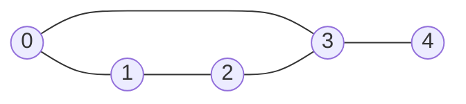

# Bipartite Graph (이분 그래프)

> **한 줄 요약**: 정점을 두 집합으로 나눠 모든 간선이 서로 다른 집합을 잇게 할 수 있는가? 한 정점을 색 0으로 칠하고 이웃을 반대 색으로 칠해 가다 충돌이 나면 아니다. 이분 그래프 ⇔ **길이가 홀수인 사이클이 없다**.

## 1. 언제 쓰나 (문제 신호)

- "두 팀으로 나눌 때 **적대 관계인 사람이 같은 팀에 없게**", "**두 가지 색**으로 칠하기"
- 그래프에 **홀수 길이 사이클**이 있는가
- 정점 두 종류(예: 일꾼과 일, 학생과 좌석) 사이의 관계만 있는 **이분 매칭**의 전제 확인 → [이분 매칭](../../../lv3-advanced/03-graph-advanced/bipartite-matching/)
- 간선이 "서로 달라야 한다"는 제약인 문제 (같은 값이면 안 된다, 반대 편이어야 한다)
- 격자에서 체스판 무늬로 칸을 나누는 것은 항상 이분 그래프입니다 (인접한 칸은 색이 다르다).

## 2. 핵심 아이디어

**이분 그래프**: 정점 집합을 `A`, `B`로 나눌 수 있어 모든 간선의 두 끝점이 서로 다른 집합에 속하는 그래프.

**2-색칠하기**: 아무 정점이나 색 0으로 칠하고, [BFS](../../../lv1-elementary/05-graph-basics/bfs/)로 퍼지며 이웃을 **반대 색**으로 칠합니다. 이미 칠해진 이웃이 **나와 같은 색**이면 충돌이므로 이분 그래프가 아닙니다.

**왜 이게 전부인가**: 한 연결 요소에서 한 정점의 색을 정하면 나머지 정점의 색은 **전부 강제**됩니다 (이웃은 반대 색, 이웃의 이웃은 같은 색, …). 그래서 BFS가 한 번 칠한 색이 유일한 후보이고, 그 칠하기가 모순이면 다른 방법은 없습니다. 연결 요소마다 독립이므로 **칠하지 않은 정점마다 BFS를 새로 시작**합니다.

**홀수 사이클과의 관계**: 사이클을 따라가면 색이 번갈아 바뀌므로, 길이가 홀수이면 한 바퀴 돌아와 같은 색끼리 이어져 모순입니다. 반대로 홀수 사이클이 없으면 색칠이 성공합니다. 그러므로

> **이분 그래프 ⇔ 길이가 홀수인 사이클이 없다.**

충돌이 난 간선 `(u, v)`(같은 색)에서 BFS 트리를 거슬러 올라가 공통 조상을 찾으면 그 홀수 사이클을 실제로 구할 수 있습니다 (`odd_cycle`).

**유니온 파인드 방식**: 정점 `x`마다 "x가 색 0" 노드 `x`와 "x가 색 1" 노드 `x + n`을 둡니다. 간선 `(u, v)`는 "u가 0이면 v는 1, u가 1이면 v는 0"이므로 `(u, v + n)`과 `(u + n, v)`를 합칩니다. 어떤 `x`에서 `x`와 `x + n`이 같은 집합이 되면 모순입니다. 간선이 **동적으로 추가**될 때 편리합니다. → [유니온 파인드](../union-find/)

### 무엇을 저장하고 어떻게 움직이나

정점을 두 색으로 칠해 모든 간선의 양 끝이 다른 색인지 검사합니다. 새 요소의 시작색은 자유이며 이웃에는 반대색을 전달합니다. 이분 그래프 여부와 최대 이분 매칭의 크기는 서로 다른 질문입니다.

### 왜 이 방법이 맞는가

한 요소에서 시작점을 정하면 경로 길이의 홀짝이 색을 결정합니다. 같은 정점으로 홀짝이 다른 두 경로가 이어지면 홀수 사이클이 생겨 색이 충돌합니다. 반대로 홀수 사이클이 없으면 두 색을 일관되게 배정할 수 있습니다.

### 작은 예제로 검산하기

삼각형 A-B-C-A에서 A를 0, B와 C를 1로 칠하면 B-C가 충돌합니다. 사각형은 0,1,0,1로 칠할 수 있습니다. 자기 루프도 양 끝이 같은 정점이므로 즉시 이분 그래프 조건을 깨뜨립니다.

## 3. 손으로 따라가기

**이분 그래프인 경우**: 간선 `0–1, 0–3, 1–2, 2–3, 3–4` (길이 4의 사이클 `0–1–2–3`과 꼬리 `3–4`).



| 단계 | 꺼낸 정점 | 하는 일 | 색 `[0,1,2,3,4]` |
|---|---|---|---|
| 시작 | | 0을 색 0으로 | `[0, -, -, -, -]` |
| 1 | 0 | 이웃 1, 3을 색 1로 | `[0, 1, -, 1, -]` |
| 2 | 1 | 이웃 0(색 0, 다름 ✓), 2를 색 0으로 | `[0, 1, 0, 1, -]` |
| 3 | 3 | 이웃 0(✓), 2(색 0, 다름 ✓), 4를 색 0으로 | `[0, 1, 0, 1, 0]` |
| 4 | 2 | 이웃 1(✓), 3(✓) | |
| 5 | 4 | 이웃 3(✓) | |

모두 충돌 없이 끝났습니다. 두 집합: `{0, 2, 4}`와 `{1, 3}`.

**이분 그래프가 아닌 경우**: 간선 `0–1, 1–2, 2–3, 3–4, 4–2`에는 `2–3–4`라는 길이 3의 사이클이 있습니다. BFS는 0, 1, 2를 차례로 색 0, 1, 0으로 칠하고, 정점 2의 이웃 3과 4를 **둘 다 색 1**로 칠합니다. 그다음 3을 처리하다 이웃 4가 자기와 같은 색(1)임을 발견해 충돌입니다. 두 정점의 BFS 트리 부모를 거슬러 올라가면 공통 조상이 2이므로, `odd_cycle`은 `3 → 2 → 4`와 충돌한 간선 `4–3`으로 이루어진 사이클 `[3, 2, 4]`(길이 3)를 반환합니다.

## 4. 구현

전체 코드는 [solution.py](solution.py)에 있습니다.

```python
def two_color(graph):
    color = [-1] * len(graph)
    for s in range(len(graph)):           # 연결되어 있지 않을 수 있으니 모든 정점에서 시작
        if color[s] != -1:
            continue
        color[s] = 0
        queue = deque([s])
        while queue:
            u = queue.popleft()
            for v in graph[u]:
                if color[v] == -1:
                    color[v] = 1 - color[u]      # 이웃은 반대 색
                    queue.append(v)
                elif color[v] == color[u]:       # 같은 색끼리 이어짐 → 이분 그래프 아님
                    return None
    return color
```

- 그래프는 **무방향 인접 리스트** `graph[u] = [v, ...]`입니다. 양방향이므로 양쪽에 모두 넣어야 합니다.
- `is_bipartite`, `partition`: 판별과 두 집합 목록.
- `odd_cycle(graph)`: 이분 그래프가 아니면 길이가 홀수인 사이클을 정점 순서대로 돌려줍니다. 자기 자신으로 가는 간선도 길이 1의 홀수 사이클입니다.
- `is_bipartite_dsu(n, edges)`: 유니온 파인드로 판별하는 방식 (정점당 노드 두 개).
- 직접 실행하면 테스트 케이스 수 `K`, 각 케이스의 `V E`와 간선 `u v`를 받아 `YES/NO`를 출력합니다.

## 5. 복잡도와 입력 크기 가이드

- **시간 O(V+E)**, **공간 O(V+E)**. BFS(또는 DFS) 한 번과 같습니다.
- 이 환경에서 V = 10⁵, E ≈ 3×10⁵인 이분 그래프를 칠하는 데 0.19초가 걸렸습니다. ([복잡도 치트시트](../../../docs/complexity-cheatsheet.md))
- 재귀 DFS로 칠하면 깊이가 V까지 갈 수 있어서 큰 입력에서 `RecursionError`가 납니다. BFS나 스택을 쓰세요.

## 6. 자주 하는 실수

- **연결 요소 하나만 검사**: 그래프가 연결되어 있지 않을 수 있습니다. 칠하지 않은 정점마다 새로 시작해야 합니다. (두 번째 연결 요소에만 홀수 사이클이 있는 경우를 [테스트](test_solution.py)가 확인합니다)
- **양방향 간선을 한쪽만 추가**: 무방향 그래프는 `graph[a].append(b)`와 `graph[b].append(a)` 둘 다.
- **방문 여부와 색을 따로 관리하다 어긋남**: `color == -1`이 곧 "아직 안 칠함"이므로 색 하나로 충분합니다.
- **자기 자신으로 가는 간선**: 같은 정점이라 항상 같은 색이므로 이분 그래프가 아닙니다. 이 구현은 `color[v] == color[u]`로 자연스럽게 걸러집니다.
- **색 충돌을 이웃만 보고 판단**: 이미 칠해진 이웃의 색을 확인하지 않고 큐에 넣기만 하면 충돌을 놓칩니다.
- **테스트 케이스 사이에 상태 초기화 누락**: 여러 케이스를 읽을 때 색 배열과 그래프를 케이스마다 새로 만드세요.

## 7. 변형과 응용

- **이분 매칭**: 이분 그래프에서 최대로 짝짓기. → [이분 매칭](../../../lv3-advanced/03-graph-advanced/bipartite-matching/)
- **최대 독립 집합 = V − 최대 매칭** (쾨니그의 정리), **최소 정점 덮개 = 최대 매칭**: 이분 그래프에서만 성립하는 성질입니다.
- **격자 문제**: 칸을 `(r + c) % 2`로 나누면 인접한 칸은 항상 다른 집합. 체스판 문제를 이분 매칭으로 풀 수 있습니다.
- **2-SAT**: "x 또는 y" 형태의 제약을 만족하는 값 배정을 구하는 문제는 이분 그래프 판별과 SCC의 확장. → [2-SAT](../../../lv3-advanced/03-graph-advanced/two-sat/)
- **홀수 사이클 찾기**: `odd_cycle`.

## 8. 연습문제

[problems.md](problems.md)에 쉬운 것부터 어려운 순서로 정리했습니다.

## 9. 다음 단계

- 선행: [BFS](../../../lv1-elementary/05-graph-basics/bfs/), [연결 요소](../../../lv1-elementary/05-graph-basics/connected-components/)
- 이어서: [이분 매칭](../../../lv3-advanced/03-graph-advanced/bipartite-matching/), [2-SAT](../../../lv3-advanced/03-graph-advanced/two-sat/), [유니온 파인드](../union-find/)
