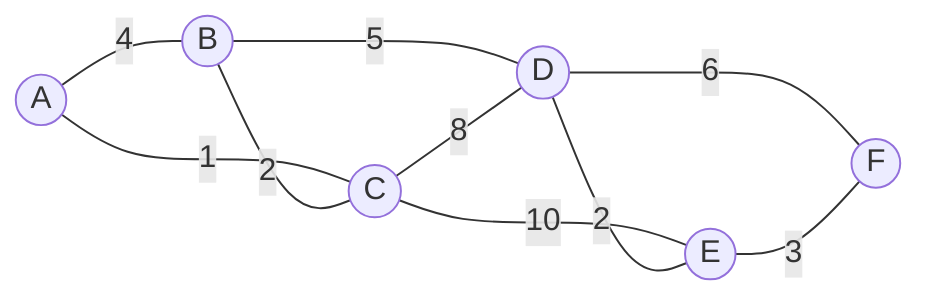

# Kruskal's Algorithm (크루스칼 알고리즘, 최소 스패닝 트리)

> **한 줄 요약**: 간선을 가중치가 작은 순으로 훑으며, 이미 연결된 두 정점을 잇는(= 사이클을 만드는) 간선만 빼고 모두 채택한다. 최소 신장 트리(MST)를 가장 간단하게 만드는 방법이다.

## 1. 언제 쓰나 (문제 신호)

- "모든 정점을 **연결**하는데 **총 비용을 최소**로" (도시를 잇는 도로, 통신망, 배관)
- "**스패닝 트리**", "**최소 신장 트리**(MST)", "정점 V개를 V−1개의 간선으로 잇기"
- 정점을 **K개의 그룹으로 나누는** 최소 비용 (MST에서 가장 비싼 K−1개 간선을 뺀 것)
- 간선이 **간선 목록**으로 주어지거나 쉽게 정렬할 수 있다. 간선 수 E가 정점 수 V에 비해 아주 크지 않다.
- 정점 사이의 거리를 직접 계산해 간선을 만들어야 하는 경우도 많다 (좌표 평면의 점들).

## 2. 핵심 아이디어

**스패닝 트리**: 연결된 무방향 그래프의 모든 정점을 사이클 없이 잇는 간선 집합 (간선 V−1개). 그중 가중치 합이 최소인 것이 **MST**입니다.

**그리디**: "가장 싼 간선부터, 사이클이 안 생기면 채택."

> **절단 성질**: 정점을 어떻게 두 쪽으로 나누든, 그 두 쪽을 잇는 간선 중 가장 싼 간선은 반드시 어떤 MST에 들어간다. (가장 싼 간선이 하나뿐이면 모든 MST에 들어간다.)

크루스칼이 지금 보는 간선 `e`가 두 집합 `A`와 `B`를 잇고 사이클을 만들지 않는다면, 지금까지 본 간선은 모두 `e`보다 싸거나 같으므로 `A`와 나머지를 잇는 간선 중 `e`가 가장 쌉니다. 그래서 `e`를 채택해도 안전합니다.

**사이클 판별**은 [유니온 파인드](../union-find/)가 맡습니다. 두 끝점이 이미 같은 집합이면 사이클입니다. 채택하면 두 집합을 합칩니다.

간선을 **내림차순**으로 훑으면 **최대 신장 트리**입니다.

## 3. 손으로 따라가기

여섯 도시 A~F, 간선의 숫자는 가중치.



가중치순으로 정렬한 간선을 차례로 봅니다. (가중치가 같으면 입력 순서)

| 간선 | 가중치 | 판정 | 총합 | 집합들 |
|---|---|---|---|---|
| A–C | 1 | 채택 | 1 | `{A,C}` `{B}` `{D}` `{E}` `{F}` |
| B–C | 2 | 채택 | 3 | `{A,B,C}` `{D}` `{E}` `{F}` |
| D–E | 2 | 채택 | 5 | `{A,B,C}` `{D,E}` `{F}` |
| E–F | 3 | 채택 | 8 | `{A,B,C}` `{D,E,F}` |
| A–B | 4 | **버림** (A와 B는 이미 같은 집합) | 8 | 그대로 |
| B–D | 5 | 채택 | 13 | `{A,B,C,D,E,F}` |
| D–F | 6 | 버림 | | |
| C–D | 8 | 버림 | | |
| C–E | 10 | 버림 | | |

채택한 간선 5개(= V−1) `A–C, B–C, D–E, E–F, B–D`, 총 **13**. 5개를 채택한 시점에 멈춰도 됩니다.

**그룹으로 나누기**: 두 마을로 나누려면 MST에서 가장 비싼 간선(B–D, 5)을 빼서 `13 − 5 = 8`, 세 마을이면 `13 − 5 − 3 = 5`. (`kruskal_until_components`) 이 예제는 [테스트](test_solution.py)의 `test_readme_example`로 검증됩니다.

## 4. 구현

전체 코드는 [solution.py](solution.py)에 있습니다.

```python
def kruskal(n, edges, maximize=False):
    parent = list(range(n))                    # 유니온 파인드
    size = [1] * n
    total, chosen = 0, []
    for u, v, w in sorted(edges, key=lambda e: e[2], reverse=maximize):
        ru, rv = _find(parent, u), _find(parent, v)
        if ru == rv:
            continue                           # 이미 연결 → 사이클
        if size[ru] < size[rv]:
            ru, rv = rv, ru
        parent[rv] = ru
        size[ru] += size[rv]
        total += w
        chosen.append((u, v, w))
        if len(chosen) == n - 1:               # 연결된 그래프라면 더 볼 필요 없다
            break
    return total, chosen
```

- 그래프는 **간선 목록** `[(u, v, w), ...]`과 정점 수 `n`으로 받습니다. 정점 번호는 0부터입니다.
- 연결되지 않은 그래프이면 연결 요소마다 하나씩 만든 **최소 신장 숲**이 됩니다 (채택한 간선 수 = `n` − 연결 요소 수).
- 자기 자신으로 가는 간선은 두 끝점이 항상 같은 집합이라 자동으로 버려집니다. 평행 간선은 가장 싼 것이 먼저 채택됩니다.
- `kruskal_until_components(n, edges, k)`: 연결 요소가 `k`개가 될 때까지만 합치고 그 비용을 돌려줍니다. 처음부터 `k`개보다 많으면 `None`.
- 직접 실행하면 `V E`와 `A B C`(E줄)를 받아 MST의 가중치 합을 출력합니다.

## 5. 복잡도와 입력 크기 가이드

- **시간 O(E log E)**: 정렬이 지배합니다. 유니온 파인드는 간선당 거의 상수입니다. **공간 O(V+E)**.
- 이 환경에서 V = 10⁵, E = 3×10⁵인 랜덤 그래프로 [프림](../prim/)과 비교했습니다. ([복잡도 치트시트](../../../docs/complexity-cheatsheet.md))

| 알고리즘 | 시간 |
|---|---|
| 크루스칼 | 0.36초 |
| 프림 (힙) | 0.97초 |

- 간선을 정렬하는 부분이 C로 구현된 `sorted`라서 파이썬에서 크루스칼이 프림보다 빠른 경우가 많습니다. 간선 수가 매우 커서 (V = 1,500의 완전 그래프, E ≈ 110만) 메모리와 입력이 부담일 때는 [프림](../prim/)의 O(V²) 행렬 버전을 쓰세요.

## 6. 자주 하는 실수

- **정점이 연결되어 있지 않은 입력**: MST가 존재하지 않을 수 있습니다. 채택한 간선이 `n − 1`개인지 확인하세요.
- **정렬 기준을 가중치가 아닌 다른 것으로**: `sorted(edges)`는 튜플 첫 원소(정점 번호)로 정렬합니다. `key=lambda e: e[2]`.
- **사이클 판별에 `visited` 사용**: 두 정점이 모두 방문되었다는 것은 사이클을 뜻하지 않습니다. 같은 **집합**인지가 기준입니다.
- **최대 스패닝 트리**: 정렬을 뒤집으면 되지만, `reverse=True`를 빼먹으면 최소를 구합니다.
- **정점 번호가 1부터**: 크기 `V + 1`이거나 `-1`을 해서 0부터로 바꿉니다.
- **간선 수 N²의 좌표 문제**: 점이 수천 개면 모든 쌍으로 간선을 만들면 메모리가 터집니다. 문제의 특성(정렬 후 인접한 점만 후보)을 이용하거나 [프림](../prim/) O(V²).
- **가중치 합의 비교에서 부동소수점**: 좌표 거리는 `math.hypot` 등으로 계산하면 실수 오차가 생깁니다. 비교는 같지만, 출력 형식(소수점 자리)을 문제에서 확인하세요.

## 7. 변형과 응용

- **K개 그룹으로 나누기**: `kruskal_until_components`. (도시 분할 계획)
- **최대 신장 트리**: `maximize=True`.
- **이미 연결된 간선이 일부 주어짐**: 그 간선을 먼저 합쳐 놓고 시작. (우주신과의 교감)
- **MST에 없는 간선의 추가 비용, 두 번째로 좋은 MST**: MST 위의 경로 최댓값(LCA, 희소 배열)을 이용. → [LCA](../../../lv3-advanced/03-graph-advanced/lca/)
- **전체 비용에서 MST를 뺀 절약액**: 모든 간선의 합 − MST. (전력난)
- **가상 정점 추가**: "각 정점에 우물을 파는 비용"처럼 정점마다 비용이 있으면 가상의 정점 0을 두고 정점마다 간선을 연결합니다. (물대기)

## 8. 연습문제

[problems.md](problems.md)에 쉬운 것부터 어려운 순서로 정리했습니다.

## 9. 다음 단계

- 선행: [유니온 파인드](../union-find/), [그리디](../../../lv1-elementary/07-algorithm-paradigms/greedy/), [정렬 활용](../../../lv1-elementary/02-sorting/sort-with-key/)
- 이어서: [프림](../prim/), [LCA](../../../lv3-advanced/03-graph-advanced/lca/)
