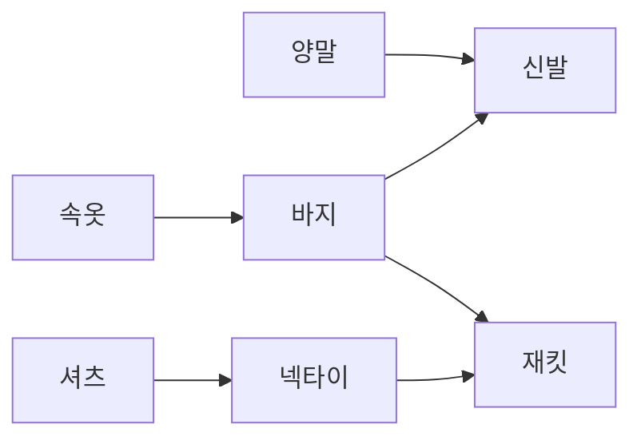

# Topological Sort (위상 정렬)

> **한 줄 요약**: 방향 그래프의 모든 간선 `u → v`를 "u가 v보다 먼저"로 읽고 모든 정점을 그 순서대로 한 줄로 세운다. 사이클이 있으면 불가능하며, 이 성질로 사이클도 판별한다.

## 1. 언제 쓰나 (문제 신호)

- "A를 하려면 먼저 B를 해야 한다" 같은 **선후 관계**(선수 과목, 작업 순서, 빌드 순서)를 모두 지키는 순서를 구하라
- **사이클이 있는가** (순환 의존)를 방향 그래프에서 판별
- 선후 관계가 있는 작업들의 **최소 소요 시간**(가장 긴 경로), 경우의 수 DP를 DAG 위에서
- "가능한 순서 중 **사전순으로 가장 앞선** 것"
- 무방향 그래프에서는 의미가 없습니다. 방향이 있어야 하고, 사이클이 없어야(DAG) 합니다.

## 2. 핵심 아이디어

**칸 알고리즘(Kahn)**: 정점마다 **진입 차수**(들어오는 간선의 수)를 셉니다. 진입 차수가 0인 정점은 아무도 기다리지 않으므로 지금 바로 맨 앞에 세울 수 있습니다.

1. 진입 차수가 0인 정점을 모두 큐에 넣는다.
2. 큐에서 하나 꺼내 순서에 추가하고, 그 정점에서 나가는 간선을 모두 지운다 (이웃의 진입 차수를 1씩 뺀다).
3. 진입 차수가 새로 0이 된 정점을 큐에 넣는다. 큐가 빌 때까지 반복한다.

**사이클 판별**: 큐가 비었는데 순서에 들어간 정점이 `n`개보다 적다면, 남은 정점은 서로를 기다리는 사이클에 막혀 있는 것입니다.

**DFS 방식**: DFS로 정점의 모든 후손을 다 방문한 뒤에야 그 정점을 후위 순서에 넣고, 마지막에 **뒤집습니다**. 정점이 끝나는 시점에는 그 정점이 가리키는 모든 정점이 이미 끝나 있기 때문입니다. "탐색 중"인 정점을 다시 만나면 사이클입니다. 재귀 한도를 피하려고 이 폴더의 구현은 스택을 직접 씁니다.

**순서는 여러 개**입니다. 큐의 순서나 DFS의 이웃 순서에 따라 달라지며, 모두 정답입니다. 문제가 "하나만 출력"이면 검사기가 있고, "사전순 최소"처럼 하나로 정해지면 아래 변형을 씁니다.

**사전순 최소**: 큐 대신 **최소 힙**을 써서 진입 차수가 0인 정점 중 번호가 가장 작은 것을 먼저 꺼냅니다.

**DAG 위의 DP**: 위상 순서대로 보면 한 정점을 처리할 때 그 정점의 모든 선행 정점이 이미 처리되어 있습니다. 그래서 "가장 빨리 끝나는 시각 = 자기 시간 + 선행 작업들이 끝나는 시각의 최댓값"을 한 번의 훑기로 구합니다.

### 무엇을 저장하고 어떻게 움직이나

DAG에서 모든 선행 정점이 처리된 정점만 다음에 처리합니다. 진입 차수는 아직 처리되지 않은 선행 간선 수입니다. 차수가 0인 정점을 큐에 넣고 제거할 때 후속 정점의 차수를 줄입니다.

### 왜 이 방법이 맞는가

차수가 0인 정점은 현재 남은 그래프에서 반드시 맨 앞에 놓아도 됩니다. DAG에는 항상 그런 정점이 존재합니다. 모든 정점을 제거하지 못했다면 남은 정점들의 선행 관계에 사이클이 있습니다. 가능한 위상 순서는 여러 개일 수 있습니다.

### 작은 예제로 검산하기

A→C, B→C라면 A와 B의 순서는 자유지만 C는 둘 뒤여야 합니다. A만 처리했을 때 C의 차수는 아직 1입니다. 정점 하나에서 시작하는 DFS만 하면 비연결 요소를 놓치므로 전체 그래프를 대상으로 합니다.

## 3. 손으로 따라가기

옷 입는 순서. 간선은 "먼저 → 나중". 0 속옷, 1 바지, 2 신발, 3 양말, 4 셔츠, 5 넥타이, 6 재킷.



진입 차수 `[0, 1, 2, 0, 0, 1, 2]`, 처음 큐는 `[속옷, 양말, 셔츠]`.

| 꺼낸 정점 | 진입 차수가 0이 된 정점 | 큐 | 진입 차수 |
|---|---|---|---|
| 속옷 | 바지 | 양말, 셔츠, 바지 | `[0,0,2,0,0,1,2]` |
| 양말 | (신발은 아직 1) | 셔츠, 바지 | `[0,0,1,0,0,1,2]` |
| 셔츠 | 넥타이 | 바지, 넥타이 | `[0,0,1,0,0,0,2]` |
| 바지 | 신발 (재킷은 아직 1) | 넥타이, 신발 | `[0,0,0,0,0,0,1]` |
| 넥타이 | 재킷 | 신발, 재킷 | 모두 0 |
| 신발 | | 재킷 | |
| 재킷 | | 비어 있음 | |

순서: **속옷 → 양말 → 셔츠 → 바지 → 넥타이 → 신발 → 재킷** (`[0, 3, 4, 1, 5, 2, 6]`). 사전순(번호순)으로 가장 앞선 순서는 `[0, 1, 3, 2, 4, 5, 6]` (속옷, 바지, 양말, 신발, 셔츠, 넥타이, 재킷)이고, DFS 방식은 `[4, 5, 3, 0, 1, 6, 2]`를 냈습니다. 세 순서 모두 모든 간선을 지킵니다. ([테스트](test_solution.py)의 `test_readme_example`)

**소요 시간**: 작업 0~4의 시간이 `[3, 2, 1, 4, 5]`이고 `0→2`, `1→2`, `2→4`, `3→4`가 선행 관계라면, 작업 2는 0과 1이 모두 끝나야(3과 2 중 큰 값 3) 시작해 `3 + 1 = 4`에 끝나고, 작업 4는 2(4)와 3(4) 중 큰 값 4 뒤에 시작해 `4 + 5 = 9`에 끝납니다. `earliest_finish_times`의 결과 `[3, 2, 4, 4, 9]`.

## 4. 구현

전체 코드는 [solution.py](solution.py)에 있습니다.

```python
def topological_sort(n, edges):               # 칸 알고리즘
    graph, indegree = _build(n, edges)
    queue = deque(v for v in range(n) if indegree[v] == 0)
    order = []
    while queue:
        u = queue.popleft()
        order.append(u)
        for v in graph[u]:
            indegree[v] -= 1
            if indegree[v] == 0:
                queue.append(v)
    return order if len(order) == n else None  # 다 못 꺼냈다면 사이클
```

- 그래프는 **간선 목록** `[(u, v), ...]`(u가 v보다 먼저)과 정점 수 `n`으로 받습니다. 사이클이면 `None`.
- `topological_sort_dfs`: DFS 후위 순서를 뒤집는 방식 (색 0/1/2로 사이클 판별, 반복문).
- `smallest_topological_order`: 최소 힙으로 사전순 최소.
- `has_cycle`: 위상 정렬이 실패하면 사이클.
- `earliest_finish_times(durations, edges)`: 작업별 최단 완료 시각 (DAG DP).
- 직접 실행하면 `N M`과 `A B`(A가 B보다 앞) M줄을 받아 가능한 순서를 한 줄에 출력합니다. (사이클이면 `-1`)

## 5. 복잡도와 입력 크기 가이드

- **시간 O(V+E)**, **공간 O(V+E)**. 사전순 최소는 힙 때문에 O((V+E) log V).
- 이 환경에서 V = 10⁵, E = 5×10⁵인 DAG로 측정했습니다. ([복잡도 치트시트](../../../docs/complexity-cheatsheet.md))

| 방법 | 시간 |
|---|---|
| 칸 알고리즘 | 0.29초 |
| DFS 후위 순서 (반복문) | 0.34초 |
| 최소 힙 (사전순 최소) | 0.30초 |

- 재귀 DFS는 깊이가 V까지 갈 수 있어 10⁵에서 `RecursionError`가 납니다. 반복문이 안전합니다. (테스트가 길이 10만 사슬에서 확인합니다)

## 6. 자주 하는 실수

- **간선 방향을 반대로 입력**: "A 앞에 B" 문장이 `B → A`인지 `A → B`인지 확인하세요. 결과가 정확히 뒤집힙니다.
- **사이클 확인 누락**: 문제에서 사이클이 없다고 보장하지 않으면 `len(order) == n` 검사가 필요합니다.
- **순서가 여러 개일 때 정답 비교**: 자신의 출력과 예시 출력이 달라도 틀린 것이 아닐 수 있습니다. 검사기가 있는지, "사전순" 같은 조건이 있는지 확인하세요.
- **사전순 최소에 일반 큐 사용**: 큐는 번호순을 보장하지 않습니다. 최소 힙을 쓰세요.
- **중복 간선**: 같은 간선이 두 번 들어오면 진입 차수도 두 번 올라가고 두 번 내려가므로 괜찮습니다. 한쪽만 중복 처리하면 틀립니다.
- **재귀 DFS의 깊이**: 정점이 많으면 `RecursionError`. 반복문이나 `sys.setrecursionlimit`.
- **DP 순서**: 위상 순서가 아니라 번호 순서로 `dp`를 채우면 선행 정점이 아직 계산되지 않았을 수 있습니다.

## 7. 변형과 응용

- **작업 소요 시간, 임계 경로**: `earliest_finish_times`. 모든 작업이 끝나는 최소 시간은 `max(finish)`. 임계 경로에 속하는 간선을 세려면 역방향 그래프에서 같은 DP를 합니다.
- **DAG 위의 최단 경로**: 음수 간선이 있어도 위상 순서로 한 번 훑으면 O(V+E). ([벨만-포드](../../01-shortest-path/bellman-ford/)보다 빠르다)
- **경우의 수 세기(DP)**: 시작점에서 각 정점까지의 경로 수를 위상 순서로.
- **순서가 유일한가?**: 큐의 크기가 항상 1이면 유일합니다.
- **강한 연결 요소를 한 정점으로 묶은 뒤**: 사이클이 있는 그래프도 SCC를 압축하면 DAG가 되어 위상 정렬이 가능합니다. → [SCC](../../../lv3-advanced/03-graph-advanced/scc/)

## 8. 연습문제

[problems.md](problems.md)에 쉬운 것부터 어려운 순서로 정리했습니다.

## 9. 다음 단계

- 선행: [그래프](../../../lv1-elementary/05-graph-basics/graph/), [BFS](../../../lv1-elementary/05-graph-basics/bfs/)
- 이어서: [유니온 파인드](../union-find/), [SCC](../../../lv3-advanced/03-graph-advanced/scc/), [트리 DP](../../03-trees/tree-dp/)
