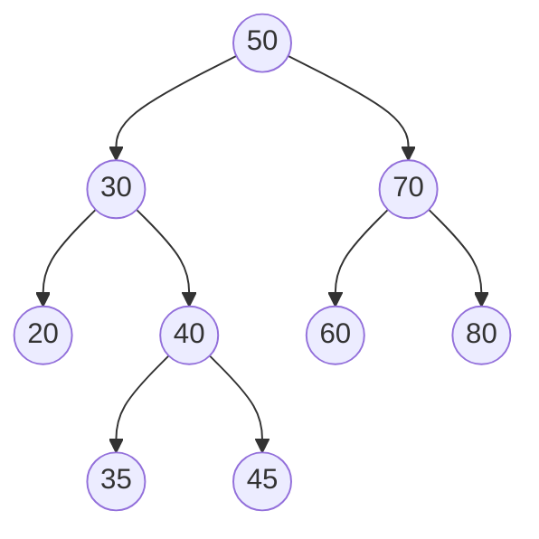

# Binary Search Tree (이진 탐색 트리)

> **한 줄 요약**: 모든 노드에서 "왼쪽 서브트리의 키 < 내 키 < 오른쪽 서브트리의 키"를 지키는 이진 트리. 한 번 비교할 때마다 절반씩 버리듯 내려가므로 검색·삽입·삭제가 평균 O(log n)이지만, 정렬된 순서로 넣으면 사슬이 되어 O(n)이 된다.

## 1. 언제 쓰나 (문제 신호)

- 값을 **동적으로 넣고 빼면서** "있는가", "최솟값/최댓값", "x 다음으로 큰 값", "k번째로 작은 값"을 묻는다
- **전위 순회 결과로부터 후위 순회 결과**를 복원하라 (BST의 성질을 이용)
- 이분 탐색을 하고 싶은데 배열 대신 **삽입·삭제가 섞인** 데이터에 쓰고 싶다
- 이후의 **균형 이진 트리**(AVL, 레드-블랙, 트립), 세그먼트 트리를 이해하는 출발점

파이썬 표준 라이브러리에는 균형 트리가 없습니다. 값이 최대 10⁵~10⁶개이고 삽입·삭제가 많지 않다면 **정렬된 리스트 + `bisect`** 가 더 간단하고 빠른 경우가 많습니다. BST는 구조 자체를 이해하는 것이 목적입니다.

## 2. 핵심 아이디어

**BST 성질**: 모든 노드 `x`에 대해 `x`의 왼쪽 서브트리의 모든 키는 `x.key`보다 작고, 오른쪽 서브트리의 모든 키는 `x.key`보다 큽니다. (이 구현은 같은 키를 한 번만 저장하는 집합입니다.)

그래서 **중위 순회**(왼쪽 → 나 → 오른쪽)를 하면 키가 **오름차순**으로 나옵니다.

**검색**: 루트에서 시작해 `찾는 키 < 내 키`이면 왼쪽, 크면 오른쪽, 같으면 찾았다. 없으면 `None`에서 끝납니다.

**삽입**: 검색하듯 내려가다 빈 자리에 새 잎으로 붙입니다.

**삭제**는 세 경우입니다.

1. **잎**: 그냥 뗀다.
2. **자식이 하나**: 그 자식으로 대체한다.
3. **자식이 둘**: 오른쪽 서브트리의 **최솟값**(후속자, 중위 순회에서 바로 다음 키)의 키를 가져오고, 그 후속자 노드를 지운다. (후속자는 왼쪽 자식이 없으므로 경우 1 또는 2)

**서브트리 크기(`size`)** 를 노드마다 저장하면 순서 질의가 O(높이)가 됩니다.

- **k번째로 작은 키**: 왼쪽 서브트리의 크기 `L`과 `k`를 비교한다. `k = L + 1`이면 지금 노드, `k ≤ L`이면 왼쪽, 아니면 `k − (L + 1)`번째를 오른쪽에서.
- **순위(rank)**: `key`보다 작은 키의 개수. 내려가다 오른쪽으로 꺾을 때마다 `왼쪽 크기 + 1`을 더한다.

**성능은 높이에 달려 있습니다.** 키를 무작위 순서로 넣으면 높이가 O(log n)이지만, `1, 2, 3, …`처럼 정렬된 순서로 넣으면 왼쪽 자식이 없는 사슬이 되어 높이가 n입니다. 높이를 항상 O(log n)으로 유지하는 것이 균형 트리입니다.

## 3. 손으로 따라가기

키를 `50, 30, 70, 20, 40, 60, 80, 35, 45` 순서로 넣습니다.



- 중위 순회: `20 30 35 40 45 50 60 70 80` (정렬됨), 높이 4, 노드 9개
- `kth_smallest(4) = 40`, `rank(45) = 4` (45보다 작은 키 20, 30, 35, 40)
- `floor(55) = 50`, `ceil(55) = 60`, `successor(50) = 60`

**삭제 세 경우** (위 트리에서 차례로):

| 삭제 | 경우 | 결과 |
|---|---|---|
| 20 | 잎 | 30의 왼쪽이 비어짐 |
| 30 | 자식이 하나(오른쪽 40) | 30 자리를 40 서브트리가 대신함 (이제 루트의 왼쪽 자식은 40) |
| 50 (루트) | 자식이 둘 | 오른쪽 서브트리(70 아래)의 최솟값 60의 키를 루트로 가져오고, 원래 60 노드를 지움. 루트 키는 **60** |

세 번 삭제한 뒤 중위 순회는 `35 40 45 60 70 80`입니다. ([테스트](test_solution.py)의 `test_delete_all_three_cases`)

## 4. 구현

전체 코드는 [solution.py](solution.py)에 있습니다.

```python
class Node:
    __slots__ = ("key", "left", "right", "size")
    def __init__(self, key):
        self.key, self.left, self.right, self.size = key, None, None, 1

class BST:
    def insert(self, key):
        if key in self:
            return False
        new = Node(key)
        if self.root is None:
            self.root = new
            return True
        node = self.root
        while True:
            node.size += 1                       # 이 서브트리에 노드가 하나 는다
            if key < node.key:
                if node.left is None:
                    node.left = new
                    return True
                node = node.left
            else:
                if node.right is None:
                    node.right = new
                    return True
                node = node.right
```

- 모든 연산을 **반복문**으로 구현해, 사슬 모양의 깊은 트리에서도 `RecursionError`가 나지 않습니다.
- `delete`는 루트에서 지울 노드까지의 경로(`path`)를 모아 두었다가, 실제로 떼어 낸 뒤 경로 위 모든 노드의 `size`를 1씩 줄입니다.
- `minimum`, `maximum`, `inorder`, `height`, `kth_smallest`, `rank`, `floor`, `ceil`, `successor`도 있습니다.
- `build_balanced(sorted_keys)`: 정렬된 키의 가운데를 루트로 삼아 양쪽을 재귀로 만듭니다. 높이는 `⌈log₂(n+1)⌉`입니다.
- `postorder_from_preorder(preorder)`: BST의 전위 순회에서 후위 순회를 O(n)에 구합니다. 스택에 "오른쪽 자식이 아직 정해지지 않을 수 있는 노드"를 쌓고, 새 키가 스택 맨 위보다 크면 위에서부터 pop하며 마지막으로 pop한 노드의 오른쪽 자식으로 붙입니다.
- 직접 실행하면 한 줄에 키 하나씩(전위 순회)을 입력 끝까지 받아 후위 순회를 출력합니다.

## 5. 복잡도와 입력 크기 가이드

- 검색·삽입·삭제·순서 질의 모두 **O(높이)**. 키가 무작위 순서면 평균 O(log n), 정렬된 순서면 최악 O(n). **공간 O(n)**.
- 이 환경에서 측정한 값입니다. ([복잡도 치트시트](../../../docs/complexity-cheatsheet.md))

| 상황 | 결과 |
|---|---|
| 서로 다른 키 10⁵개를 무작위 순서로 삽입 | 0.37초, 높이 **42** |
| 같은 10⁵개를 `bisect.insort`로 정렬 리스트에 삽입 | 0.58초 |
| 키 3,000개를 **정렬된 순서**로 삽입 | 0.54초, 높이 **3,000** (사슬) |
| 정렬된 10⁵개로 `build_balanced` | 높이 **17** |

- 무작위 입력에서는 BST와 리스트 `insort`가 비슷한 시간입니다. 리스트는 삽입이 O(n)이지만 C로 구현된 메모리 이동이라 n이 10⁵ 정도까지는 빠릅니다.
- 입력이 정렬되어 있거나 거의 정렬되어 있다면(자주 있는 상황) 균형을 잡지 않는 BST는 쓰지 마세요.

## 6. 자주 하는 실수

- **정렬된 입력으로 삽입해 사슬이 됨**: 성능이 O(n)이 됩니다. 균형 트리를 쓰거나 `build_balanced`로 한 번에 만들어 두세요.
- **삭제 후 `size` 갱신 누락**: k번째 질의가 틀립니다. 지나온 모든 노드의 `size`를 줄여야 합니다.
- **자식이 둘일 때 후속자의 자리**: 후속자는 오른쪽 서브트리의 **가장 왼쪽** 노드입니다. 오른쪽 서브트리의 가장 오른쪽을 고르면 BST 성질이 깨집니다.
- **중복 키 처리**: 문제에 따라 무시할지, 개수를 셀지, 한쪽에 보낼지 정해야 합니다. 개수를 센다면 노드에 `count`를 둡니다.
- **재귀 구현의 깊이**: 사슬 모양에서 `RecursionError`. 반복문이나 `sys.setrecursionlimit`.
- **중위 순회가 정렬이라는 사실로 BST 검증**: 중위 순회가 오름차순이면 BST입니다. 각 노드의 자식 키만 비교해서는(부모-자식 관계만 봐서는) 틀립니다. 서브트리 전체가 범위 안에 있어야 합니다.
- **`None` 처리**: 빈 트리의 `minimum()`/`floor()`가 `None`을 반환하는 경우를 호출하는 쪽에서 확인하세요.

## 7. 변형과 응용

- **균형 이진 트리**: AVL, 레드-블랙, 트립, 스플레이 트리는 삽입·삭제 후 회전으로 높이를 O(log n)으로 유지합니다. 이 저장소에서는 상위 레벨에서 다룹니다.
- **세그먼트 트리, 펜윅 트리**: 값의 범위가 작으면 "BST로 k번째 찾기"를 이진 인덱스 트리로 더 빠르게 합니다. → [세그먼트 트리](../../../lv3-advanced/01-range-query-structures/segment-tree/), [펜윅 트리](../../../lv3-advanced/01-range-query-structures/fenwick-tree/)
- **이중 우선순위 큐, 다중 집합**: 최솟값과 최댓값을 모두 꺼내야 하는 문제는 BST(multiset)나 힙 두 개 + 지연 삭제.
- **정렬된 리스트 + 이분 탐색**: 삽입이 드물면 가장 간단합니다. → [이분 탐색](../../../lv1-elementary/03-binary-search/binary-search/)
- **트라이**: 문자열 키의 이진 트리 변형. → [트라이](../../07-strings/trie/)

## 8. 연습문제

[problems.md](problems.md)에 쉬운 것부터 어려운 순서로 정리했습니다.

## 9. 다음 단계

- 선행: [트리](../../../lv1-elementary/05-graph-basics/tree/), [트리 순회](../../../lv1-elementary/05-graph-basics/tree-traversal/), [이분 탐색](../../../lv1-elementary/03-binary-search/binary-search/)
- 이어서: [트리 DP](../tree-dp/), [세그먼트 트리](../../../lv3-advanced/01-range-query-structures/segment-tree/)
