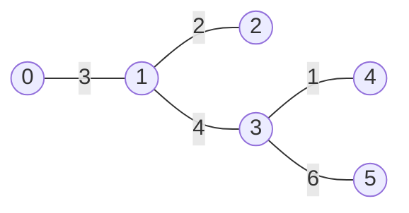

# Tree Diameter (트리의 지름)

> **한 줄 요약**: 트리에서 가장 멀리 떨어진 두 정점 사이의 거리. 아무 정점에서 가장 먼 정점 `u`를 찾고, `u`에서 가장 먼 정점 `v`를 찾으면 `(u, v)`가 지름의 양 끝이다. BFS 두 번이면 끝난다.

## 1. 언제 쓰나 (문제 신호)

- "트리에서 **가장 먼 두 정점**의 거리", "가장 긴 경로"
- 각 정점에서 **가장 먼 정점까지의 거리**(이심률)
- 트리의 **중심**(가장 먼 정점까지의 거리가 최소인 정점), **최소 높이 트리** (어디를 루트로 하면 높이가 가장 낮은가)
- 간선에 가중치가 있다. (단, **음수가 없어야** 이 풀이가 맞는다)

## 2. 핵심 아이디어

### 방법 ①: BFS(또는 DFS) 두 번

1. 임의의 정점 `a`에서 가장 먼 정점 `u`를 구한다.
2. `u`에서 가장 먼 정점 `v`를 구한다. `dist(u, v)`가 지름이다.

**왜 맞는가.** (스케치) 지름의 한 끝점을 `p`, `q`라고 하자. `a`에서 가장 먼 정점 `u`는 **항상 어떤 지름의 끝점**이다. 만약 `u`가 아니라면 `a → u` 경로와 `p ↔ q` 경로가 만나는 지점에서 `u`가 반대편 끝점보다 더 멀거나 같다는 것을 보여, `u`를 끝점으로 하는 더 긴(또는 같은) 경로가 존재해 지름이 되는 모순이 생긴다. 지름의 한 끝점에서 가장 먼 정점은 다른 끝점이므로 두 번째 탐색이 지름을 준다. **간선 가중치가 음수이면 "멀다"의 성질이 깨져 틀립니다.**

### 방법 ②: 트리 DP

각 정점 `v`를 "꼭대기"로 하는 가장 긴 경로는 **가장 깊은 두 자식 방향의 길이의 합**입니다. `down[v]` = `v`에서 서브트리 안으로 내려가는 가장 긴 길이. 모든 `v`에 대해 `(가장 긴 두 자식 방향 길이의 합)`의 최댓값이 지름입니다. 리프에서 위로 올라오며 계산합니다.

### 이심률과 중심

지름의 양 끝점을 `u`, `v`라 하면, **어떤 정점에서든 가장 먼 정점은 `u` 또는 `v`** 입니다. 그러므로 정점 `x`의 이심률(가장 먼 정점까지의 거리)은 `max(dist(x, u), dist(x, v))`이고, BFS 두 번(u에서, v에서)으로 **모든 정점의 이심률**이 나옵니다. 이심률이 가장 작은 정점이 **중심**이며, 지름 경로의 한가운데에 있습니다(한 개 또는 인접한 두 개).

### 무엇을 저장하고 어떻게 움직이나

지름은 트리 안에서 가장 먼 두 정점 사이의 거리입니다. 임의의 정점에서 가장 먼 정점 a를 찾고, a에서 다시 가장 먼 b를 찾습니다. 지름 길이뿐 아니라 부모 정보로 실제 경로도 복원할 수 있습니다.

### 왜 이 방법이 맞는가

무가중치 또는 비음수 가중치 트리에서는 유일 경로와 가장 먼 거리의 성질로 첫 탐색의 끝점이 지름의 끝점 후보가 됩니다. 두 번째 탐색이 반대 끝을 찾습니다. 음수 가중치를 허용하면 같은 논증을 그대로 적용할 수 없습니다.

### 작은 예제로 검산하기

간선 A-B-C-D가 모두 1이고 B에서 시작하면 D가 가장 멉니다. D에서 다시 탐색하면 A까지 거리가 3으로 지름입니다. 정점 수로 경로 길이를 표현하는 문제라면 간선 수 3과 정점 수 4를 구분합니다.

## 3. 손으로 따라가기

정점 0..5, 간선 `0–1 (3)`, `1–2 (2)`, `1–3 (4)`, `3–4 (1)`, `3–5 (6)`.



| 단계 | 시작 | 거리 `[0,1,2,3,4,5]` | 가장 먼 정점 |
|---|---|---|---|
| ① | 0 | `[0, 3, 5, 7, 8, 13]` | **5** (거리 13) |
| ② | 5 | `[13, 10, 12, 6, 7, 0]` | **0** (거리 13) |

지름은 **13**, 양 끝점은 `0`과 `5`, 경로는 `0 → 1 → 3 → 5`.

이심률은 `max(dist(x, 0), dist(x, 5))`: 정점 0 → 13, 1 → 10, 2 → 12, 3 → 7, 4 → 8, 5 → 13. 최솟값 7인 정점 **3**이 중심입니다. (지름 경로의 합 13에서, 한가운데 6.5에 가장 가까운 정점)

## 4. 구현

전체 코드는 [solution.py](solution.py)에 있습니다.

```python
def tree_diameter(n, edges):
    adj = _adjacency(n, edges)
    d0, _ = distances_from(adj, 0)
    u = max(range(n), key=lambda x: d0[x])      # 어느 정점에서든 가장 먼 정점은 지름의 한 끝점
    du, _ = distances_from(adj, u)
    v = max(range(n), key=lambda x: du[x])
    return du[v], u, v                           # (지름, 끝점 u, 끝점 v)
```

- 입력은 **가중치 있는 무방향 간선 목록** `[(u, v, w), ...]`과 정점 수입니다.
- `distances_from`: BFS로 한 정점에서의 거리와 부모. 트리는 경로가 하나뿐이라 BFS로 충분합니다.
- `diameter_path`: 부모를 따라가 지름 경로의 정점 목록을 만듭니다.
- `tree_diameter_dp`: 트리 DP 방식(위의 방법 ②).
- `eccentricities`, `tree_centers`: 모든 정점의 이심률과 중심.
- 직접 실행하면 `N`과 N−1개의 간선 `A B C`를 받아 지름을 출력합니다.

## 5. 복잡도와 입력 크기 가이드

- **시간 O(n)** (BFS 두 번), **공간 O(n)**. ([복잡도 치트시트](../../../docs/complexity-cheatsheet.md))
- 이 환경에서 길이 10⁵의 사슬(깊이 최대)에서 BFS 방식 0.10초, DP 방식 0.11초였습니다. 둘 다 재귀를 쓰지 않습니다.
- 정점 수가 10⁵를 넘는 입력은 간선 입력에 `sys.stdin.readline`을 쓰세요.

## 6. 자주 하는 실수

- **음수 가중치**: "가장 먼 정점" 성질이 깨져 두 번 탐색 방법이 틀립니다. 음수가 있다면 DP로 최대 경로 합을 따로 정의해야 합니다.
- **첫 탐색을 루트에서만**: 어느 정점에서 시작해도 되지만, 두 번째 탐색은 **반드시 첫 번째에서 찾은 가장 먼 정점**에서 시작합니다.
- **지름을 간선 수로 착각**: 가중치가 있으면 합, 없으면 간선 수. 문제에서 "길이"의 정의를 확인하세요.
- **재귀 DFS의 깊이**: 사슬 모양에서 `RecursionError`. BFS나 반복문을 쓰세요.
- **정점이 하나인 트리**: 지름은 0입니다.
- **연결되지 않은 입력**: 이 구현은 연결된 트리를 가정합니다. 숲이면 요소별로 구합니다.
- **DP 방식에서 부모 방향 거리**: 상향식으로 올라올 때 간선 가중치를 더하는 것을 빠뜨리지 마세요.

## 7. 변형과 응용

- **최소 높이 트리**: 루트를 중심에 두면 높이가 최소. 리프를 하나씩 벗겨 가장 안쪽의 한두 정점을 남겨도 같다. (LeetCode 310)
- **두 정점 사이의 거리**: 루트에서의 깊이와 [LCA](../../../lv3-advanced/03-graph-advanced/lca/)로 O(log n)에.
- **트리 DP로 일반화**: 경로 합의 최댓값(음수 가중치 허용), 지름 위의 정점 수 등. → [트리 DP](../tree-dp/)
- **트리의 반지름 = ⌈지름/2⌉** (간선 수가 정수일 때)
- **트리가 아닌 그래프**에서는 이 방법이 맞지 않습니다. 모든 쌍의 최단 거리가 필요합니다. → [플로이드-워셜](../../01-shortest-path/floyd-warshall/)

## 8. 연습문제

[problems.md](problems.md)에 쉬운 것부터 어려운 순서로 정리했습니다.

## 9. 다음 단계

- 선행: [트리](../../../lv1-elementary/05-graph-basics/tree/), [BFS](../../../lv1-elementary/05-graph-basics/bfs/)
- 이어서: [트리 DP](../tree-dp/), [LCA](../../../lv3-advanced/03-graph-advanced/lca/)
