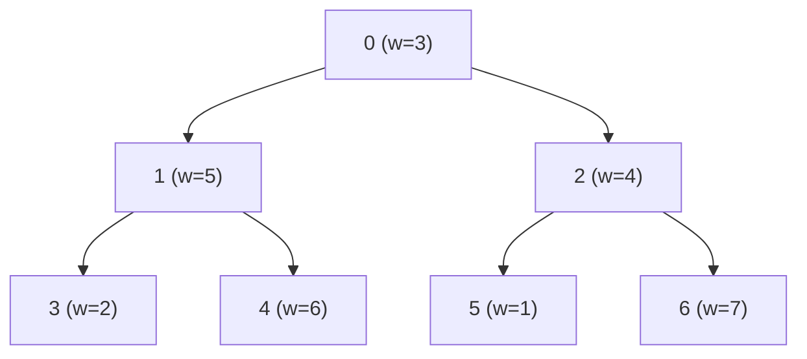

# Tree DP (트리 DP)

> **한 줄 요약**: 트리에 루트를 정하고, 각 정점에서 "그 정점을 루트로 하는 서브트리"의 답을 자식들의 답으로 계산한다. 자식을 먼저 처리하는 순서(후위 순서)가 계산 순서이고, 상태는 대개 "이 정점을 고르는가/어떤 상태인가"다.

## 1. 언제 쓰나 (문제 신호)

- 트리에서 **정점/간선을 고르는데 인접한 것끼리 제약**이 있다 (인접한 정점을 둘 다 고를 수 없다, 모든 간선을 덮어야 한다)
- "**서브트리별**로 답이 정해지고 부모는 자식 답을 합친다"
- 트리의 **최대 독립 집합**, **최소 정점 덮개**, **지배 집합**, 서브트리 크기·합
- 트리에서 길이/가중치의 최대·최소 경로 (지름은 [트리의 지름](../tree-diameter/))
- n이 10⁵~10⁶이고 간선이 n−1개인 연결 그래프

## 2. 핵심 아이디어

트리는 사이클이 없으므로 루트를 정하면 모든 정점이 **부모-자식 관계**를 갖고, 정점 `v`의 서브트리들은 서로 독립입니다. 그래서

> `dp[v][상태]` = `v`를 루트로 하는 서브트리만 봤을 때, `v`가 그 상태일 때의 최적값

을 정의하면 `dp[v]`는 **자식들의 `dp`만으로** 계산됩니다. 자식이 전부 끝난 뒤에 부모를 계산해야 하므로 **리프에서 루트 방향**으로 처리합니다. (재귀 DFS의 후위 순서와 같다. 이 구현은 BFS 순서를 뒤집어 재귀를 쓰지 않는다.)

### 예 ① 최대 가중치 독립 집합

서로 인접하지 않은 정점들을 골라 가중치의 합을 최대로.

- `dp[v][1]` = `v`를 고를 때: `weights[v] + Σ dp[자식][0]` (고르면 자식은 고를 수 없다)
- `dp[v][0]` = `v`를 안 고를 때: `Σ max(dp[자식][0], dp[자식][1])` (자식은 자유)
- 답: `max(dp[루트][0], dp[루트][1])`

### 예 ② 최소 정점 덮개

모든 간선의 적어도 한 끝점을 고르도록 하는 최소 정점 수.

- `dp[v][1]` = 고를 때: `1 + Σ min(dp[자식][0], dp[자식][1])`
- `dp[v][0]` = 안 고를 때: `Σ dp[자식][1]` (간선 `(v, 자식)`을 덮으려면 자식이 골라져야 한다)

트리에서는 **(최소 정점 덮개) + (최대 독립 집합) = n** (가중치 1일 때)입니다. 덮개의 여집합이 독립 집합이기 때문입니다.

### 예 ③ 최소 지배 집합 (세 가지 상태)

모든 정점이 "골라졌거나 골라진 이웃이 있도록" 하는 최소 정점 수. 상태가 둘로는 부족합니다.

| 상태 | 뜻 | 점화식 |
|---|---|---|
| `dp[v][0]` | `v`를 고름 | `1 + Σ min(dp[자식][0], dp[자식][1], dp[자식][2])` |
| `dp[v][1]` | `v`는 안 고르고, **자식 중 하나가 골라져** 이미 덮임 | `Σ min(dp[자식][0], dp[자식][1])`에 더해 **적어도 한 자식은 상태 0**이 되도록 가장 적게 드는 증가분 |
| `dp[v][2]` | `v`는 안 고르고 아직 덮이지 않음 (부모가 덮어 줄 것) | `Σ dp[자식][1]` (자식이 `v`를 덮어 주지 않으므로 자식은 스스로 덮여 있어야 한다) |

답: `min(dp[루트][0], dp[루트][1])` (루트는 부모가 없어 상태 2일 수 없다).

## 3. 손으로 따라가기

정점 0..6, 가중치 `[3, 5, 4, 2, 6, 1, 7]`, 간선 `0–1, 0–2, 1–3, 1–4, 2–5, 2–6`. 0이 루트.



리프부터 계산합니다. 각 칸은 `(안 고름, 고름)`.

| 정점 | 안 고름 `dp[v][0]` | 고름 `dp[v][1]` |
|---|---|---|
| 3 (리프) | 0 | 2 |
| 4 (리프) | 0 | 6 |
| 5 (리프) | 0 | 1 |
| 6 (리프) | 0 | 7 |
| 1 | max(0,2) + max(0,6) = **8** | 5 + 0 + 0 = **5** |
| 2 | max(0,1) + max(0,7) = **8** | 4 + 0 + 0 = **4** |
| 0 | max(8,5) + max(8,4) = **16** | 3 + 8 + 8 = **19** |

답은 `max(16, 19) = 19`. 복원: 루트는 "고름"(19 > 16), 따라서 자식 1, 2는 고를 수 없음. 1의 서브트리에서는 1을 고르지 않는 쪽이 더 크므로(8 > 5) 3, 4를 고르고, 2의 서브트리에서도 5, 6을 고릅니다. 고른 정점 `{0, 3, 4, 5, 6}`, 가중치 `3 + 2 + 6 + 1 + 7 = 19`.

같은 트리에서 최소 정점 덮개는 `{1, 2}`(**2**개), 최소 지배 집합도 `{1, 2}`(**2**개)입니다. (`min_vertex_cover`, `min_dominating_set`)

## 4. 구현

전체 코드는 [solution.py](solution.py)에 있습니다.

```python
def max_weight_independent_set(n, weights, edges):
    order, children = _rooted(n, edges)         # 루트 0, BFS 순서
    dp = [[0, 0] for _ in range(n)]
    for v in reversed(order):                   # 자식이 부모보다 먼저 계산된다
        dp[v][1] = weights[v]
        for c in children[v]:
            dp[v][1] += dp[c][0]
            dp[v][0] += max(dp[c][0], dp[c][1])
    ...                                         # 루트에서 내려가며 어느 쪽을 택했는지 복원
    return max(dp[order[0]]), sorted(chosen)
```

- 입력은 **무방향 간선 목록** `[(u, v), ...]`과 정점 수입니다. `_rooted`가 루트 0을 기준으로 BFS해서 부모와 자식을 정합니다.
- `max_weight_independent_set(n, weights, edges)` → `(최댓값, 고른 정점들)`, `min_vertex_cover`, `min_dominating_set`.
- 가중치가 음수인 정점은 고르지 않는 것이 이득입니다(`[-5, 4, -1]` 사슬 → 4만 선택).
- 직접 실행하면 `N`, 가중치, N−1개의 간선을 받아 최댓값과 고른 정점들을 출력합니다.

## 5. 복잡도와 입력 크기 가이드

- **시간 O(n)**: 정점마다 자식을 한 번씩 봅니다. **공간 O(n)**. ([복잡도 치트시트](../../../docs/complexity-cheatsheet.md))
- 재귀 DFS로 구현하면 사슬 모양의 트리(깊이 10⁵)에서 파이썬의 재귀 한도에 걸립니다. 이 폴더의 테스트는 길이 10만 사슬에서 세 함수를 모두 확인합니다.

## 6. 자주 하는 실수

- **부모 방향 간선을 자식으로 오해**: 무방향 간선은 양쪽에 모두 넣고, 방문한 정점을 건너뛰어야 부모가 자식 목록에 들어가지 않습니다.
- **자식보다 부모를 먼저 계산**: `reversed(order)`로 돌려야 합니다. 번호 순서로 `dp`를 채우면 안 됩니다(번호가 부모-자식 순서를 보장하지 않음).
- **상태가 부족함**: 지배 집합처럼 "덮였는가"를 구분해야 하면 상태를 늘려야 합니다.
- **리프의 초깃값**: 리프는 자식이 없으므로 `dp[v][1] = weights[v]`, `dp[v][0] = 0`이어야 합니다. 상태 1이 "자식이 골라져야 한다"는 뜻일 때 리프는 불가능(`inf`)입니다.
- **복원 시 루트의 선택**: 최댓값이 `dp[루트][0]`과 `dp[루트][1]` 중 어느 쪽인지로 시작합니다.
- **그래프가 연결되어 있지 않음(숲)**: 연결 요소마다 따로 계산해서 합쳐야 합니다.

## 7. 변형과 응용

- **서브트리 크기·합**: `size[v] = 1 + Σ size[자식]`. ([트리](../../../lv1-elementary/05-graph-basics/tree/)에서 다룸)
- **트리의 지름, 중심**: DP로도 구할 수 있습니다. → [트리의 지름](../tree-diameter/)
- **이진 트리 위의 카메라/집 도둑**: 같은 틀(LeetCode 337, 968)
- **루트를 바꾸는 DP(리루팅)**: 모든 정점을 루트로 했을 때의 값을 O(n)에 구하려면 위로 올라오는 값을 한 번 더 계산합니다.
- **트리 배낭(서브트리 크기 제한)**: 서브트리를 합칠 때 개수별로 합쳐 `dp[v][k]`를 만들고 크기 합의 성질로 O(n²) 또는 O(nk).
- **구간 DP, 비트마스크 DP**: 트리가 아닌 다른 구조에서의 DP. → [구간 DP](../../04-dynamic-programming/interval-dp/), [비트마스크 DP](../../04-dynamic-programming/bitmask-dp/)

## 8. 연습문제

[problems.md](problems.md)에 쉬운 것부터 어려운 순서로 정리했습니다.

## 9. 다음 단계

- 선행: [트리](../../../lv1-elementary/05-graph-basics/tree/), [DP 연습](../../../lv1-elementary/07-algorithm-paradigms/dp-practice/)
- 이어서: [트리의 지름](../tree-diameter/), [LCA](../../../lv3-advanced/03-graph-advanced/lca/)
