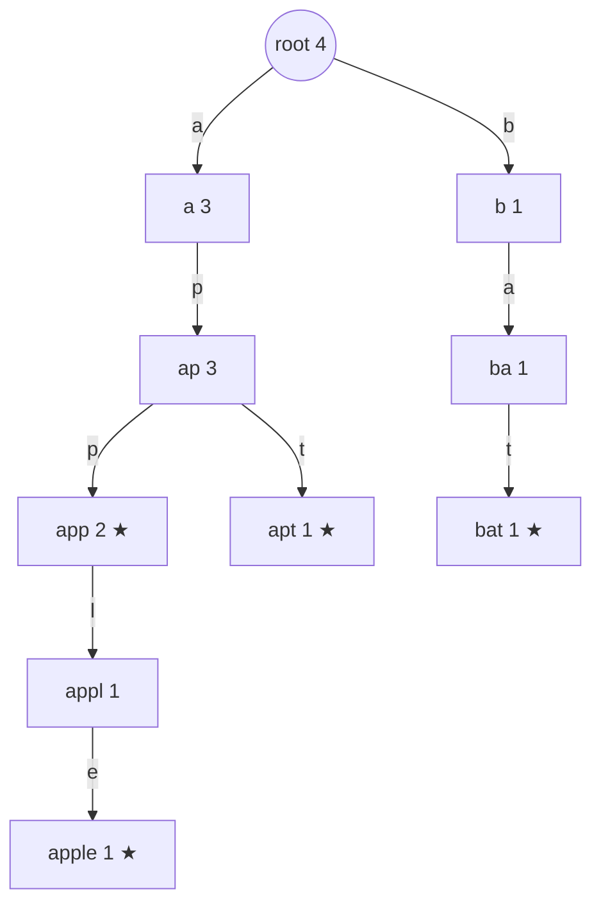

# Trie (트라이, 접두사 트리)

> **한 줄 요약**: 문자열을 글자 하나씩 간선으로 하는 **트리**에 저장한다. 루트에서 내려간 경로가 곧 접두사라서, 단어가 몇 개든 길이 `L`인 문자열의 삽입·검색·"이 접두사로 시작하는 단어 수"가 모두 `O(L)`이다. 숫자를 이진수로 보고 비트를 간선으로 삼으면 "XOR이 최대인 두 수"도 풀 수 있다.

## 1. 언제 쓰나 (문제 신호)

- "이 접두사로 **시작하는** 단어가 몇 개인가", "자동 완성 후보를 사전순으로"
- 단어 집합에서 "어떤 단어가 다른 단어의 **접두어**인가" (전화번호 목록 일관성)
- 수많은 문자열을 한꺼번에 다루면서 공통 접두사를 활용 (공통 접두사 길이, 입력 횟수 세기)
- "배열에서 **XOR이 최대(최소)인 두 수**", 구간·부분 수열의 XOR 최대 → 이진 트라이
- 문자열 집합에 대해 정확 일치만 묻는다면 `set`이 훨씬 간단하고 빠르다 (트라이는 **접두사** 질의가 필요할 때)

## 2. 핵심 아이디어

**구조**: 루트는 빈 문자열. 노드 하나가 접두사 하나이고, 자식은 다음 글자별로 하나씩 있습니다. 단어를 넣을 때 글자를 따라 내려가며 없는 노드를 만들고, 마지막 노드에 "여기서 단어가 끝난다"는 표시를 합니다.



노드 안의 숫자는 그 노드를 **지나가는 단어의 수**(`passing`), ★는 단어가 끝나는 곳입니다. 이 두 값이 핵심입니다.

- **정확 일치** `count(word)`: 글자를 따라 내려가 도착한 노드의 `end_count`. 중간에 막히면 0. 도착했어도 ★가 아니면 단어가 아닙니다 (`ap`는 접두사일 뿐 단어가 아님).
- **접두사 질의** `count_prefix(prefix)`: 도착한 노드의 `passing`. 그 아래 모든 단어가 지나가기 때문입니다.

**왜 해시보다 좋은가**: `set`은 "이 문자열이 있나"만 답합니다. "`ap`로 시작하는 단어가 몇 개"는 모든 단어를 훑어야 합니다. 트라이는 `O(접두사 길이)`입니다. (정렬한 뒤 `bisect`로 구간을 찾는 방법도 있으며 같은 값을 줍니다. 트라이가 필요한 것은 삭제·갱신이 섞이거나 노드 정보를 붙여야 할 때입니다.)

**이진 트라이로 XOR 최대**: 수를 높은 비트부터 `0/1` 문자열로 보고 트라이에 넣습니다. 각 수 `x`마다 높은 비트부터 **반대 비트**의 자식이 있으면 그쪽으로 내려갑니다. 그 자리가 `1`이 되고, 높은 자리의 `1`은 아래 모든 자리를 합친 것보다 크기 때문에 욕심쟁이 선택이 최적입니다. `n`개의 수를 `b`비트로 보면 `O(n·b)`.

## 3. 손으로 따라가기

### 삽입과 질의: `["app", "apple", "apt", "bat"]`

위의 그림이 네 단어를 모두 넣은 결과입니다 (루트 포함 노드 10개).

| 단어 삽입 | 새로 만든 노드 | 지나간 노드의 `passing` 증가 |
|---|---|---|
| `app` | `a`, `ap`, `app` | 루트 1, `a` 1, `ap` 1, `app` 1 (★) |
| `apple` | `appl`, `apple` | 루트 2, `a` 2, `ap` 2, `app` 2, `appl` 1, `apple` 1 (★) |
| `apt` | `apt` | 루트 3, `a` 3, `ap` 3, `apt` 1 (★) |
| `bat` | `b`, `ba`, `bat` | 루트 4, `b` 1, `ba` 1, `bat` 1 (★) |

질의 결과 (이 환경에서 확인):

| 질의 | 결과 | 설명 |
|---|---|---|
| `count_prefix("ap")` | 3 | `app`, `apple`, `apt` |
| `count_prefix("app")` | 2 | `app`, `apple` |
| `count_prefix("c")` | 0 | 루트에서 `c` 자식이 없음 |
| `"app" in trie` | True | `app` 노드가 ★ |
| `"ap" in trie` | False | 노드는 있지만 ★가 아님 |
| `words_with_prefix("ap")` | `['app', 'apple', 'apt']` | `ap` 아래를 사전순 DFS |

`app`을 한 번 더 넣으면 `count("app") = 2`, `count_prefix("ap") = 4`. `erase("app")`로 하나를 지우면 `count("app") = 1`, `count_prefix("ap") = 3`으로 돌아옵니다. 지나온 노드의 `passing`을 모두 줄이기 때문에 접두사 개수도 맞습니다. 없는 `zzz`를 지우려 하면 `False`.

### 공통 접두사

`longest_common_prefix`는 단어들을 넣은 뒤 **자식이 하나뿐이고 단어가 끝나지 않는 동안** 내려갑니다.

| 입력 | 결과 |
|---|---|
| `["flower", "flow", "flight"]` | `fl` (`flo`와 `fli`로 갈라짐) |
| `["dog", "racecar"]` | `` (빈 문자열, 루트에서 이미 갈라짐) |
| `["ab", "abc"]` | `ab` (`ab` 노드에서 단어가 끝나므로 멈춤) |

### 이진 트라이: `[3, 10, 5, 25, 2, 8]`의 최대 XOR

5비트로 쓰면 `3 = 00011`, `10 = 01010`, `5 = 00101`, `25 = 11001`, `2 = 00010`, `8 = 01000`. `x = 5 (00101)`로 시작하면:

| 비트 위치 | `x`의 비트 | 반대 비트 | 가능한가 | XOR 누적 |
|---|---|---|---|---|
| 4 | 0 | 1 | `25`가 있어 가능 | `10000` |
| 3 | 0 | 1 | 경로 `1…`에서 `25 = 11001`이 `1` | `11000` |
| 2 | 1 | 0 | `25`의 비트 2는 0 | `11100` |
| 1 | 0 | 1 | `25`의 비트 1은 0이라 불가능 → 같은 비트로 | `11100` |
| 0 | 1 | 0 | `25`의 비트 0은 1이라 불가능 → 같은 비트로 | `11100` |

`11100₂ = 28 = 5 ⊕ 25`. 다른 수로 시작해도 28을 넘지 못하므로 `max_xor_pair([3, 10, 5, 25, 2, 8]) = 28`입니다.

## 4. 구현

전체 코드는 [solution.py](solution.py)에 있습니다.

```python
class Trie:
    def __init__(self):
        self.children = [{}]        # 노드 i 의 자식: {글자: 노드 번호}
        self.end_count = [0]        # 노드 i 에서 끝나는 단어의 수
        self.passing = [0]          # 노드 i 를 지나는 단어의 수
        self.word_count = 0

    def insert(self, word):
        node = 0
        self.passing[0] += 1
        for ch in word:
            nxt = self.children[node].get(ch)
            if nxt is None:         # 없으면 새 노드
                nxt = self._new_node()
                self.children[node][ch] = nxt
            node = nxt
            self.passing[node] += 1
        self.end_count[node] += 1
        self.word_count += 1

    def count_prefix(self, prefix):
        node = self._walk(prefix)   # 글자를 따라 내려간다. 막히면 -1
        return 0 if node == -1 else self.passing[node]
```

- `count(word)`, `word in trie`, `starts_with(prefix)`, `erase(word)`, `words_with_prefix(prefix)`(사전순, 반복문 DFS).
- 노드를 객체가 아니라 **번호**와 병렬 리스트로 두었습니다. 객체를 만드는 것보다 가볍고 재귀 깊이 걱정이 없습니다.
- `longest_common_prefix(words)`, `max_xor_pair(numbers, bits=31)`(이진 트라이, 음수가 없는 수).
- 직접 실행하면 `N M`, 집합 `S`의 `N`개 문자열, 질의 `M`개 문자열을 받아 질의 중 `S`에 있는 것의 수를 출력합니다.

## 5. 복잡도와 입력 크기 가이드

- 삽입·검색·접두사 질의 모두 **O(L)** (`L`은 그 문자열 길이, 저장된 단어 수와 무관). 공간은 **O(전체 글자 수)**. ([복잡도 치트시트](../../../docs/complexity-cheatsheet.md))
- 이진 트라이: 수 하나당 **O(b)**(`b`는 비트 수).
- 이 환경에서 측정한 값입니다(무작위 소문자 단어, 길이 10, 10⁵개, 두 번 중 최소).

| 작업 | 시간 | 비고 |
|---|---|---|
| `Trie`에 10⁵개 삽입 | 0.45초 | 노드 707,800개 |
| `in`으로 10⁵번 검색 | 0.18초 | |
| `set`에 같은 단어 삽입 | 0.005초 | |
| `set`으로 10⁵번 검색 | 0.0035초 | |
| `max_xor_pair` (31비트 정수 10⁵개) | 2.3초 | 삽입 + 질의 각 `31 · 10⁵`번 |

- 정확 일치만 필요하면 `set`이 위 입력에서 삽입은 약 90배, 검색은 약 50배 빠릅니다. 트라이는 **접두사 질의**나 **노드마다 값을 붙일 때** 씁니다.
- 노드 수가 많아져 메모리가 문제가 됩니다(노드 1개당 딕셔너리 1개). 알파벳이 26자이면 배열로 만들 수도 있지만 파이썬에서는 `10⁶` 노드 × 26칸도 부담입니다. 단어의 전체 글자 수가 `10⁶`을 넘으면 정렬 + `bisect`를 고려하세요.
- `max_xor_pair`는 파이썬에서 `10⁵`개에 2초대입니다. 비트를 위에서부터 하나씩 확정하며 각 수의 접두사를 `set`에 담는 방법(`set` 연산 31번)이 더 빠를 수 있습니다(이 문서에서는 측정하지 않음).

## 6. 자주 하는 실수

- **끝 표시 누락**: `ap`는 `apple`을 넣으면 노드가 생기지만 단어는 아닙니다. 노드의 존재와 단어의 존재를 구분하세요.
- **접두사 개수에서 `end_count` 사용**: 접두사를 세려면 `passing`이 필요합니다. `end_count`만 있으면 아래를 모두 훑어야 합니다.
- **삭제 후 개수 불일치**: 지울 때 지나온 모든 노드의 `passing`을 줄여야 합니다. 노드 자체는 남겨도 `passing`이 `0`이면 질의는 맞습니다.
- **재귀 DFS**: 단어 길이가 길면 재귀 깊이 제한에 걸립니다. `words_with_prefix`처럼 스택을 직접 씁니다.
- **사전순 DFS의 스택 순서**: 스택은 마지막에 넣은 것을 먼저 꺼내므로 자식을 **거꾸로** 정렬해 넣어야 사전순으로 나옵니다.
- **이진 트라이의 비트 수**: 값의 최댓값보다 비트가 적으면 윗자리가 잘립니다. `bits=31`은 `2³¹ − 1`까지. 음수는 따로 다룹니다.
- **중복 단어**: 같은 단어를 두 번 넣으면 `passing`이 두 번 올라갑니다. 집합으로 중복을 제거하고 싶으면 이미 있는지 먼저 확인합니다.
- **메모리**: 노드마다 딕셔너리를 두면 큰 입력(10⁶ 글자 이상)에서 메모리 초과가 날 수 있습니다.

## 7. 변형과 응용

- **자동 완성**: 접두사 노드 아래를 DFS하고, 노드에 빈도를 저장하면 상위 `k`개 추천.
- **XOR 문제**: 구간 XOR 최대는 누적 XOR(`prefix_xor`)과 이진 트라이를 결합합니다. 삭제를 지원하려면 노드마다 개수를 둡니다.
- **전화번호 목록 일관성**: 정렬 후 인접한 두 번호만 비교하거나, 트라이에 넣으면서 "중간 노드가 이미 ★인가 / 끝 노드에 자식이 있는가"를 확인합니다.
- **압축 트라이(radix tree)**: 자식이 하나뿐인 경로를 하나의 간선으로 합쳐 노드 수를 줄입니다.
- **아호-코라식**: 트라이에 KMP의 실패 링크를 붙여 여러 패턴을 한 번에 찾습니다. → [아호-코라식](../../../lv3-advanced/05-strings-advanced/aho-corasick/)
- **접미사 트라이/배열**: 모든 접미사를 트라이에 넣은 것이 접미사 트리의 원형. → [접미사 배열과 LCP](../../../lv3-advanced/05-strings-advanced/suffix-array-lcp/)

## 8. 연습문제

[problems.md](problems.md)에 쉬운 것부터 어려운 순서로 정리했습니다.

## 9. 다음 단계

- 선행: [트리](../../../lv1-elementary/05-graph-basics/tree/), [해시 테이블](../../../lv1-elementary/01-data-structures/hash-table/), [집합과 딕셔너리](../../../lv1-elementary/01-data-structures/set-and-dict/)
- 이어서: [KMP](../kmp/), [아호-코라식](../../../lv3-advanced/05-strings-advanced/aho-corasick/), [접미사 배열과 LCP](../../../lv3-advanced/05-strings-advanced/suffix-array-lcp/)
