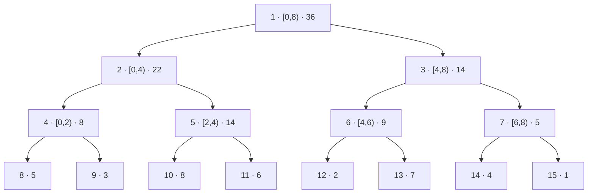

# Segment Tree (세그먼트 트리, 구간 트리)

> **한 줄 요약**: 배열을 반씩 나눈 **이진 트리**의 각 노드에 "자기 구간의 연산 결과"(합, 최솟값, 최댓값, gcd, …)를 저장해서 **한 칸 바꾸기(점 갱신)와 임의 구간 질의를 모두 `O(log n)`**에 처리한다. 결합 법칙을 만족하는 연산이면 무엇이든 되고, 합뿐 아니라 최솟값·최대 연속 부분 합 같은 "뺄 수 없는" 연산에도 쓸 수 있다.

## 1. 언제 쓰나 (문제 신호)

- "수열의 한 값을 바꾸는 질의와 **구간 최솟값(최댓값, gcd, 곱)** 질의가 섞여 있다" (질의 10⁵~10⁶개)
- 구간 합이면 [펜윅 트리](../fenwick-tree/)로도 되지만, **역연산이 없는 연산**(최솟값, 최댓값, gcd)은 세그먼트 트리가 필요하다
- 구간마다 **여러 값을 함께 관리**해야 한다 (구간의 최대 연속 부분 합, 구간의 최솟값과 그 개수)
- "구간에서 처음으로 조건을 만족하는 위치" (예: `x` 이상인 첫 값) → 트리 위에서 내려가기
- 갱신이 없는 정적 배열이면 [희소 배열](../sparse-table/)이 질의 `O(1)`로 더 빠르다
- 구간 전체를 한 번에 바꾸는 갱신(구간 더하기, 구간 대입)이 있으면 [느리게 갱신되는 세그먼트 트리](../lazy-propagation/)

## 2. 핵심 아이디어

**구조**: 길이 `n`인 배열을 반으로 쪼개 내려가는 이진 트리. 리프는 원소 하나, 내부 노드는 두 자식의 결과를 `op`로 합친 값이다. 높이가 `log n`이라 어떤 구간도 `O(log n)`개의 노드로 나눌 수 있다.



배열 `[5, 3, 8, 6, 2, 7, 4, 1]`의 합 트리입니다 (노드 번호 · 구간 · 값).

**배열로 표현하는 법**: 크기를 2의 거듭제곱 `size`로 맞추고, 리프를 `tree[size .. 2·size)`에 두면 노드 `i`의 자식은 `2i`와 `2i + 1`, 부모는 `i // 2`다. 포인터가 필요 없고, 부족한 칸은 **항등원**(합이면 0, 최솟값이면 ∞)으로 채운다.

**점 갱신**: 리프의 값을 바꾸고 루트까지 올라가며 `tree[i] = op(tree[2i], tree[2i+1])`로 다시 계산한다. 층마다 한 노드만 바뀌므로 `O(log n)`.

**구간 질의** `[left, right)` (아래에서 위로): `l = left + size`, `r = right + size`에서 시작해 한 층씩 올라간다.

- `l`이 **오른쪽 자식**(홀수)이면 그 노드는 구간에 완전히 들어가지만 부모는 아니다 → 결과에 포함하고 `l += 1`.
- `r`가 **오른쪽 자식**(홀수)이면 `r − 1`번 노드가 구간에 들어간다 → `r −= 1` 후 포함.
- 둘 다 `// 2`로 부모로 올라간다. `l ≥ r`이면 끝.

왼쪽 경계에서 모은 노드는 **왼쪽 결과** 뒤에, 오른쪽 경계에서 모은 노드는 **오른쪽 결과** 앞에 붙입니다. 그래서 교환 법칙이 없는 연산(행렬 곱, 문자열 이어 붙이기)에서도 순서가 맞습니다.

**트리 위에서 내려가기** `max_right`: "`left`부터 시작해 구간 결과가 조건을 만족하는 동안 가장 멀리"를 `O(log n)`에 찾는다. 최댓값 트리에서 조건을 `값 < x`로 두면 `x` 이상이 처음 나오는 위치다.

**여러 값을 함께 저장** (최대 연속 부분 합): 노드에 `(합, 최대 접두사 합, 최대 접미사 합, 최대 연속 부분 합)` 네 값을 둔다. 두 구간 `A`, `B`를 이으면

```
합   = A.합 + B.합
접두 = max(A.접두, A.합 + B.접두)
접미 = max(B.접미, B.합 + A.접미)
최대 = max(A.최대, B.최대, A.접미 + B.접두)      ← 가운데를 걸치는 경우
```

이 결합은 `A`와 `B`의 순서에 의존하는 **비가환** 연산이다.

### 무엇을 저장하고 어떻게 움직이나

배열 구간을 반씩 나누고 각 노드에 그 구간의 요약값을 저장합니다. 부모는 왼쪽·오른쪽 자식 값을 결합합니다. 합·최솟값·최댓값뿐 아니라 결합 순서를 보존한 행렬·함수 합성도 같은 틀로 처리할 수 있습니다.

### 왜 이 방법이 맞는가

결합 연산이 결합법칙을 만족하면 구간을 어떤 트리 모양으로 묶어도 같은 요약값을 얻습니다. 질의 구간을 덮는 O(log n)개 블록을 원래 배열 순서로 결합합니다. 덧셈처럼 교환법칙까지 만족하지 않는 연산에서는 좌우 누적 순서를 구분해야 합니다.

### 작은 예제로 검산하기

`[2,1,4,3]`의 합 트리 루트는 10이고 왼쪽·오른쪽 자식은 3과 7입니다. `[1,3)`의 합은 1+4=5입니다. 겹치지 않는 구간은 항등원 0을 반환합니다. 최솟값 연산의 항등원은 0이 아니라 무한대입니다.

## 3. 손으로 따라가기

### 구간 질의: 합 `query(2, 7)` (`size = 8`)

`l = 2 + 8 = 10`, `r = 7 + 8 = 15`.

| 반복 | `l`, `r` | `l`이 홀수? | `r`가 홀수? | 포함하는 노드 | 이후 `l`, `r` |
|---|---|---|---|---|---|
| 1 | 10, 15 | 아니오 | 예 → `r = 14` | 노드 14 (값 4) | 5, 7 |
| 2 | 5, 7 | 예 → 노드 5 (값 14), `l = 6` | 예 → `r = 6`, 노드 6 (값 9) | 노드 5, 6 | 3, 3 |
| 끝 | 3, 3 | `l ≥ r` | | | |

합친 노드는 `[2,4) → 14`, `[4,6) → 9`, `[6,7) → 4`이고 `14 + 9 + 4 = 27`. 직접 더한 `8+6+2+7+4 = 27`과 같습니다. 노드 3개만 봤습니다.

### 점 갱신: 최솟값 트리에서 `a[2] = 0`

최솟값 트리 `tree[1..15] = [1, 3, 1, 3, 6, 2, 1, 5, 3, 8, 6, 2, 7, 4, 1]`. 리프 10을 `0`으로 바꾸면 위로 `10 → 5 → 2 → 1`만 다시 계산합니다.

| 노드 | 계산 | 값 |
|---|---|---|
| 10 (리프) | 새 값 | 8 → **0** |
| 5 | `min(0, 6)` | 6 → **0** |
| 2 | `min(3, 0)` | 3 → **0** |
| 1 | `min(0, 1)` | 1 → **0** |

이 환경에서 확인한 바뀐 노드는 정확히 1, 2, 5, 10입니다.

### 내려가기: `max_right`

`a = [5, 3, 8, 6, 2, 7, 4, 1]`의 최댓값 트리에서 `x = 7`이상이 처음 나오는 위치: `max_right(0, 값 < 7)`은 **2** (`a[2] = 8`), `max_right(3, 값 < 7)`은 **5** (`a[5] = 7`), `x = 9`이면 조건을 만족하는 값이 없어 **8** (= `n`).

### 최대 연속 부분 합: `[-2, 1, -3, 4, -1, 2, 1, -5, 4]`

전체의 최대 연속 부분 합은 **6**(`4, -1, 2, 1`). `query(3, 7)`의 노드는 `(6, 6, 6, 6)`입니다. 합 6, 접두 6, 접미 6, 최대 6. `query(0, 3)`(`-2, 1, -3`)은 `(-4, -1, -2, 1)`: 합 -4, 최대 접두 `-2 + 1 = -1`, 최대 접미 `1 - 3 = -2`, 최대 부분 합 `1`. 구간 두 개를 이은 예: `(4,4,4,4)`와 `(-1,-1,-1,-1)`을 이으면 `(3, 4, 3, 4)`.

## 4. 구현

전체 코드는 [solution.py](solution.py)에 있습니다.

```python
class SegmentTree:
    def __init__(self, values, op, identity):
        self.n = len(values)
        self.op, self.identity = op, identity
        self.size = 1
        while self.size < self.n:
            self.size *= 2
        self.tree = [identity] * (2 * self.size)
        self.tree[self.size:self.size + self.n] = values       # 리프
        for i in range(self.size - 1, 0, -1):                  # 아래에서 위로
            self.tree[i] = op(self.tree[2 * i], self.tree[2 * i + 1])

    def update(self, index, value):
        i = self.size + index
        self.tree[i] = value
        i >>= 1
        while i:
            self.tree[i] = self.op(self.tree[2 * i], self.tree[2 * i + 1])
            i >>= 1

    def query(self, left, right):                              # [left, right)
        l, r = left + self.size, right + self.size
        left_result = right_result = self.identity
        while l < r:
            if l & 1:
                left_result = self.op(left_result, self.tree[l]); l += 1
            if r & 1:
                r -= 1; right_result = self.op(self.tree[r], right_result)
            l >>= 1; r >>= 1
        return self.op(left_result, right_result)
```

- `SegmentTree(values, op, identity)`: `op`와 `identity`만 바꾸면 합(`lambda a, b: a + b`, `0`), 최솟값(`min`, `float("inf")`), 최댓값, gcd(`math.gcd`, `0`) 트리가 된다.
- `get(index)`, `max_right(left, predicate)`.
- `max_subarray_tree(numbers)`: 최대 연속 부분 합 (`query(l, r)[3]`), `range_gcd_tree(numbers)`.
- 직접 실행하면 `N M`, `N`개의 수, 구간 질의 `M`개(`a b`, 1부터)를 받아 각 구간의 최솟값과 최댓값을 출력합니다.

## 5. 복잡도와 입력 크기 가이드

- **시간**: 구축 **O(n)**, 점 갱신·구간 질의 **O(log n)**, `max_right` **O(log n)**. **공간 O(n)**(리프 `size`개 + 내부 노드 `size`개). ([복잡도 치트시트](../../../docs/complexity-cheatsheet.md))
- 이 환경에서 측정한 값입니다(무작위 값, 최솟값 트리, `n = 10⁵`, 두 번 중 최소).

| 작업 | 시간 |
|---|---|
| 구축 | 0.014초 |
| 구간 질의 10⁵개 (반복문 구현) | 0.29~0.33초 |
| 점 갱신 10⁵개 | 0.21초 |
| 구간 질의 10⁵개 (재귀 구현) | 1.0초 |
| 순진한 방법: 구간마다 `min(a[l:r])` 10⁴개 (평균 길이 약 2.5만) | 4.4초 |

- 같은 알고리즘을 재귀로 쓰면 3배 가까이 느립니다. 이 저장소는 **아래에서 위로 올라가는 반복문 구현**을 씁니다.
- 질의가 10⁶개이면 파이썬에서는 약 3초대(위 측정에서 선형 증가로 **추정**)입니다. 합이면 [펜윅 트리](../fenwick-tree/)가 약 2배 빠릅니다.
- 갱신이 없다면 [희소 배열](../sparse-table/)이 질의 `O(1)`입니다.

## 6. 자주 하는 실수

- **구간 경계 규칙을 섞음**: 이 구현은 반열린 `[left, right)`입니다. 문제의 닫힌 `[a, b]`(1부터)는 `query(a − 1, b)`로 바꿉니다.
- **항등원 틀림**: 합은 0, 곱은 1, 최솟값은 `+∞`, 최댓값은 `−∞`, gcd는 0입니다. 부족한 칸이 질의 결과에 섞이므로 항등원이 틀리면 답이 틀립니다.
- **교환 법칙이 없는 연산에서 순서 뒤섞기**: 질의에서 왼쪽 경계 결과는 왼쪽에, 오른쪽 경계 결과는 오른쪽에 붙입니다. `op(right_result, tree[r])`처럼 반대로 쓰면 행렬 곱이나 문자열에서 틀립니다.
- **크기를 2의 거듭제곱으로 맞추지 않음**: 반복문 질의만이라면 임의의 `n`에서도 가능하지만, 노드가 맡은 구간을 해석하거나 `max_right`처럼 트리 위에서 내려가는 연산은 2의 거듭제곱일 때만 단순합니다. 이 구현은 항상 올림합니다.
- **갱신 후 부모를 안 고침**: 리프만 바꾸고 위로 올라가지 않으면 질의가 옛 값을 돌려줍니다.
- **노드 번호를 0부터**: 루트가 1이어야 자식이 `2i`, `2i + 1`입니다.
- **입력이 크다**: `input()` 대신 `sys.stdin.buffer.read().split()`.
- **전부 음수인 구간의 최대 연속 부분 합**: 항등원을 `(0, 0, 0, 0)`으로 두면 `0`(빈 구간)이 정답처럼 섞입니다. 접두·접미·최대의 항등원은 `−∞`입니다.
- **`max_right`의 조건이 단조가 아님**: 구간을 늘릴수록 참→거짓으로만 바뀌어야 합니다.

## 7. 변형과 응용

- **구간 갱신**: 구간 전체에 더하기·대입을 `O(log n)`에. → [느리게 갱신되는 세그먼트 트리](../lazy-propagation/)
- **구간 안의 개수 세기**: 값의 종류를 인덱스로 하는 합 트리에서 "`x`보다 작은 수의 개수"(역순쌍도 이 방식), 트리 위에서 내려가 `k`번째 수.
- **구간 최솟값의 위치**: 노드에 (값, 위치) 쌍을 저장.
- **2차원 세그먼트 트리 / 오프라인 스위핑**: 점 세기, 직사각형의 합집합 넓이. → [스위핑](../../../lv2-intermediate/08-search-techniques/sweeping/)
- **트리에서의 구간 질의**: 오일러 투어로 서브트리를 구간으로 바꾼다.
- **머지 소트 트리, 퍼시스턴트 세그먼트 트리**: 구간의 `k`번째 수, 과거 버전 질의 (Lv4).
- **동적 개설 세그먼트 트리**: 좌표가 매우 클 때 필요한 노드만 만든다.

## 8. 연습문제

[problems.md](problems.md)에 쉬운 것부터 어려운 순서로 정리했습니다.

## 9. 다음 단계

- 선행: [트리](../../../lv1-elementary/05-graph-basics/tree/), [분할 정복](../../../lv2-intermediate/05-divide-and-conquer/divide-and-conquer/), [누적 합](../../../lv1-elementary/04-range-techniques/prefix-sum/)
- 이어서: [느리게 갱신되는 세그먼트 트리](../lazy-propagation/), [펜윅 트리](../fenwick-tree/), [희소 배열](../sparse-table/), [최소 공통 조상](../../03-graph-advanced/lca/)
