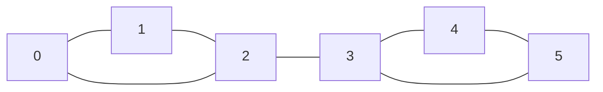

# 단절점과 단절선 (Articulation Points & Bridges)

> **한 줄 요약**: 무방향 그래프에서 **지우면 그래프가 둘 이상으로 쪼개지는 정점(단절점)과 간선(단절선, 브리지)**을 DFS 한 번으로 찾는다. 각 정점의 방문 번호 `order[v]`와, 서브트리에서 간선 하나로 거슬러 올라갈 수 있는 가장 이른 방문 번호 `low[v]`를 비교하면 된다. `O(V + E)`.

## 1. 언제 쓰나 (문제 신호)

- "도로 하나가 끊어지면 **도시가 둘로 나뉘는** 도로(단절선)", "한 지점이 막히면 네트워크가 쪼개지는 **핵심 지점**(단절점)"
- "네트워크에서 **취약한 연결**을 모두 찾아라" (Critical Connections)
- "간선을 방향 있게 바꿔서 강하게 연결되게 할 수 있는가" — 단절선이 없을 때만 가능
- 단절선을 지운 뒤의 **연결 요소**(이중 간선 연결 요소)와 그 요소들이 이루는 **트리** (단절선 트리)가 필요한 문제
- 정점·간선이 10⁵ 이상이라 정점/간선을 하나씩 지워 보는 `O(V(V+E))` 방법이 불가능

## 2. 핵심 아이디어

**DFS 트리**: 무방향 그래프를 DFS하면 간선은 **트리 간선**(처음 방문하는 정점으로 가는 간선)과 **역방향 간선**(이미 방문한 조상으로 되돌아가는 간선) 두 종류뿐입니다(무방향 그래프에는 교차 간선이 없다).

**`low[v]`**: `v`의 DFS 서브트리 안의 정점에서 **역방향 간선 하나**를 거쳐 도달할 수 있는 정점의 `order` 중 최솟값 (자기 `order[v]` 포함). 트리 간선으로 내려갔다 올 때는 `low[부모] = min(low[부모], low[자식])`, 역방향 간선 `v — w`에서는 `low[v] = min(low[v], order[w])`.

**단절선**: 트리 간선 `(p, v)`(`p`가 `v`의 부모)에서 **`low[v] > order[p]`**이면 단절선. `v`의 서브트리가 `p` 위로 올라가는 다른 길이 없어서, `(p, v)`를 지우면 서브트리가 떨어져 나가기 때문입니다.

**단절점**: 비루트 정점 `p`가 단절점 ⟺ 어떤 자식 `v`에 대해 **`low[v] ≥ order[p]`**. 그 자식의 서브트리가 `p` 자신을 거치지 않고는 `p`보다 위로 갈 수 없다는 뜻입니다(단절선과 달리 등호 포함). **루트**는 DFS 트리에서 자식이 **둘 이상**이면 단절점 (자식 서브트리 사이에는 루트를 거치지 않는 길이 없어서). 자식이 하나뿐이면 아니다.

**평행 간선**: 같은 두 정점을 잇는 간선이 둘이면 둘 다 단절선이 아닙니다(하나를 지워도 다른 하나로 연결). 부모로 올라온 **그 간선 하나만** 건너뛰고 나머지는 역방향 간선으로 취급해야 합니다. 그래서 "부모 정점"이 아니라 "부모 **간선 번호**"로 건너뜁니다. 자기 루프는 의미가 없어 무시됩니다.

**이중 간선 연결 요소와 단절선 트리**: 단절선을 모두 지우면 남은 연결 요소들이 서로 다른 경로 두 개로 이어진 "이중 간선 연결 요소"입니다. 이 요소를 한 정점으로 줄이고 단절선을 이으면 **숲(트리)**가 됩니다 (`bridge_tree`).

## 3. 손으로 따라가기

삼각형 `{0, 1, 2}`와 삼각형 `{3, 4, 5}`를 간선 `2 — 3`으로 이은 그래프 (간선: `0-1, 1-2, 2-0, 2-3, 3-4, 4-5, 5-3`):



정점 0에서 DFS: `0 → 1 → 2 → 3 → 4 → 5` (모두 트리 간선), 역방향 간선 `2 — 0`과 `5 — 3`.

| 정점 | `order` | `low` | 이유 |
|---|---|---|---|
| 0 | 0 | 0 | 루트 |
| 1 | 1 | 0 | 서브트리의 2가 역방향 간선 `2—0`으로 `order[0] = 0`에 닿음 |
| 2 | 2 | 0 | 역방향 간선 `2—0` |
| 3 | 3 | 3 | 서브트리 `{3,4,5}`는 `3` 위로 올라가지 못함 (`5—3`은 3 자신) |
| 4 | 4 | 3 | 5의 역방향 간선 `5—3`으로 `order[3] = 3` |
| 5 | 5 | 3 | 역방향 간선 `5—3` |

각 트리 간선 `(p, v)`를 검사합니다.

| 트리 간선 | `low[v]` | `order[p]` | 단절선? (`low[v] > order[p]`) | `p`는 단절점? (`low[v] ≥ order[p]`) |
|---|---|---|---|---|
| `4 → 5` | 3 | 4 | 아니오 | 아니오 |
| `3 → 4` | 3 | 3 | 아니오 | **예** → 3은 단절점 |
| `2 → 3` | 3 | 2 | **예** → `(2, 3)` 단절선 | **예** → 2는 단절점 |
| `1 → 2` | 0 | 1 | 아니오 | 아니오 |
| `0 → 1` | 0 | 0 | 아니오 | (루트: 자식 1개라 아님) |

결과: **단절점 `{2, 3}`**, **단절선 `(2, 3)`**. 단절선을 지우면 요소가 `{0,1,2}`, `{3,4,5}`로 나뉘고 `bridge_tree`는 두 요소를 잇는 간선 하나를 줍니다.

다른 예: 별 모양 `0-1, 0-2, 0-3`은 단절점 `{0}`, 단절선 세 개. 사이클은 둘 다 없음. 나비 모양(삼각형 둘이 한 정점 `2`를 공유)은 단절점 `{2}`, 단절선 없음. 간선 `(0,1)`이 두 개면 단절선 없음.

## 4. 구현

전체 코드는 [solution.py](solution.py)에 있습니다. 정점은 0부터, 연결되지 않은 그래프도 됩니다.

```python
def find_cut_vertices_and_bridges(n, edges):
    adjacency = [[] for _ in range(n)]
    for edge_id, (a, b) in enumerate(edges):
        adjacency[a].append((b, edge_id))
        adjacency[b].append((a, edge_id))
    order = [-1] * n; low = [0] * n
    parent_edge = [-1] * n; next_index = [0] * n
    is_cut = [False] * n; bridges = []; counter = 0
    for root in range(n):
        if order[root] != -1: continue
        order[root] = low[root] = counter; counter += 1
        root_children = 0
        stack = [root]
        while stack:
            v = stack[-1]
            if next_index[v] < len(adjacency[v]):
                w, edge_id = adjacency[v][next_index[v]]
                next_index[v] += 1
                if edge_id == parent_edge[v]:
                    continue                       # 올라온 간선 하나만 건너뛴다
                if order[w] == -1:                 # 트리 간선
                    parent_edge[w] = edge_id
                    order[w] = low[w] = counter; counter += 1
                    stack.append(w)
                else:                              # 역방향 간선
                    low[v] = min(low[v], order[w])
            else:                                  # v 가 끝났다
                stack.pop()
                if stack:
                    p = stack[-1]
                    low[p] = min(low[p], low[v])
                    if low[v] > order[p]:
                        bridges.append(parent_edge[v])
                    if p == root:
                        root_children += 1
                    elif low[v] >= order[p]:
                        is_cut[p] = True
        if root_children >= 2:
            is_cut[root] = True
    return [v for v in range(n) if is_cut[v]], sorted(bridges)
```

- 반환값은 (단절점 목록, 단절선의 **간선 번호** 목록). `bridge_pairs(n, edges)`는 단절선을 `(작은 정점, 큰 정점)` 쌍의 사전순 목록으로.
- `two_edge_connected_components(n, edges)`: 단절선을 지운 뒤의 연결 요소 번호. `bridge_tree(n, edges)`: (요소 번호, 요소 사이의 단절선).
- 직접 실행하면 `V E`와 `E`개의 간선(1부터)을 받아 단절선의 수와 단절선(작은 번호가 앞, 전체는 사전순)을 출력합니다.

## 5. 복잡도와 입력 크기 가이드

- DFS 한 번이라 **시간 O(V + E)**, **공간 O(V + E)**. ([복잡도 치트시트](../../../docs/complexity-cheatsheet.md))
- 이 환경에서 측정한 값입니다(반복문 구현, 두 번 중 최소).

| 입력 | 시간 |
|---|---|
| 정점 10⁵개의 사슬 (단절선 99,999개) | 0.19초 |
| 무작위 그래프 V = 10⁵, E = 2·10⁵ (단절선 7,865개) | 0.68초 |

- 정점을 하나씩 지워 보는 방법은 `O(V(V + E))`라 `V = 10⁵`에서 불가능합니다. 이 알고리즘은 몇 초 안에 `V, E ≤ 10⁶`까지 됩니다.
- 재귀 DFS는 사슬 모양 그래프에서 파이썬의 재귀 깊이 제한(약 1000)에 걸립니다. 위의 구현은 명시적 스택을 씁니다 ([테스트](test_solution.py)가 정점 10⁵개의 사슬에서도 동작함을 확인).

## 6. 자주 하는 실수

- **부모 정점으로 건너뛰기**: `w == 부모`로 건너뛰면 평행 간선을 놓쳐 단절선이 아닌 간선을 단절선으로 판정합니다. **간선 번호**로 건너뛰세요.
- **단절선과 단절점의 부등호**: 단절선은 `low[v] > order[p]`(엄격), 단절점은 `low[v] ≥ order[p]`(등호 포함).
- **루트 처리**: 루트는 `low[v] ≥ order[루트]`가 항상 참이라서 그대로 쓰면 모든 루트가 단절점이 됩니다. **자식이 둘 이상**일 때만.
- **역방향 간선에 `low[w]` 사용**: 역방향 간선에서는 `order[w]`를 써야 합니다. `low[w]`를 쓰면 서브트리 밖의 정보가 섞여 틀립니다 ([SCC](../scc/)에서는 우연히 괜찮지만 여기서는 틀립니다).
- **연결되지 않은 그래프**: 모든 정점에서 DFS를 시작해야 합니다 (`for root in range(n)`).
- **재귀 구현**: 깊이 제한에 걸립니다.
- **단절점의 중복 추가**: 자식이 여럿이어도 같은 정점을 한 번만 세어야 합니다 (불리언 배열).
- **출력 형식**: 문제가 "정점 번호가 작은 순서로", "각 간선은 작은 번호가 앞" 등을 요구하면 정렬해서 출력합니다.
- **자기 루프**: 무시해도 됩니다 (역방향 간선으로 자기 자신에 닿아 `low`가 변하지 않음).

## 7. 변형과 응용

- **이중 연결 요소 (Biconnected Component, 블록)**: 단절점을 기준으로 간선 집합을 나눕니다. 스택에 간선을 쌓아 두었다가 `low[v] ≥ order[p]`일 때 꺼내면 됩니다. 블록과 단절점을 이으면 **블록-단절점 트리**가 됩니다.
- **단절선 트리(브리지 트리)**: 이중 간선 연결 요소를 한 점으로 줄인 트리. 그 위에서 LCA, 지름 등을 구합니다. → [LCA](../lca/)
- **강한 방향 부여**: 단절선이 없는 무방향 그래프는 모든 간선에 방향을 주어 강하게 연결되게 할 수 있습니다 (DFS 트리 간선은 내려가는 방향, 역방향 간선은 올라가는 방향).
- **간선 하나를 추가해서 단절선이 가장 많이 사라지게**: 단절선 트리의 지름 양 끝을 잇는 간선.
- **방향 그래프에서는 [SCC](../scc/)**: 방향 그래프의 비슷한 개념입니다.

## 8. 연습문제

[problems.md](problems.md)에 쉬운 것부터 어려운 순서로 정리했습니다.

## 9. 다음 단계

- 선행: [DFS](../../../lv1-elementary/05-graph-basics/dfs/), [SCC](../scc/)
- 이어서: [LCA](../lca/), [2-SAT](../two-sat/), [네트워크 플로우(디닉)](../dinic/)
