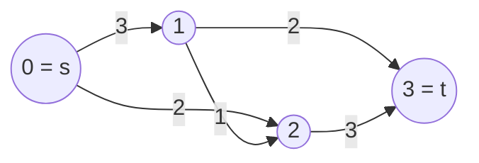

# Dinic's Algorithm (디닉 알고리즘, 네트워크 플로우)

> **한 줄 요약**: 간선마다 **용량**이 있는 방향 그래프에서 출발점 `s`에서 도착점 `t`로 **최대한 많이 흘려 보내는 양(최대 유량)**을 구한다. BFS로 `s`부터의 거리(레벨)를 매겨 레벨이 1씩 늘어나는 간선만 쓰는 **레벨 그래프**를 만들고, 그 위에서 더 못 보낼 때까지 DFS로 흘리는 단계를 반복한다. 최대 유량 = 최소 컷이라는 정리 덕에 **이분 매칭, 최소 컷, 경로 분리** 문제도 이 알고리즘 하나로 푼다.

## 1. 언제 쓰나 (문제 신호)

- "파이프/도로/네트워크의 **용량**이 주어질 때 `s`에서 `t`로 보낼 수 있는 최대량"
- "**최소 컷**: 어떤 간선들을 끊어야 `s`와 `t`가 분리되고 끊는 비용의 합이 최소인가" (최대 유량 = 최소 컷)
- **이분 매칭**을 유량으로 (가중치 없이 `1` 용량) — 하지만 이분 매칭만이면 [호프크로프트-카프](../bipartite-matching/)가 더 빠르다
- **정점/간선이 겹치지 않는 경로**의 최대 개수 (간선 용량 1, 정점은 둘로 쪼개 용량 1)
- 프로젝트 선택(최대 이익 폐쇄 부분 집합), 격자에서 칠하기 최소 비용, 영상 분할 같은 **이진 선택 + 비용** 문제
- 용량이 있는 그래프이고 "~로 보낼 수 있는 최대"라는 말이 보이면 의심

## 2. 핵심 아이디어

**잔여 그래프와 역간선**: 간선 `u → v`(용량 `c`)에 유량 `f`를 흘리면 `u → v`의 남은 용량은 `c − f`, **역간선 `v → u`에는 `+f`**의 용량이 생긴다. 역간선은 "이미 보낸 유량을 되돌려 취소한다"는 뜻이다. 이것이 없으면 처음에 잘못 고른 경로에 막혀 최적에 못 닿을 수 있다.

**증가 경로**: 잔여 그래프에서 `s`에서 `t`로 가는 경로가 있으면 그 경로의 가장 작은 남은 용량(병목)만큼 더 흘릴 수 있다. 더는 경로가 없을 때 현재 유량이 최대이다 (포드-풀커슨).

**디닉의 개선**: 증가 경로를 아무렇게나 고르지 않는다.

1. **BFS**로 `s`로부터의 최단 거리 `level[v]`를 구한다 (남은 용량이 있는 간선만). `t`에 닿지 못하면 끝.
2. **블로킹 플로우**: `level[w] == level[v] + 1`인 간선만 써서 더 이상 `s → t` 경로가 없을 때까지 DFS로 흘린다. 정점마다 **"다음에 볼 간선" 포인터**를 두어, 막다른 길로 들어간 정점이나 이미 포화된 간선을 다시 보지 않는다.
3. 1~2를 반복한다. 매 단계마다 `s → t`의 최단 거리가 **엄격히 늘어나므로** 단계는 최대 `V − 1`번.

시간은 한 단계 `O(VE)` × 최대 `V`단계 = **O(V²E)**. 용량이 모두 1인 그래프에서는 `O(E · min(V^(2/3), E^(1/2)))`, 이분 매칭에서는 `O(E√V)`로 훨씬 빠르다.

**최대 유량 최소 컷 정리**: 최대 유량의 값 = `s`와 `t`를 분리하는 컷의 최소 용량. 최대 유량을 구한 뒤 잔여 그래프에서 `s`로부터 도달 가능한 정점 집합 `S`를 구하면, `S`에서 `S` 밖으로 나가는 원래 간선들이 **최소 컷**이다 (`min_cut_source_side`).

## 3. 손으로 따라가기

정점 `0 = s`, `1`, `2`, `3 = t`. 간선(용량): `0→1 (3)`, `0→2 (2)`, `1→2 (1)`, `1→3 (2)`, `2→3 (3)`.



**단계 1** — BFS 레벨 `[0, 1, 1, 2]` (`0`:0, `1`·`2`:1, `3`:2). 레벨이 1씩 늘어나는 간선만 쓴다: `0→1`, `0→2`, `1→3`, `2→3`. (`1→2`는 같은 레벨이라 제외)

| 경로 | 병목 | 흘린 양 | 합계 |
|---|---|---|---|
| `0 → 1 → 3` | `min(3, 2) = 2` | 2 | 2 |
| `0 → 2 → 3` | `min(2, 3) = 2` | 2 | 4 |

이후 레벨 그래프에서는 `0→2`가 포화되었고 `1→3`도 포화되어 더 갈 곳이 없다.

**단계 2** — 잔여 그래프로 다시 BFS: `0→1`(남은 1) → `1→2`(남은 1) → `2→3`(남은 1)로 레벨 `[0, 1, 2, 3]`.

| 경로 | 병목 | 흘린 양 | 합계 |
|---|---|---|---|
| `0 → 1 → 2 → 3` | `min(1, 1, 1) = 1` | 1 | **5** |

**단계 3** — `t`에 닿지 못하므로 종료. **최대 유량 5**. 간선별 유량 `[3, 2, 1, 2, 3]`, 최소 컷은 `S = {0}`로 `0→1 (3) + 0→2 (2) = 5` — 최대 유량과 같다.

### 역간선이 필요한 이유

간선 `0→1, 0→2, 1→2, 1→3, 2→3` 모두 용량 1. 최대 유량은 `0→1→3`, `0→2→3`로 **2**이다. 그런데 처음에 `0→1→2→3`을 골랐다면 `0→1`, `1→2`, `2→3`이 포화되어 1에서 막힌 것처럼 보인다. 이때 잔여 그래프에는 역간선 `2→1`(용량 1)이 생기고, `0→2→1→3`으로 한 단위를 더 보낼 수 있다. 이 경로는 `1→2`에 보냈던 유량을 취소하는 효과를 낸다. 총 2.

디닉은 레벨 그래프가 `1→2`(같은 레벨)를 아예 쓰지 않으므로 처음부터 `0→1→3`과 `0→2→3`을 찾는다 (이 환경에서 확인: 레벨 `[0, 1, 1, 2]`, 최대 유량 2, 간선별 유량 `[1, 1, 0, 1, 1]`).

## 4. 구현

전체 코드는 [solution.py](solution.py)에 있습니다. 정점은 0부터. 간선 `e`의 역간선은 `e ^ 1`로 접근합니다.

```python
class Dinic:
    def __init__(self, n):
        self.n = n
        self.to, self.capacity, self.original = [], [], []
        self.adjacency = [[] for _ in range(n)]       # 정점별 나가는 간선 번호

    def add_edge(self, u, v, capacity, reverse_capacity=0):
        edge_id = len(self.to)
        self.to.append(v); self.capacity.append(capacity); self.original.append(capacity)
        self.adjacency[u].append(edge_id)
        self.to.append(u); self.capacity.append(reverse_capacity); self.original.append(reverse_capacity)
        self.adjacency[v].append(edge_id + 1)
        return edge_id

    def max_flow(self, source, sink):
        flow = 0
        while True:
            level = self._bfs(source, sink)           # 레벨 그래프
            if level[sink] < 0:
                return flow
            pointer = [0] * self.n                    # 정점마다 다음에 볼 간선
            path, v = [], source
            while True:
                if v == sink:                         # 경로 발견: 병목만큼 흘리고 처음부터
                    pushed = min(self.capacity[e] for e in path)
                    for e in path:
                        self.capacity[e] -= pushed
                        self.capacity[e ^ 1] += pushed
                    flow += pushed; path.clear(); v = source
                    continue
                advanced = False
                while pointer[v] < len(self.adjacency[v]):
                    e = self.adjacency[v][pointer[v]]
                    w = self.to[e]
                    if self.capacity[e] > 0 and level[w] == level[v] + 1:
                        path.append(e); v = w; advanced = True
                        break
                    pointer[v] += 1
                if not advanced:                      # 막다른 길: 한 칸 물러나고 그 간선은 건너뛴다
                    if v == source:
                        break
                    e = path.pop(); v = self.to[e ^ 1]; pointer[v] += 1
```

- `add_edge(u, v, c)`는 방향 간선, **무방향 간선은 `add_edge(u, v, c, c)`**(역방향 용량도 `c`). 간선 번호를 돌려주며 `flow_on(edge_id)`로 그 간선의 순유량(처음 용량 − 남은 용량)을 읽는다.
- `min_cut_source_side(source)`: 최대 유량 뒤에 `s`쪽 정점 집합 `S`(불리언 목록). 최소 컷의 용량 합이 최대 유량과 같다.
- 경로를 하나 찾아 흘린 뒤 `s`에서 다시 시작해도 포인터가 남아 있어 낭비가 없다. 재귀를 쓰지 않아 정점이 많은 긴 경로에서도 안전하다.
- 직접 실행하면 `N`과 `N`개의 파이프 `u v c`(정점은 알파벳 대소문자, 양방향)를 받아 `A`에서 `Z`까지의 최대 유량을 출력합니다.

## 5. 복잡도와 입력 크기 가이드

- **시간 O(V²E)** (일반), 용량이 정수이고 모두 1이면 훨씬 빠르다. **공간 O(V + E)**. 실제로는 이 한계보다 훨씬 빠르게 끝나는 입력이 대부분이다. ([복잡도 치트시트](../../../docs/complexity-cheatsheet.md))
- 이 환경에서 측정한 값입니다(무작위 용량 1~9, 격자는 무방향).

| 입력 | 간선 수 | 최대 유량 | 시간 |
|---|---|---|---|
| 30 × 30 격자 | 1,800 | 101 | 0.03초 |
| 60 × 60 격자 | 7,200 | 207 | 0.25초 |
| 100 × 100 격자 | 20,000 | 334 | 1.21초 |
| 무작위 그래프 V = 5·10³, E = 5·10⁴ (용량 1~100) | 50,000 | 434 | 0.11초 |
| 길이 5·10⁴의 경로 | 49,999 | 7 | 0.14초 |

- 이분 매칭(왼쪽 2000, 오른쪽 2000, 정점당 간선 5개)을 이 클래스로 풀면 0.06초이고, 같은 입력의 [호프크로프트-카프](../bipartite-matching/)는 0.011초입니다.
- 격자가 100 × 100(정점 1만 개)이면 1초대라, 파이썬에서 정점·간선이 수만 개를 넘어가는 유량 문제는 어렵습니다. 간선 수를 줄이는 모델링(정점 합치기, 불필요한 간선 제거)이 중요합니다.

## 6. 자주 하는 실수

- **역간선을 만들지 않음**: 역간선이 없으면 잘못된 경로 선택을 되돌릴 수 없어 최대 유량보다 작은 값이 나옵니다. 항상 쌍으로 추가.
- **무방향 간선을 `u→v`만 추가**: 양방향 용량이 같은 무방향 간선은 `add_edge(u, v, c, c)`. 두 방향을 별도 간선 두 개로 추가해도 되지만 간선 수가 두 배.
- **레벨 조건을 빼먹음**: `level[w] == level[v] + 1`을 확인하지 않으면 사이클을 돌거나 무한 루프에 빠질 수 있습니다.
- **포인터를 되돌리지 않음/전진시키지 않음**: 막다른 길이거나 포화된 간선을 만났을 때 `pointer[v] += 1` 하지 않으면 같은 곳을 반복해 시간 초과입니다.
- **단계마다 포인터를 초기화하지 않음**: 포인터는 단계(BFS)마다 `[0] * n`으로 새로 시작합니다.
- **용량 0 간선을 레벨 그래프에 포함**: BFS에서도 `capacity > 0`인 간선만 봅니다.
- **정점 용량(정점이 지날 수 있는 양 제한)**: 정점을 `in`과 `out` 두 개로 쪼개 `in → out` 간선에 용량을 줍니다.
- **소스/싱크가 여러 개**: 가상의 슈퍼 소스/슈퍼 싱크를 만들고 무한 용량(또는 충분히 큰 값)으로 잇습니다.
- **`source == sink`**: 정의되지 않으므로 이 구현은 `ValueError`를 냅니다.
- **큰 용량에서 오버플로 걱정**: 파이썬은 문제없지만 C++/Java에서는 `long long`이 필요한 경우가 있습니다.

## 7. 변형과 응용

- **이분 매칭**: 소스 → 왼쪽(용량 1) → 오른쪽(용량 1) → 싱크. 유량 = 최대 매칭. → [이분 매칭](../bipartite-matching/)
- **최소 컷으로 문제 모델링**: "각 원소를 A 또는 B에 넣는데 서로 다른 쪽에 들어가면 비용" 같은 이진 선택 문제 (영상 분할, 프로젝트 선택). 컷의 한쪽이 A, 다른 쪽이 B.
- **최대 이익 폐쇄 부분 집합**: 이익이 양수인 정점은 `s`에서 이익만큼, 음수인 정점은 `t`로 비용만큼 연결하고 선행 관계는 무한 용량으로. 총 이익 − 최소 컷.
- **서로소인 경로의 최대 개수**: 간선 서로소는 모든 용량 1, 정점 서로소는 정점을 쪼개서.
- **하한이 있는 유량, 순환(circulation)**: 슈퍼 소스/싱크로 변환.
- **최소 비용 최대 유량(MCMF)**: 간선에 비용이 있는 경우. SPFA나 다익스트라로 증가 경로를 고른다. (Lv4)
- **Dinic의 개선**: 스케일링, 현재 간선 최적화는 이미 포함(포인터). 더 큰 입력은 푸시-리라벨 계열.

## 8. 연습문제

[problems.md](problems.md)에 쉬운 것부터 어려운 순서로 정리했습니다.

## 9. 다음 단계

- 선행: [BFS](../../../lv1-elementary/05-graph-basics/bfs/), [DFS](../../../lv1-elementary/05-graph-basics/dfs/), [그래프](../../../lv1-elementary/05-graph-basics/graph/)
- 이어서: [이분 매칭](../bipartite-matching/), 최소 비용 최대 유량(Lv4 예정)
