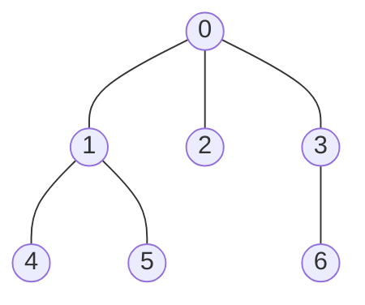

# LCA (최소 공통 조상, Lowest Common Ancestor)

> **한 줄 요약**: 루트가 있는 트리에서 두 정점의 **공통 조상 중 가장 깊은 정점**을 구한다. 부모를 한 칸씩 따라 올라가면 질의 하나에 `O(n)`이지만, **2^k번째 조상을 표로 만들어 두고(이진 리프팅) 큰 걸음부터 뛰면 `O(log n)`**, 트리를 오일러 투어로 펴서 구간 최솟값(희소 배열)으로 바꾸면 질의 `O(1)`이다. LCA를 알면 트리 위의 **두 정점 사이 거리와 경로**를 마음대로 다룰 수 있다.

## 1. 언제 쓰나 (문제 신호)

- "트리의 두 정점 `a`, `b`의 **가장 가까운 공통 조상**" 질의가 10⁵개 이상
- "두 정점 사이의 **거리**(간선 수)" — `depth[a] + depth[b] − 2·depth[lca]`
- 두 정점을 잇는 **경로 위의 합·최댓값·최솟값**, 경로 위의 `k`번째 정점
- "정점 `a`가 정점 `b`의 조상인가" (서브트리 판별)
- 트리의 간선에 가중치가 있고 경로의 병목(최대 간선)을 묻는 문제 — [크루스칼](../../../lv2-intermediate/02-graph-algorithms/kruskal/)로 만든 MST 위에서 자주 나온다
- 트리가 사슬 모양이어서 부모를 따라 올라가는 순진한 방법이 `O(n)`인 입력

## 2. 핵심 아이디어

**순진한 방법**: 두 정점의 깊이를 맞춘 뒤 한 칸씩 같이 올라가 처음 만나는 곳이 LCA. 질의당 `O(깊이)`인데 트리가 사슬이면 `O(n)`이라 질의 `10⁵`개에 `10¹⁰`.

**이진 리프팅 (binary lifting)**: `up[k][v]` = `v`의 `2^k`번째 조상을 표로 만든다. `up[0]`은 부모, `up[k][v] = up[k−1][ up[k−1][v] ]`(`2^(k−1)`칸을 두 번). 루트의 부모는 루트 자신으로 둔다(넘쳐 올라가도 루트에 머문다).

1. **깊이 맞추기**: 깊은 쪽을 `depth` 차이만큼 올린다. 차이를 이진수로 쓰면 켜진 비트에 해당하는 `2^k` 점프만 하면 된다. 이때 둘이 같아지면 그것이 답이다.
2. **함께 올라가기**: 큰 `k`부터 `up[k][u] ≠ up[k][v]`이면 두 점프를 모두 한다(아직 만나지 않는 곳까지 최대한 올라간다). 끝나면 `u`와 `v`는 서로 다르지만 **부모가 같은** 정점이므로 `up[0][u]`가 LCA.

왜 이진 탐색이 되는가: `u`와 `v`의 `j`번째 조상은 `j`가 LCA의 깊이 차이 이상이면 같고 그보다 작으면 다릅니다 (단조). 큰 걸음부터 "아직 다르면 뛴다"를 적용해 **마지막으로 다른 곳**을 찾는 것입니다.

**오일러 투어 + 구간 최솟값**: DFS를 하며 정점에 들어갈 때와 자식에서 돌아올 때마다 기록한 길이 `2n − 1`의 배열을 오일러 투어라고 한다. `first[v]`는 `v`의 첫 등장 위치. `u`와 `v` 사이의 LCA는 투어에서 `first[u]`와 `first[v]` 사이 구간 중 **깊이가 가장 작은 정점**이다. 두 정점 사이를 오가는 경로가 LCA를 반드시 지나고 그보다 위로는 가지 않기 때문입니다. 구간 최솟값은 [희소 배열](../../01-range-query-structures/sparse-table/)로 `O(1)`.

**거리**: `dist(u, v) = depth[u] + depth[v] − 2·depth[lca(u, v)]`.

### 무엇을 저장하고 어떻게 움직이나

루트를 정한 트리에서 두 정점의 공통 조상 중 가장 깊은 정점을 찾습니다. 이진 리프팅은 각 정점의 1,2,4,8,…번째 조상을 저장합니다. 먼저 두 깊이를 맞추고, 서로 다른 조상을 갖는 만큼 큰 점프부터 함께 올립니다.

### 왜 이 방법이 맞는가

같은 깊이에 있는 두 정점이 서로 다르면 LCA 아래에서만 동시에 올라갈 수 있습니다. 2^k번째 조상이 다를 때 점프하면 아직 LCA를 넘지 않습니다. 큰 점프부터 처리한 뒤 두 정점의 바로 위 부모가 LCA입니다.

### 작은 예제로 검산하기

루트 0에서 1과 2가 자식이고 3과 4가 1의 자식이면 LCA(3,4)=1, LCA(3,2)=0입니다. 거리 공식은 `depth[u]+depth[v]-2*depth[lca]`입니다. 가중치 트리에서는 깊이 대신 루트 거리 합을 사용합니다.

## 3. 손으로 따라가기

### 이진 리프팅 표

정점 `0`을 루트로 하는 트리 (간선 `0-1, 0-2, 0-3, 1-4, 1-5, 3-6`):



깊이 `[0, 1, 1, 1, 2, 2, 2]`, 올라갈 수 있는 최대 높이가 6 이하라 `k = 0, 1, 2`의 세 층을 만든다.

| `k` | `up[k][0..6]` |
|---|---|
| 0 (부모) | `0, 0, 0, 0, 1, 1, 3` |
| 1 (2칸 위) | `0, 0, 0, 0, 0, 0, 0` |
| 2 (4칸 위) | `0, 0, 0, 0, 0, 0, 0` |

`up[1][4] = up[0][up[0][4]] = up[0][1] = 0`.

### `lca(4, 6)`

깊이가 둘 다 2라서 맞추기는 필요 없다. 큰 `k`부터 비교한다.

| `k` | `up[k][u]`, `up[k][v]` | 판단 | `u`, `v` |
|---|---|---|---|
| 2 | 0, 0 | 같다 → 너무 높이 올라갔으니 건너뜀 | 4, 6 |
| 1 | 0, 0 | 같다 → 건너뜀 | 4, 6 |
| 0 | 1, 3 | 다르다 → 뜀 | 1, 3 |

마지막에 `up[0][1] = 0`이 답입니다. `lca(4, 5) = 1`, `distance(4, 6) = 2 + 2 − 2·0 = 4`.

### 깊이를 맞춰야 하는 예: `lca(4, 7)`

간선 `0-1, 1-2, 2-3, 3-4, 1-5, 5-6, 6-7` (깊이 `[0, 1, 2, 3, 4, 2, 3, 4]`). 4와 7은 깊이가 4로 같지만 `lca(4, 7)`을 구하려면 `1`까지 올라가야 한다.

| `k` | `up[k][u]`, `up[k][v]` | 판단 | `u`, `v` |
|---|---|---|---|
| 2 (4칸 위) | 0, 0 | 같다 → 건너뜀 | 4, 7 |
| 1 (2칸 위) | 2, 5 | 다르다 → 뜀 | 2, 5 |
| 0 (1칸 위) | 1, 1 | 같다 → 건너뜀 | 2, 5 |

`up[0][2] = 1`이 LCA. `kth_ancestor(4, 3) = 1`처럼 `k`번째 조상은 `k`의 이진수대로 점프해 구한다.

### 오일러 투어

위의 첫 트리의 오일러 투어와 각 위치의 깊이 (길이 `2·7 − 1 = 13`):

| 위치 | 0 | 1 | 2 | 3 | 4 | 5 | 6 | 7 | 8 | 9 | 10 | 11 | 12 |
|---|---|---|---|---|---|---|---|---|---|---|---|---|---|
| 정점 | 0 | 1 | 4 | 1 | 5 | 1 | 0 | 2 | 0 | 3 | 6 | 3 | 0 |
| 깊이 | 0 | 1 | 2 | 1 | 2 | 1 | 0 | 1 | 0 | 1 | 2 | 1 | 0 |

`first = [0, 1, 7, 9, 2, 4, 10]`. `lca(4, 6)`: `first[4] = 2`, `first[6] = 10` → 구간 `[2, 10]`에서 깊이가 가장 작은 정점은 `0`. `lca(4, 5)`: `[2, 4]` = `4, 1, 5` → 깊이 1인 `1`.

## 4. 구현

전체 코드는 [solution.py](solution.py)에 있습니다. 정점은 0부터, 간선은 무방향 `(a, b)` 목록.

```python
class BinaryLiftingLCA:
    def __init__(self, n, edges, root=0):
        ...                                       # BFS 로 parent, depth 를 구한다 (반복문)
        self.log = max(1, (n - 1).bit_length())
        self.up = [parent]
        for k in range(1, self.log):
            previous = self.up[-1]
            self.up.append([previous[previous[v]] for v in range(n)])

    def kth_ancestor(self, v, k):
        k = min(k, self.depth[v])                 # 루트를 넘어가면 루트
        for bit in range(self.log):
            if k >> bit & 1:
                v = self.up[bit][v]
        return v

    def lca(self, u, v):
        if self.depth[u] < self.depth[v]:
            u, v = v, u
        u = self.kth_ancestor(u, self.depth[u] - self.depth[v])   # 깊이를 맞춘다
        if u == v:
            return u
        for bit in range(self.log - 1, -1, -1):
            if self.up[bit][u] != self.up[bit][v]:                # 아직 만나지 않는 곳까지 함께 올라간다
                u, v = self.up[bit][u], self.up[bit][v]
        return self.up[0][u]
```

- `distance(u, v)`, `is_ancestor(u, v)`.
- `EulerTourLCA(n, edges, root)`: 오일러 투어 + 희소 배열. 질의 `O(1)`. 이 파일에 희소 배열이 내장되어 있습니다.
- 모든 탐색이 반복문이라 정점이 `10⁵`개인 사슬에서도 재귀 깊이 문제가 없습니다.
- 직접 실행하면 `N`, `N − 1`개의 간선(1부터), `M`, `M`개의 질의 `a b`를 받아 각 질의의 LCA를 출력합니다 (루트는 1).

## 5. 복잡도와 입력 크기 가이드

- **이진 리프팅**: 구축 **O(n log n)** 시간·공간, 질의 **O(log n)**. **오일러 투어 + 희소 배열**: 구축 **O(n log n)**, 질의 **O(1)**. 순진한 방법은 질의당 **O(깊이)**. ([복잡도 치트시트](../../../docs/complexity-cheatsheet.md))
- 이 환경에서 측정한 값입니다(정점 `n = 10⁵`, 질의 10⁵개, 두 번 중 최소).

| 방법 | 구축(무작위 트리) | 구축(사슬) | 질의 10⁵개(무작위 트리) | 질의 10⁵개(사슬) |
|---|---|---|---|---|
| 이진 리프팅 | 0.14초 | 0.09초 | 0.32초 | 0.29초 |
| 오일러 투어 + 희소 배열 | 0.48초 | 0.35초 | 0.06초 | 0.09초 |
| 순진한 방법(부모 따라 올라가기) | 없음 | 없음 | - | 질의 200개에 0.25초 |

- 순진한 방법을 사슬 모양 트리에서 쓰면 질의 10⁵개에 약 124초(위의 200개 측정값을 500배한 **추정**)가 걸립니다. 두 방법은 구축에 0.1~0.5초가 들지만, 사슬에서도 질의 시간이 거의 변하지 않습니다.
- 질의가 많으면 오일러 투어(질의 5배 빠름), 구축 시간과 메모리가 중요하면 이진 리프팅입니다. 이진 리프팅은 `k`번째 조상과 경로 값 질의까지 같은 표로 풀 수 있어서 더 범용적입니다.
- 메모리: 표 `up`이 `n log n`칸이라 `n = 10⁵`에서 약 170만 칸입니다.

## 6. 자주 하는 실수

- **루트의 부모를 `-1`이나 `None`으로 둠**: 루트 위로 점프하는 경우(`2^k`가 깊이보다 큰 경우)가 생겨 표를 만들 때 오류가 납니다. 루트의 부모를 루트 자신으로 둡니다.
- **깊이를 맞춘 뒤 `u == v` 확인을 빠뜨림**: 한쪽이 다른 쪽의 조상이면 이미 답입니다. 확인 없이 다음 단계로 가면 부모를 돌려줍니다.
- **함께 올라가는 순서**: 작은 `k`부터 올라가면 틀립니다. **큰 `k`부터** 시도해야 이진 탐색이 됩니다.
- **`log` 부족**: 올라갈 최대 높이 `n − 1`을 표현할 비트 수가 필요합니다 (`(n − 1).bit_length()`).
- **재귀 DFS**: 사슬 모양 트리에서 파이썬의 재귀 깊이 제한(약 1000)에 걸립니다. BFS나 스택으로 깊이와 부모를 구합니다.
- **간선을 방향 있는 것으로 저장**: 입력이 무방향이면 양쪽 인접 리스트에 모두 넣고, 루트에서 시작해 부모 방향을 정합니다.
- **0부터 vs 1부터**: 입력이 1부터면 읽을 때 `− 1`, 출력할 때 `+ 1`.
- **오일러 투어에서 구간의 양 끝 순서**: `first[u] > first[v]`일 수 있으니 정렬해서 구간으로 씁니다.
- **트리가 아님**: 간선이 `n − 1`개가 아니거나 연결되어 있지 않으면 일부 정점의 깊이가 0으로 남습니다.

## 7. 변형과 응용

- **경로 위의 값**: 표에 `up[k][v]`와 함께 "`v`에서 `2^k`칸 위까지 경로의 최댓값(합)"을 저장하면, 질의에서 점프할 때 함께 합쳐 경로 최댓값·합을 `O(log n)`에 구한다. MST 위의 병목 간선 질의에 쓴다.
- **경로 위의 `k`번째 정점**: `lca`를 구한 뒤 `u` 쪽에서 `k`칸 올리거나, 넘치면 `v` 쪽에서 `거리 − k`칸 올린다.
- **오프라인 Tarjan LCA**: 질의를 미리 받아 DFS 한 번과 유니온 파인드로 푼다 (거의 `O(n + q)`).
- **희소 배열과의 관계**: 이진 리프팅의 표는 [희소 배열](../../01-range-query-structures/sparse-table/)과 같은 아이디어로, 구간 대신 "점프"를 합성합니다.
- **HLD(Heavy-Light Decomposition)**: 경로 갱신·질의까지 필요하면 트리를 사슬로 분해합니다 (Lv4).
- **LCA와 트리 DP**: 서브트리 정보는 [트리 DP](../../../lv2-intermediate/03-trees/tree-dp/), 두 정점 사이 거리 합 같은 문제는 LCA와 누적합을 조합합니다. [트리의 지름](../../../lv2-intermediate/03-trees/tree-diameter/)은 LCA 없이도 구합니다.
- **가상 트리(virtual tree)**: 질의로 주어진 정점 몇 개만 남긴 압축 트리를 LCA로 만든다.

## 8. 연습문제

[problems.md](problems.md)에 쉬운 것부터 어려운 순서로 정리했습니다.

## 9. 다음 단계

- 선행: [트리](../../../lv1-elementary/05-graph-basics/tree/), [BFS](../../../lv1-elementary/05-graph-basics/bfs/), [희소 배열](../../01-range-query-structures/sparse-table/)
- 이어서: [트리 DP](../../../lv2-intermediate/03-trees/tree-dp/), [Mo's 알고리즘](../../06-query-techniques/mos-algorithm/)(트리 위의 질의), [SCC](../scc/)
