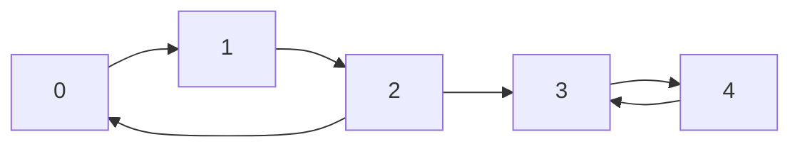

# SCC (강한 연결 요소, Strongly Connected Components)

> **한 줄 요약**: 방향 그래프에서 **서로 오갈 수 있는 정점들의 가장 큰 묶음**을 찾는다. 두 정점이 같은 묶음이면 `u → v`로도 `v → u`로도 갈 수 있다. 묶음을 한 정점으로 줄이면 **사이클 없는 DAG**가 되어 위상 정렬과 DP를 쓸 수 있다. DFS 한 번의 타잔(Tarjan)이나 두 번의 코사라주(Kosaraju)로 `O(V + E)`에 구한다.

## 1. 언제 쓰나 (문제 신호)

- "서로 **오갈 수 있는** 정점 그룹", "사이클에 속한 정점들", "한 번 들어가면 되돌아올 수 있는 구역"
- "도미노 한 줄을 쓰러뜨릴 때 **직접 쓰러뜨려야 하는 최소 개수**" — SCC로 줄인 DAG에서 **진입 차수가 0인 묶음의 수**
- "간선을 몇 개 더하면 그래프 전체가 강하게 연결되는가" — `max(진입 차수 0인 묶음 수, 진출 차수 0인 묶음 수)`
- 사이클이 있는 방향 그래프에서 DP를 하고 싶다 (SCC로 줄인 뒤 위상 순서로 DP)
- [2-SAT](../two-sat/): 논리식의 함의 그래프에서 변수와 그 부정이 같은 SCC에 있는지 확인

## 2. 핵심 아이디어

**정의**: `u`에서 `v`로 가는 경로와 `v`에서 `u`로 가는 경로가 모두 있으면 같은 SCC입니다. 이 관계는 동치 관계라서 정점이 SCC들로 나뉩니다.

**축약 그래프는 DAG**: SCC 하나를 정점 하나로 보고 SCC 사이의 간선을 그리면 사이클이 없습니다(있었다면 그 SCC들이 하나로 합쳐졌을 것). 그래서 [위상 정렬](../../../lv2-intermediate/02-graph-algorithms/topological-sort/) 순서가 존재합니다.

**코사라주 (두 번의 DFS)**

1. 원래 그래프를 DFS하며 **끝난 순서**를 기록한다.
2. **간선을 뒤집은 그래프**에서 끝난 순서의 **역순**으로 DFS를 시작한다. 한 번의 DFS가 닿는 정점들이 한 SCC.

왜 맞나: 끝나는 시각이 가장 늦은 정점은 위상 정렬에서 맨 앞(소스)의 SCC에 있습니다. 뒤집은 그래프에서는 그 SCC에서 **밖으로 나가는 간선이 없으므로**(원래는 들어오는 간선뿐) DFS가 그 SCC 안에서만 돕니다. 이를 지우고 반복합니다. 결과는 위상 정렬 순서(소스 쪽이 먼저)입니다.

**타잔 (DFS 한 번)**: 각 정점에 방문 번호 `order[v]`를 매기고, `low[v]` = `v`의 DFS 서브트리에서 스택에 있는 정점으로 간선 하나를 거쳐 도달할 수 있는 **가장 작은 방문 번호**로 둡니다.

- DFS로 들어갈 때 정점을 **스택**에 넣는다.
- 간선 `v → w`: `w`가 미방문이면 내려갔다 오면서 `low[v] = min(low[v], low[w])`. `w`가 이미 방문됐고 **아직 스택에 있으면**(아직 SCC로 확정되지 않았다) `low[v] = min(low[v], order[w])`. 스택에 없으면(이미 다른 SCC로 확정) 무시.
- `v`의 모든 이웃을 본 뒤 `low[v] == order[v]`이면 `v`는 SCC의 **루트**: 스택에서 `v`가 나올 때까지 꺼내면 한 SCC.

결과는 위상 정렬의 **역순**(싱크 쪽이 먼저)입니다.

**두 방법 비교**

| | 코사라주 | 타잔 |
|---|---|---|
| DFS 횟수 | 2 (그래프 뒤집기 필요) | 1 |
| 메모리 | 원래 + 뒤집은 인접 리스트 | 원래 인접 리스트 + 스택 |
| 결과 순서 | 위상 정렬 순서 | 위상 정렬의 역순 |
| 구현 | 이해하기 쉽다 | 짧고 빠르다 |

### 무엇을 저장하고 어떻게 움직이나

방향 그래프에서 서로 도달 가능한 정점들을 한 묶음으로 만듭니다. 각 묶음을 정점 하나로 축약하면 사이클 없는 DAG가 됩니다. 방향을 무시한 연결성과 모든 정점쌍의 왕복 가능성을 구분해야 합니다.

### 왜 이 방법이 맞는가

서로 왕복 가능한 관계는 같은 묶음으로 합칠 수 있는 동치 관계입니다. 축약 그래프에 사이클이 남으면 그 사이클의 묶음들은 서로 왕복 가능해 원래 하나의 SCC여야 하므로 모순입니다. 탐색 종료 순서와 역방향 그래프가 묶음 경계를 드러냅니다.

### 작은 예제로 검산하기

A→B→C→A와 C→D가 있으면 `{A,B,C}`와 `{D}` 두 SCC입니다. D에서 돌아오는 간선이 없다면 같은 묶음이 아닙니다. 축약 DAG에서 경로·선택 DP를 하면 원래 사이클을 따로 처리할 필요가 줄어듭니다.

## 3. 손으로 따라가기

### 타잔: 간선 `0→1, 1→2, 2→0, 2→3, 3→4, 4→3`



| 순서 | 일어난 일 | `order` | `low` | 스택 |
|---|---|---|---|---|
| 1 | 0 방문 | `order[0]=0` | `low[0]=0` | `[0]` |
| 2 | 0→1: 1 방문 | `order[1]=1` | `low[1]=1` | `[0,1]` |
| 3 | 1→2: 2 방문 | `order[2]=2` | `low[2]=2` | `[0,1,2]` |
| 4 | 2→0: 0은 스택에 있다 | | `low[2]=min(2, order[0]=0)=0` | |
| 5 | 2→3: 3 방문 | `order[3]=3` | `low[3]=3` | `[0,1,2,3]` |
| 6 | 3→4: 4 방문 | `order[4]=4` | `low[4]=4` | `[0,1,2,3,4]` |
| 7 | 4→3: 3은 스택에 있다 | | `low[4]=min(4, 3)=3` | |
| 8 | 4 끝: `low[4]=3≠order[4]=4`, 부모에 반영 | | `low[3]=min(3, low[4]=3)=3` | |
| 9 | 3 끝: **`low[3]==order[3]=3`** → 3이 루트. 스택에서 3까지: `4, 3` | | | `[0,1,2]` |
| 10 | 2 끝: `low[2]=0≠2` → 부모에 반영 `low[1]=0` | | | |
| 11 | 1 끝: `low[1]=0≠1` → `low[0]=0` | | | |
| 12 | 0 끝: **`low[0]==order[0]`** → 루트. 스택에서 0까지: `2, 1, 0` | | | `[]` |

SCC는 `{3, 4}`, `{0, 1, 2}`(꺼낸 순서대로). 싱크 쪽 `{3, 4}`가 먼저 나왔고 위상 순서는 `{0,1,2} → {3,4}`이므로 역순입니다.

### 코사라주: 같은 그래프

1. 원래 그래프 DFS(0에서): 0 → 1 → 2 → (0은 방문) → 3 → 4 → (3은 방문). 끝난 순서 `4, 3, 2, 1, 0`.
2. 역순 `0, 1, 2, 3, 4`로 뒤집은 그래프(`1→0, 2→1, 0→2, 3→2, 4→3, 3→4`)에서 DFS:
   - 0에서 시작: `0 → 2 → 1`. 닿은 정점 `{0, 2, 1}` = 한 SCC. (3으로는 갈 수 없다: 뒤집은 그래프에는 `0 → 3`이 없다.)
   - 1, 2는 이미 배정됨, 3에서 시작: `3 → 2`(배정됨), `3 → 4`. `{3, 4}` = 한 SCC.

결과 `[0, 2, 1]`, `[3, 4]` — 위상 순서(소스 쪽 먼저).

### 축약 그래프와 "간선 몇 개 더?"

`condensation`은 정점별 SCC 번호 `[0, 0, 0, 1, 1]`과 DAG `{0 → 1}`을 줍니다. 진입 차수가 0인 SCC(소스)가 1개, 진출 차수가 0인 SCC(싱크)가 1개이므로 간선 `max(1, 1) = 1`개(예: `3 → 0`)를 더하면 전체가 하나의 SCC가 됩니다.

### 7개 정점 예제

간선 `1→4, 4→5, 5→1, 1→6, 6→7, 2→5, 7→2, 3→7, 3→6` (1부터): `1→6→7→2→5→1`이 한 바퀴를 이루어 `{1, 2, 4, 5, 6, 7}`이 한 SCC이고 `{3}`은 혼자입니다. 출력은 `2`, `1 2 4 5 6 7 -1`, `3 -1`.

## 4. 구현

전체 코드는 [solution.py](solution.py)에 있습니다. 정점은 0부터, 간선은 `(u, v)` = `u → v`. 두 방법 모두 반복문 DFS입니다.

```python
def tarjan_scc(n, edges):
    ...                                          # adjacency 만들기
    order = [-1] * n; low = [0] * n; on_stack = [False] * n
    stack, components, counter = [], [], 0
    for start in range(n):
        if order[start] != -1: continue
        order[start] = low[start] = counter; counter += 1
        stack.append(start); on_stack[start] = True
        call_stack = [(start, 0)]                # (정점, 다음에 볼 이웃의 인덱스)
        while call_stack:
            v, i = call_stack.pop()
            if i < len(adjacency[v]):
                call_stack.append((v, i + 1))
                w = adjacency[v][i]
                if order[w] == -1:               # 트리 간선
                    order[w] = low[w] = counter; counter += 1
                    stack.append(w); on_stack[w] = True
                    call_stack.append((w, 0))
                elif on_stack[w]:                # 스택에 있는 정점
                    low[v] = min(low[v], order[w])
            else:
                if low[v] == order[v]:           # SCC 의 루트
                    ... # 스택에서 v 까지 꺼낸다
                if call_stack:                   # 부모의 low 에 반영
                    parent = call_stack[-1][0]
                    low[parent] = min(low[parent], low[v])
    return components
```

- `kosaraju_scc(n, edges)`: 위상 정렬 순서로 SCC 목록.
- `component_ids(n, components)`, `condensation(n, edges)`(정점별 SCC 번호, 축약 DAG), `min_edges_to_make_strongly_connected(n, edges)`.
- 직접 실행하면 `V E`와 `E`개의 간선(1부터)을 받아 SCC의 수와, 각 SCC의 정점(오름차순)을 한 줄에 하나씩 `-1`로 끝내서 출력합니다.

## 5. 복잡도와 입력 크기 가이드

- 두 방법 모두 정점과 간선을 한 번씩 보므로 **시간 O(V + E)**, **공간 O(V + E)**. ([복잡도 치트시트](../../../docs/complexity-cheatsheet.md))
- 이 환경에서 측정한 값입니다(반복문 구현, 두 번 중 최소).

| 입력 | 타잔 | 코사라주 |
|---|---|---|
| 정점 10⁵개를 잇는 하나의 큰 사이클 | 0.07초 | 0.14초 |
| 무작위 그래프 V = 5·10⁴, E = 1.2·10⁵ (SCC 11,543개) | 0.09초 | 0.10초 |
| 무작위 그래프 V = 2·10⁵, E = 4·10⁵ | 0.76초 | 0.86초 |

- 파이썬에서도 `V, E ≤ 10⁶` 정도까지 몇 초 안에 됩니다. 코사라주는 인접 리스트를 두 벌(원본과 뒤집은 것) 만들어서 타잔보다 메모리를 더 씁니다.
- **재귀로 쓰면** 사슬이나 큰 사이클에서 파이썬의 재귀 깊이 제한(약 1000)에 걸립니다. 위의 구현은 모두 명시적 스택을 씁니다. [테스트](test_solution.py)가 정점 10⁵개의 사슬과 사이클에서도 동작함을 확인합니다.

## 6. 자주 하는 실수

- **타잔에서 스택에 없는 정점으로 `low`를 갱신**: 이미 다른 SCC로 확정된 정점(교차 간선)의 방문 번호를 `low`에 반영하면 SCC가 합쳐져 틀립니다. `on_stack[w]`를 확인합니다.
- **`low[w]`와 `order[w]` 혼동**: 트리 간선으로 내려갔다 올 때는 `low[w]`를 부모에 반영하고, 스택에 있는 정점으로 되돌아가는 간선에는 정의대로 `order[w]`를 씁니다. (SCC만 구할 때는 `low[w]`를 써도 결과가 같지만, 이 방식을 [단절점과 단절선](../articulation-and-bridges/)에 옮기면 틀립니다.)
- **재귀 구현**: 정점이 10⁵개이고 사슬 모양이면 파이썬의 재귀 깊이 제한에 걸립니다. 반복문 구현이나 `sys.setrecursionlimit` + 스레드가 필요합니다.
- **코사라주에서 뒤집지 않은 그래프로 두 번째 DFS**: 반드시 뒤집은 그래프에서, 끝난 순서의 **역순**으로.
- **자기 루프와 평행 간선**: 문제없습니다(자기 자신은 SCC 하나로 이미 같은 묶음).
- **출력 순서**: 문제가 "정점 번호가 작은 순서로" 같은 정렬을 요구하면 SCC 목록을 정렬해서 출력합니다. 타잔의 결과는 위상 정렬의 역순입니다.
- **무방향 그래프에 사용**: 무방향 그래프의 SCC는 연결 요소와 같습니다. 단절점·단절선은 다른 알고리즘 → [단절점과 단절선](../articulation-and-bridges/).
- **간선을 더하는 문제에서 SCC가 1개인 경우**: `max(소스 수, 싱크 수)`가 1이 되지만 답은 0입니다.

## 7. 변형과 응용

- **2-SAT**: 변수 `x`와 `¬x`가 같은 SCC에 있으면 모순. SCC 번호의 위상 순서로 값을 배정. → [2-SAT](../two-sat/)
- **도미노**: 축약 DAG에서 진입 차수 0인 SCC의 수 = 직접 쓰러뜨려야 하는 최소 개수.
- **SCC 위에서의 DP**: 정점마다 값이 있을 때 SCC의 값의 합을 구하고, 축약 DAG에서 위상 순서로 DP (예: 한 번 지난 정점을 다시 지나도 값을 한 번만 받는 최대 경로).
- **강하게 연결되었는가**: SCC가 하나인가. 정점 0에서 DFS 한 번, 뒤집은 그래프에서 DFS 한 번으로도 판정합니다.
- **사이클 검출**: SCC의 크기가 2 이상이거나 자기 루프가 있으면 사이클이 있다.
- **DAG에서의 도달 가능성**: 축약 후 비트셋으로 전파하면 "`u`에서 `v`로 갈 수 있는가"를 빠르게 답할 수 있다.

## 8. 연습문제

[problems.md](problems.md)에 쉬운 것부터 어려운 순서로 정리했습니다.

## 9. 다음 단계

- 선행: [DFS](../../../lv1-elementary/05-graph-basics/dfs/), [위상 정렬](../../../lv2-intermediate/02-graph-algorithms/topological-sort/)
- 이어서: [2-SAT](../two-sat/), [단절점과 단절선](../articulation-and-bridges/), [네트워크 플로우(디닉)](../dinic/)
