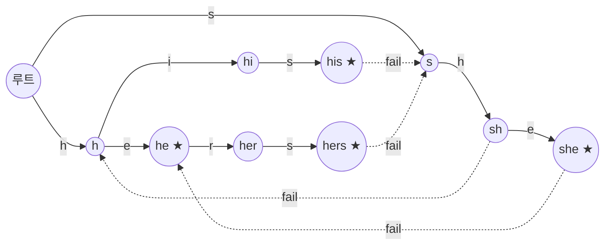

# 아호-코라식 (Aho-Corasick)

> **한 줄 요약**: **여러 패턴을 본문에서 한꺼번에** 찾는다. 패턴들을 [트라이](../../../lv2-intermediate/07-strings/trie/)에 넣고, 노드마다 "이 노드가 나타내는 문자열의 **가장 긴 진 접미사 중 트라이에 있는 것**"을 가리키는 **실패 링크**를 만든다([KMP](../../../lv2-intermediate/07-strings/kmp/)의 실패 함수를 트라이로 일반화한 것). 본문을 한 글자씩 읽으며 막히면 실패 링크로 물러나므로 본문 길이에 선형이고, 패턴이 몇 개든 본문은 한 번만 훑는다.

## 1. 언제 쓰나 (문제 신호)

- "금지 단어 사전에 있는 단어가 **글 안에 하나라도 들어 있는가**" (여러 질의 문자열)
- "단어 `N`개가 본문에 **각각 몇 번** 나오는가", "나오는 위치를 전부"
- 패턴이 수천 개이고 본문이 길어서 패턴마다 KMP를 돌리면 `O(패턴 수 × 본문)`이 되는 경우
- "길이 `L`인 문자열 중 금지 문자열을 **포함하지 않는** 것의 수" 같은 문자열 DP — 오토마톤의 노드를 상태로 쓴다
- 입력이 스트림처럼 한 글자씩 들어오고 매번 "방금 어떤 단어로 끝났나"를 물을 때

## 2. 핵심 아이디어

**순진한 방법**: 패턴마다 본문을 따로 찾는다. 패턴 총 길이 `S`, 본문 `T`, 패턴 `N`개면 `O(N·T)`. 패턴 2000개, 본문 10⁵면 2·10⁸.

**트라이 + 실패 링크**: 

1. 모든 패턴을 트라이에 넣는다. 패턴이 끝나는 노드에 패턴 번호를 적는다.
2. 노드 `v`가 문자열 `w`를 나타낼 때 `fail[v]` = `w`의 **가장 긴 진 접미사** 중 트라이에 노드가 있는 것. 없으면 루트.
3. 본문을 읽으며 현재 노드 `u`에서 글자 `c`로 갈 수 있으면 간다. 못 가면 `u = fail[u]`로 물러나며 다시 시도하고, 루트에서도 안 되면 루트에 머문다. 물러나는 것은 KMP에서 `π`를 따라 밀리는 것과 같다.

**실패 링크 만들기 (BFS)**: 깊이 1인 노드의 실패 링크는 루트. 깊이가 얕은 노드부터(BFS) 부모 `u`의 자식 `v`(간선 글자 `c`)에 대해
`f = fail[u]`에서 출발해 `c`로 갈 수 있을 때까지 `f = fail[f]`로 물러나고, 갈 수 있으면 `fail[v] = children[f][c]`, 끝까지 못 가면 루트.
`fail[v]`는 항상 `v`보다 얕은 노드를 가리키므로 BFS 순서로 만들면 필요한 값이 이미 있다.

**찾은 패턴 모두 보고하기**: 노드 `v`에 도착했다면 `v`가 끝인 패턴뿐 아니라 **실패 링크를 따라간 노드들이 끝인 패턴**(= `v`의 접미사인 패턴)도 함께 본문에서 끝난 것이다. 매번 실패 링크 전체를 훑으면 느리므로, `output_link[v]` = 실패 링크를 따라가며 **처음 만나는 "끝나는 패턴이 있는 노드"**를 미리 계산해 두고 그것만 건너뛰며 방문한다.

**왜 선형인가**: 현재 노드의 깊이는 글자 하나를 읽을 때 최대 1만 늘고, 실패 링크를 한 번 따를 때마다 줄어든다. 줄어든 만큼만 늘 수 있으므로 물러남의 총합 ≤ 본문 길이. 구축도 같은 방식으로 패턴 총 길이에 선형이다.

**각 패턴의 등장 횟수만 필요할 때**: 보고하지 않고, 본문을 읽으며 도착한 노드의 방문 횟수만 센 뒤 **BFS의 역순**(깊은 노드부터)으로 `visits[fail[v]] += visits[v]`를 전파한다. 노드 `v`에 도착한 것은 `fail[v]`가 나타내는 접미사에도 도착한 것이기 때문이다. 패턴 `p`의 끝 노드의 값이 `p`의 등장 횟수.

## 3. 손으로 따라가기

패턴 `{he, she, his, hers}`, 본문 `ushers`.

### 트라이와 실패 링크

노드 번호는 만든 순서(이 구현의 번호)입니다. 실선은 트라이 간선, 점선은 실패 링크이고, 루트로 가는 실패 링크는 생략했습니다.



(★ = 패턴이 끝나는 노드)

| 노드 | 문자열 | `fail` | 끝나는 패턴 | `output_link` |
|---|---|---|---|---|
| 1 | `h` | 루트 | - | 없음 |
| 2 | `he` | 루트 | `he` | 없음 |
| 3 | `s` | 루트 | - | 없음 |
| 4 | `sh` | `h` (1) | - | 없음 |
| 5 | `she` | `he` (2) | `she` | `he` (2) |
| 6 | `hi` | 루트 | - | 없음 |
| 7 | `his` | `s` (3) | `his` | 없음 |
| 8 | `her` | 루트 | - | 없음 |
| 9 | `hers` | `s` (3) | `hers` | 없음 |

`sh`의 가장 긴 진 접미사 `h`는 트라이에 있으므로 `fail = h`. `she`의 진 접미사 `he`가 트라이에 있어 `fail = he`이고, `he`가 패턴이므로 `she`에 도착하면 `he`도 같이 나옵니다. `hers`의 접미사 `ers`, `rs`는 트라이에 없고 `s`는 있어 `fail = s`입니다. BFS 순서(깊이 순)는 `1, 3, 2, 6, 4, 8, 7, 5, 9`입니다.

### 본문 `ushers` 훑기

| 읽은 글자 | 도착한 노드 | 보고되는 패턴 (시작 위치) |
|---|---|---|
| `u` | 루트 (`u`로 가는 간선 없음) | - |
| `s` | `s` | - |
| `h` | `sh` | - |
| `e` | `she` | `she` (1), `he` (2) ← `output_link`로 |
| `r` | `her` (`she`에서 `r`로 못 가서 `he`로 물러난 뒤 `r`로) | - |
| `s` | `hers` | `hers` (2) |

`she`에서 `r`을 읽을 때 `she`에는 `r` 간선이 없으므로 `fail[she] = he`로 물러나 `he → r → her`로 갑니다. 결과 `[(she, 1), (he, 2), (hers, 2)]` (괄호의 숫자는 0부터 센 시작 위치).

등장 횟수 방식으로 세면 도착한 노드(`s`, `sh`, `she`, `her`, `hers`)의 방문 횟수가 각각 1입니다. 깊은 노드부터 실패 링크로 전파하면 `she`의 1이 `he`로, `hers`의 1이 `s`로, `sh`의 1이 `h`로 넘어가서 `he`:1, `she`:1, `his`:0, `hers`:1이 됩니다 (패턴 끝 노드의 값이 등장 횟수).

겹치는 패턴 `{a, aa, aaa}`를 `aaaa`에 대보면 등장 횟수는 `a`:4, `aa`:3, `aaa`:2.

## 4. 구현

전체 코드는 [solution.py](solution.py)에 있습니다.

```python
class AhoCorasick:
    def __init__(self, patterns):
        ...                                       # 트라이: children[v] = {글자: 자식}, ends[v] = 끝나는 패턴 번호들
        queue = deque(self.children[0].values())  # 깊이 1 의 실패 링크는 루트
        while queue:
            u = queue.popleft()
            for ch, v in self.children[u].items():
                f = self.fail[u]
                while f and ch not in self.children[f]:
                    f = self.fail[f]
                self.fail[v] = self.children[f].get(ch, 0)
                link = self.fail[v]
                self.output_link[v] = link if self.ends[link] else self.output_link[link]
                queue.append(v)

    def _next(self, node, ch):
        while node and ch not in self.children[node]:
            node = self.fail[node]
        return self.children[node].get(ch, 0)

    def find_all(self, text):                     # (시작 위치, 패턴 번호), 끝 위치 순, 같은 끝에서는 긴 것부터
        result, node = [], 0
        for i, ch in enumerate(text):
            node = self._next(node, ch)
            v = node
            while v:
                for index in self.ends[v]:
                    result.append((i - len(self.patterns[index]) + 1, index))
                v = self.output_link[v]
        return result
```

- `count_occurrences(text)`: 패턴별 등장 횟수(겹쳐도). 위의 역순 전파.
- `contains_any(text)`: 하나라도 들어 있는가. 처음 발견하면 바로 끝낸다.
- 같은 패턴이 두 번 주어져도 둘 다 따로 보고합니다. 빈 패턴은 `ValueError`.
- 직접 실행하면 BOJ 9250 형식 — `N`, `N`개의 패턴, `Q`, `Q`개의 질의 — 을 받아 각 질의가 패턴을 하나라도 포함하면 `YES`, 아니면 `NO`를 출력합니다.
- 노드마다 딕셔너리를 둔 구현이라 알파벳 크기에 상관없이 쓸 수 있습니다. 노드가 수십만 개를 넘으면 메모리가 커지므로 영소문자 전용이라면 길이 26 배열이나 `array`로 바꿀 수 있습니다.

## 5. 복잡도와 입력 크기 가이드

- **구축 O(S)**, 탐색 **O(|T| + 찾은 개수)** (`S`는 패턴 길이의 합), **공간 O(S)** (딕셔너리 간선 포함). 개수만 세면 탐색은 `O(|T| + 노드 수)`. ([복잡도 치트시트](../../../docs/complexity-cheatsheet.md))
- 이 환경에서 측정한 값입니다.

| 작업 | 입력 | 시간 |
|---|---|---|
| 구축 | 패턴 10000개(각 10글자, 영문 4종), 노드 41637개 | 0.07초 |
| `count_occurrences` | 위 오토마톤으로 본문 10⁶ 글자 | 0.42초 |
| `find_all` | 같은 본문, 찾은 것 9448개 | 0.53초 |
| `count_occurrences` | 패턴 2000개(각 8글자, `a`/`b`), 본문 10⁵ | 0.02초 |
| 패턴마다 `startswith` 반복 | 같은 입력에서 패턴 20개만 | 0.09초 |

- 마지막 두 줄을 비교하면 패턴 2000개를 이렇게 하나씩 찾을 때는 **약 9초**(20개 측정값을 100배한 **추정**)이고, 아호-코라식은 0.02초였습니다. 같은 결과(앞 20개의 등장 횟수)를 냈음을 측정 스크립트에서 확인했습니다.
- 파이썬에서 패턴 총 길이 10⁵, 본문 10⁶까지는 몇 초 안에 됩니다. 찾은 위치가 수백만 개를 넘는 입력에서는 `find_all`이 느려지므로 횟수만 세는 방식을 쓰세요.

## 6. 자주 하는 실수

- **현재 노드의 패턴만 보고하고 `output_link`를 안 따라감**: `she`에서 `he`를 놓칩니다. 패턴이 다른 패턴의 접미사인 경우를 꼭 시험해 보세요.
- **실패 링크를 DFS 순서로 만듦**: `fail[v]`가 더 얕은 노드의 `fail`에 의존하므로 반드시 **깊이 순(BFS)** 입니다.
- **루트에서 못 가는 글자**: 루트에서는 더 물러날 곳이 없으니 루트에 머뭅니다(`_next`의 `while node` 조건).
- **깊이 1 노드의 실패 링크를 계산식에 넣음**: 깊이 1 노드는 따로 루트로 두고 큐에 넣어야 합니다. 일반 식에 넣으면 자기 자신을 가리킬 수 있습니다.
- **패턴 집합을 `set`으로 받아 중복·번호를 잃음**: 같은 패턴이 두 번 나오면 둘 다 세야 하는 문제가 있습니다. 번호로 구분하세요.
- **빈 패턴**: 모든 위치에서 일치하는 것으로 취급해야 해서 대부분 입력에서 나오지 않습니다. 이 구현은 거부합니다.
- **시작 위치 계산**: 끝 위치 `i`에서 길이 `m`인 패턴은 `i − m + 1`에서 시작합니다.
- **공통 접두사가 긴 패턴이 매우 많음**: 같은 글자만 `a…a`로 이어진 패턴이 많으면 한 위치에서 보고할 패턴이 많아 출력이 폭발합니다. 개수만 필요한지 확인하세요.
- **노드 번호 0을 "없음"으로 씀**: 루트가 0이므로 `output_link`가 0이면 "없음"(루트는 패턴이 아님)으로 읽는 이 구현의 약속을 지키세요.

## 7. 변형과 응용

- **오토마톤 DP**: 노드를 상태로, 글자를 전이로 보고 `dp[길이][노드]`를 채운다. "금지 문자열을 포함하지 않는 길이 `L`의 문자열 수"는 `has_output`이 참인 노드(금지 패턴이 끝나는, 또는 그 접미사가 끝나는 노드)로 가는 전이를 막으면 된다. 이 구현의 `has_output`이 그 역할을 합니다.
- **"모든 패턴을 포함"**: 어떤 패턴을 만났는지를 비트마스크로 상태에 더한다 (패턴이 ≤ 10~20개일 때).
- **행렬 거듭제곱**: 길이 `L`이 10¹⁸까지 큰 "금지 문자열 회피" 문제는 전이 행렬을 [행렬 거듭제곱](../../07-dp-advanced/matrix-exponentiation/)한다.
- **스트림 질의**: 글자를 하나씩 넣으며 `_next`만 호출하고 `has_output`을 확인하면 된다 (LeetCode 1032).
- **트라이와의 관계**: 실패 링크가 없으면 [트라이](../../../lv2-intermediate/07-strings/trie/)이고, 패턴이 하나면 [KMP](../../../lv2-intermediate/07-strings/kmp/)입니다. 같은 아이디어의 일반화입니다.
- **전이 함수를 모두 채우기(완전 오토마톤)**: 각 노드에서 모든 글자의 도착 노드를 미리 계산하면 `_next`의 반복문이 사라져 질의당 `O(1)`이 되지만 구축이 `O(S·|Σ|)`.
- **접미사 구조와의 비교**: 본문이 고정이고 패턴이 여러 번 바뀌면 [접미사 배열](../suffix-array-lcp/)이, 패턴이 고정이고 본문이 바뀌면 아호-코라식이 맞습니다.

## 8. 연습문제

[problems.md](problems.md)에 쉬운 것부터 어려운 순서로 정리했습니다.

## 9. 다음 단계

- 선행: [트라이](../../../lv2-intermediate/07-strings/trie/), [KMP](../../../lv2-intermediate/07-strings/kmp/), [BFS](../../../lv1-elementary/05-graph-basics/bfs/)
- 이어서: [행렬 거듭제곱](../../07-dp-advanced/matrix-exponentiation/) (긴 문자열 개수 세기), [접미사 배열과 LCP](../suffix-array-lcp/)
